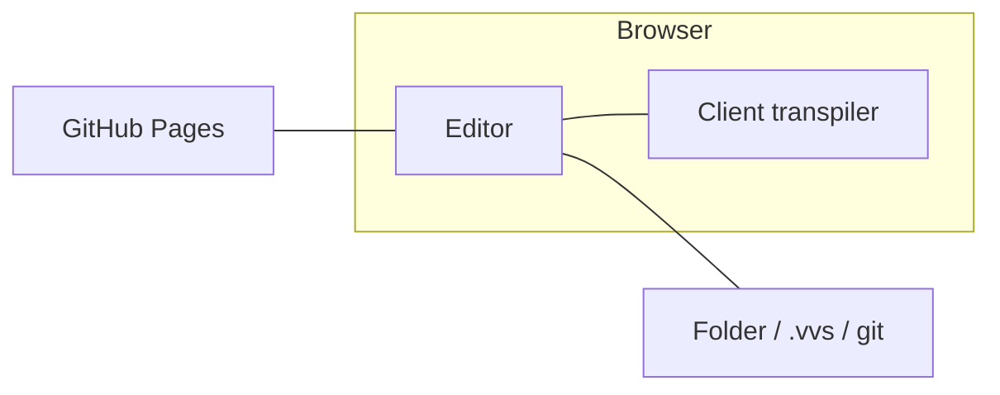
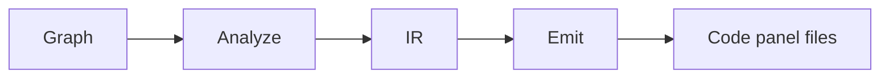

# Vision Visual Scripting (VVS)

> **Early public development** - try the live editor below, or run locally. See [Where we are now](#where-we-are-now). **Origin:** [Vision Visual Scripting (2021)](https://github.com/Sheriff99yt/Vision_Visual_Scripting)

**Visual programming that generates real code.** Compose logic on a graph, **Generate** ordinary source, and keep using your IDE, git, and CI. **Canvas is the source of truth** - every export line maps to a graph node. Symbol tables index only.

VVS builds **on top of traditional development**, not instead of it. The graph is the authoring view. Text code stays the integration layer, with **text-shaped fidelity** (what you draw is what you could type). See [docs/visual_to_text_fidelity.md](docs/visual_to_text_fidelity.md).

There is **no VVS account** and **no dedicated app server**. Hosted GitHub Pages plus a local folder / `.vvs/` / git. The hosted agent is the **in-page TypeScript** panel, not a remote MCP host.



---

## Try it (live)

**Open the editor now:** [https://sheriff99yt.github.io/VVS-Web/](https://sheriff99yt.github.io/VVS-Web/)

That is the latest successful **GitHub Pages** deployment. Browser storage only. No cloud account.

| Channel | Where | What |
|---------|--------|------|
| **Live preview** | [sheriff99yt.github.io/VVS-Web](https://sheriff99yt.github.io/VVS-Web/) | Tracks `main` after a green Pages deploy |
| **Current pre-release** | [Releases](https://github.com/Sheriff99yt/VVS-Web/releases) - tag `pre-release` | Same site link plus `vvs-web-pre-release.zip` |
| **Versioned downloads** | [Releases](https://github.com/Sheriff99yt/VVS-Web/releases) - SemVer tags (`v0.1.0`, ...) | Frozen static zips for a specific version |

Details: [docs/setup.md](docs/setup.md).

---

## Where we are now

**Phase 1 ships:** web editor plus an 8-language client transpiler (Python, JavaScript, C++, Verse, GDScript, Rust, C#, Go). JavaScript is one target, not "JS/TS". There is **no live Play**. **Compile-once-all is not shipped.**

| Layer | Today | Not yet |
|-------|--------|---------|
| **Web editor** (`apps/web`) | Start screen, graph canvas, tabs, References, wiring, local / folder / `.vvs/` persist, real codegen preview (`@vvs/transpiler`). Start cards: Simple, Complex, Advanced. Research tab on the in-app roadmap (Open / Done / Research). GitHub Pages showcase | U93 code-to-visual (research), session collab |
| **Transpiler** (`packages/transpiler`) | Client-side Generate for all eight languages | Honest leftovers stay `(x)` where a language has no API (Verse GetInput, Bind outside csharp / javascript / gdscript) |
| **Backend** (`server/`) | Optional **local** MCP sidecar plus optional HTTP. **Not** the product host and **not** the hosted agent. Writes gated by `VVS_MCP_ALLOW_WRITE` | Dedicated app server, accounts, library upload auth |
| **UE6 plugin** (`plugins/`) | Roadmap only | In-engine canvas |

**What you can do today:** run locally or on Pages, create projects, edit graphs, save to browser storage / folder / `.vvs/`, and **Generate** source into the Code panel. Status chrome is honest: **offline / local**, not fake synced.



**Generate** is the user action and that full path. **Emit** is Stage C only (printers write text). It is not a toolbar word. Event invoke is **Dispatch**, not Emit.

**Canonical detail:** [docs/current_state.md](docs/current_state.md). **Direction:** [docs/visual_to_text_fidelity.md](docs/visual_to_text_fidelity.md). **Phases:** [docs/roadmap.md](docs/roadmap.md).

---

## Text-shaped graphs

VVS does **not** simulate Unreal Blueprint (macro expansion, latent delays, VM-only behavior). Generated code must be honest, grep-able, and embeddable. Rationale and rejected alternatives: [docs/visual_to_text_fidelity.md](docs/visual_to_text_fidelity.md).

---

## UI-first approach (why we build this way)

We build the **visual editor and data contracts first**. Persistence is **local** (browser storage, folder, `.vvs/`, git). The **client transpiler** (`@vvs/transpiler`) matures in parallel. Cloud database is **out of product scope**. The hosted agent is in-page TypeScript (already shipped). A thin MCP wrapper for other apps is later. The optional Go sidecar is a local experiment, not a host.

**What UI-first means here**

1. **Shape the product in the canvas** - tabs, references, wiring rules, project tree, properties, and navigation must feel right before we lock extra surfaces.
2. **Define interfaces while building UI** - `ProjectSnapshot`, graph documents, `VvsApi`, validation messages, and target-language selection are contracts the transpiler implements.
3. **Mock honestly** - `localStorage` and folder save stand in for a cloud we are not building. Codegen uses `@vvs/transpiler`. The UI says **offline** / **Agent ready** honestly. No fake connected or MCP Ready chrome.
4. **One vertical slice at a time** - editor, analysis, Generate, Code panel. See [docs/ui_api_delivery_loop.md](docs/ui_api_delivery_loop.md) for contract-first wiring. Cloud persistence is not a product track.

**What this helps us avoid**

| Bad decision | UI-first guardrail |
|--------------|-------------------|
| Transpiler designed without a proven graph UX | Editor and graph schema come first; printers target a stable IR |
| UI coupled to an unfinished host | Components call `VvsApi`, not raw `fetch` scattered in views |
| Fake "connected" or "synced" states | Status bar shows **offline** / **Agent ready** / **Agent error** from `agentStatusStore` |
| Big-bang integration | One feature slice per iteration with shared types |
| Engine jargon leaking into a portable web product | Web copy stays engine-neutral; Verse/UE is a **target**, not the identity |

**Rule of thumb for contributors:** if it is not in [current_state.md](docs/current_state.md), treat it as **planned** or **research**. The hosted agent is in-page TS. Optional local Go MCP sidecar and HTTP API exist for experiments. Cloud persistence is not a product track ([deployment.md](docs/deployment.md)).

---

## Where VVS started

Vision Visual Scripting began as a **[university graduation project](https://github.com/Sheriff99yt/Vision_Visual_Scripting)** (2021): an open-source Python desktop app where anyone could hop in and program with visual nodes, and the graph would translate into whatever programming language syntax you selected. That logic/syntax split still defines VVS.

**VVS Web** is the next chapter: a browser-native open monorepo for the AI era (in-page agent, bring-your-own key, later MCP wrapper for other apps) and a long-term goal - an **open visual scripting language** portable across engines and workflows, not locked to one runtime.

Read the origin story: **[docs/history.md](docs/history.md)**. **[Vision & philosophy](docs/vision.md)**. **[Public roadmap](docs/roadmap.md)**.

---

## Highlights

| Principle | What it means |
|-----------|----------------|
| **Born open** | Started as an MIT graduation project; VVS Web continues as a public open platform |
| **Real code out** | Generate readable source files. No proprietary VM |
| **Logic / syntax split** | One graph; eight shipped targets (Python, JavaScript, C++, Verse, GDScript, Rust, C#, Go) |
| **Open visual scripting** | Portable graph schema aimed at all engines and workflows |
| **Bring your own AI** | In-page TS agent (optional local LLM key). No bundled LLM. Other apps: later MCP wrapper; today optional Go sidecar |
| **Offline-capable** | Client-side transpiler. Edit and Generate without a host |
| **Research tab** | In-app roadmap is Open / Done / Research. U93 code-to-visual lives there, not as a product default |
| **Verse in v1** | Phase 1 transpiler plus web editor. Not deferred to a UE plugin alone |
| **UE6 plugin (roadmap)** | In-engine canvas reuses the v1 Verse emitter |

---

## Repository structure

```text
vvs-web/
  apps/web/              # Next.js graph editor
  packages/              # graph-types, transpiler, syntax-registry, syntax-packs, language-profiles
    transpiler/          # Pure TS: graph -> IR -> code
    graph-types/         # Shared graph schema
    syntax-registry/     # Data-driven language constructs
    syntax-packs/        # Printers + Rosetta fixtures
  server/                # Optional local MCP sidecar + HTTP (not the product host)
  plugins/               # Future UE6 editor plugin
  docs/                  # Vision, roadmap, architecture
  tools/                 # setup_env.ps1, start_app.ps1
  .agents/               # Public contributor agent skills and memory
```

Shared contracts live in `packages/graph-types`. The web app imports them.

---

## Quick start

**First time:** [docs/setup.md](docs/setup.md). **Daily use:** [docs/quickstart.md](docs/quickstart.md).

**Prerequisites:** [Bun](https://bun.sh), Git. Go 1.22+ is optional (local sidecar only).

```powershell
# Windows
.\tools\setup_env.ps1
.\tools\start_app.ps1
```

```bash
cd apps/web
bun install
bun run dev
```

Open [http://localhost:3000](http://localhost:3000). Create or open a project from the start screen.

Prefer not to install? Use the **[live preview](https://sheriff99yt.github.io/VVS-Web/)** or a zip from **[Releases](https://github.com/Sheriff99yt/VVS-Web/releases)**.

Before pushing: confirm `apps/web/.env.local` does **not** appear in `git status`.

**Build:**

```bash
cd apps/web
bun run build
```

```bash
cd server
go build ./...
```

The Go build is only for the optional sidecar.

---

## Architecture (locked)

1. **Transpiler** - pure TypeScript, zero React deps. Three stages: analyze -> IR -> emit.
2. **Syntax registry** - data-driven language constructs (JSON), not hardcoded per-language hacks.
3. **Agent tools** - in-page TypeScript runtime against the live canvas. Optional Go MCP sidecar is thin wrappers over testable functions, local only.
4. **Monorepo boundaries** - UI and transpiler communicate only via typed contracts.

Contributor rules: **[CONTRIBUTING.md](CONTRIBUTING.md)**. **[.agents/AGENTS.md](.agents/AGENTS.md)**.

---

## Documentation

| Document | Use when |
|----------|----------|
| **[setup.md](docs/setup.md)** | Install, Pages preview, pre-release + SemVer releases |
| **[history.md](docs/history.md)** | Origin story - graduation project to VVS Web |
| **[vision.md](docs/vision.md)** | Product philosophy, UE6/Verse direction, logic/syntax model |
| **[roadmap.md](docs/roadmap.md)** | Public roadmap (Open / Done / Research) |
| **[current_state.md](docs/current_state.md)** | What is implemented in this repo |
| **[code_panel.md](docs/code_panel.md)** | Code panel - selection highlight, hover, double-click to node, Files pin |
| **[naming_and_product_direction.md](docs/naming_and_product_direction.md)** | UI vocabulary (web stays engine-neutral) |
| **[project_requirements.md](docs/project_requirements.md)** | Full requirements spec |
| **[vvs_2_0_tech_stack.md](docs/vvs_2_0_tech_stack.md)** | Technology choices |
| **[visual_to_text_fidelity.md](docs/visual_to_text_fidelity.md)** | Text-shaped graphs |
| **[docs/README.md](docs/README.md)** | Full documentation index |
| **[ui_api_delivery_loop.md](docs/ui_api_delivery_loop.md)** | Wiring UI to APIs incrementally |

---

## License

[MIT](LICENSE). See [CONTRIBUTING.md](CONTRIBUTING.md) for how to participate.
