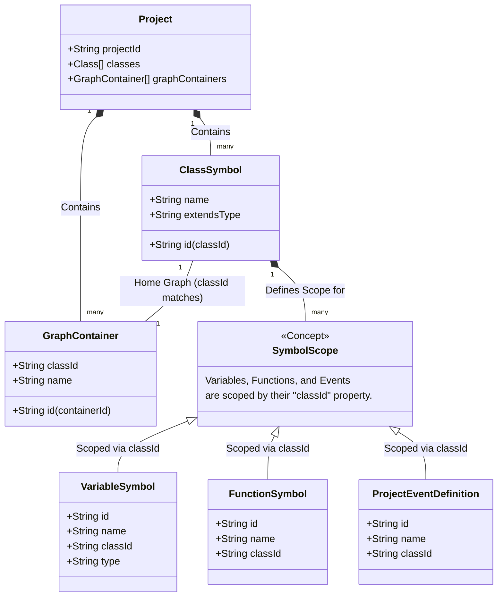

# VVS Class Scopes and Symbol Relationships
*Documented on: 2026-07-11T19:45:15+03:00*

This document illustrates how VVS structures class scopes, symbols, and visual graphs. 

In VVS, every symbol (Variable, Function, Event) is firmly scoped to a specific **Class**. The Project Root itself acts as a default main class (using `MAIN_CLASS_ID`) so you can build standalone scripts without explicitly defining a class.

### Key Takeaways
1. **`classId` is the Anchor:** Every Variable, Function, and Event symbol has a `classId` property. This binds the symbol directly to its parent class.
2. **`MAIN_CLASS_ID`:** If you are building a simple script and haven't created a class, all your variables and functions are implicitly scoped to a special internal ID (`MAIN_CLASS_ID`).
3. **Graph Containers:** Each class usually has a designated "Home Graph" (`GraphContainer`) where its `classId` dictates which declare nodes are valid to be placed on that canvas. This prevents you from accidentally declaring `Class B`'s variables on `Class A`'s graph.
