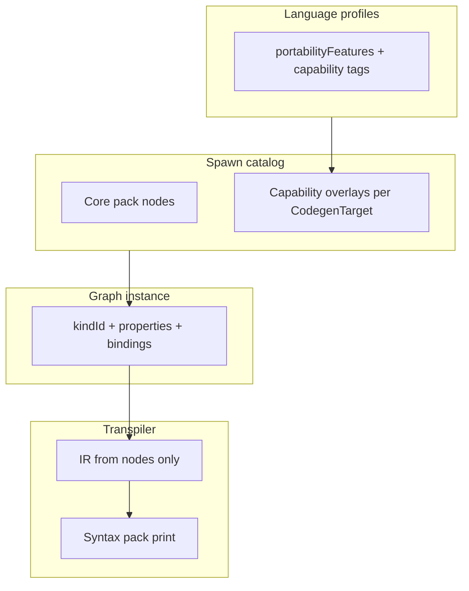

# Language capability catalog

**Status:** Living plan (July 2026) — drives unified, modular UI for all codegen targets.  
**Companion:** [language_neutral_vocabulary.md](language_neutral_vocabulary.md) · [terms_refactor_plan.md](terms_refactor_plan.md) · [fidelity_streamline.md](fidelity_streamline.md) · [node_system.md](../node_system.md) · [visual_to_text_fidelity.md](../visual_to_text_fidelity.md) · [language_profiles.md](../language_profiles.md)

---

## Purpose

VVS targets **seven pack-driven families** (python, javascript, cpp, verse, gdscript, rust, csharp) plus json preview. Languages differ in surface syntax and in **what members and expressions can express**. This document is the **single inventory** of those differences so we can:

1. Plan **one neutral UI** (spawn catalog, inspector, Project tree) that scales to every target.
2. Know which features need **new or extended canvas nodes** vs syntax-pack-only emission.
3. Track **usability example tests** that prove visual availability before we ship a capability.
4. Keep **AI / MCP agents** aligned — agents mutate graphs and registry data, never bypass canvas truth.

---

## Golden rule: canvas + registry are source of truth

```text
User / Agent
    → places nodes + inspector properties on graph JSON
    → dual-write define nodes when creating symbols from panels
    → Generate
    → transpiler lowers nodes → IR → syntax packs print text
```

| Rule | Meaning |
|------|---------|
| **No sidebar-only codegen** | `variables[]`, `functions[]`, `events[]` index CRUD; emitted declarations come from **Declare** nodes on the class home graph (`ir.members`). |
| **No implicit casts** | Use **Conversion** nodes on the graph; transpiler does not fold casts into Print/Set. |
| **Language options on nodes** | Visibility, `static`, overload sets, `const`, etc. live in **node `properties`** or symbol records that **mirror** define nodes — not hidden compiler flags. |
| **Syntax packs print only** | Packs emit idiomatic text for values already on the IR; they do not invent members the graph never declared. |
| **AI parity** | MCP tools (`list_syntax_packs`, graph/symbol CRUD, `run_rosetta_suite`) operate on the same JSON the editor saves. Agent prompts that "add a private method" must create **`function_define`** (Declare) + function tab + properties — not edit generated `.py` files. |

Strict errors that block Generate when fidelity breaks: `DEFINE_NODE_MISSING`, `DECLARATION_NOT_ON_CANVAS`, `ORPHAN_DEFINE_NODE`.

---

## Unified UI architecture (target)

Neutral vocabulary on canvas; **capability-aware** inspector and spawn catalog.



| Layer | Responsibility |
|-------|----------------|
| **Registry `propertySchema`** | Declares inspector fields (visibility, static, async, …) with neutral labels. |
| **Language profiles** | Which properties apply / warn / hide per `CodegenTarget`. |
| **Node effectiveness** | Dim or badge nodes ineffective for current target (planned — `terms_refactor_plan` V4). |
| **Usability example tests** | Fixed graphs that must compile and expose every shipped capability in the UI. |
| **Rosetta fixtures** | Pack-level golden strings; complement graph-driven tests. |

---

## Usability example test matrix

These fixtures live in `apps/web/src/lib/usabilityExampleTests/`. They are **not** tutorials — they regression-test **visual availability** and codegen fidelity.

| Fixture | File | Exercises today | Surfaces gaps for |
|---------|------|-----------------|-------------------|
| **First Graph** | `firstGraphUsabilityTest.ts` | Simple StartScreen test — Declare → Get User Input → Print → Call | Newcomer path, function tab |
| **Coverage Lab** | `coverageLabUsabilityTest.ts` | **Primary golden** — Machine+Sensor one graph; modifiers; enum/switch/array; **shared imports once at file top** + conditional Import json in branch; event Y order; Get User Input; one graph → one file | Class shell, inheritance, enum access, import placement, Code panel single home module |
| Calculator / Async Fetcher / Dual Class Lab | *(retired as StartScreen cards)* | Historical migration narrative only | See Coverage Lab |

**Verify as the user sees:** `bun apps/web/scripts/extract_test_project_outputs.ts` → `apps/web/test_project_outputs/` (mirrors Code | Files).

**Tests:** `coverageLabUsabilityTest.test.ts`, `firstGraphUsabilityTest.ts`, `usabilityExampleSnapshots.test.ts`, `generate.test.ts`, `calculatorModifierRollout.test.ts`.

When a catalog row below moves to **Shipped**, add or extend a usability test assertion that the capability is set **on canvas** and appears in generated code.

---

## Capability catalog

**Columns:** `uiStatus` — `shipped` \| `partial` \| `planned` \| `n/a` (not applicable for target).  
**Node column:** registry `kindId` or planned id.  
**Families:** py, js, cpp, cs, rs, gd, verse (abbreviations).

### A — Member declaration (Declare chain)

| Capability | Neutral UI | Node / property | Families | uiStatus | Notes |
|------------|------------|-----------------|----------|----------|-------|
| Class / module shell | Declare Class `{name}` | `class_define` | all | shipped | `extendsType` on class + define node |
| Variable field | Declare `{name}` | `var_define` | all | shipped | **TypeRef** (builtin / enum / class / array / map); legacy `enumType` migrates |
| Function member | Declare `{name}` | `function_define` | all | shipped | links to function tab graph |
| Event member slot | Declare `{name}` | `event_member_define` | all | shipped | paired with On handler in flow |
| **Enum declaration** | Declare Enum | `enum_define` | all | shipped | members on node; Dual Class Lab |
| **Enum-typed field** | Type picker → enum | `VariableSymbol.typeRef` `{ kind: 'enum' }` | all | **shipped** | Default = member name (`OK`); emit via pack `EnumMemberAccess` |
| **Class-typed field** | Type picker → class | `typeRef` `{ kind: 'class' }` | all | **shipped** | Dual Class Lab `Host: Machine` |
| **Typed Array / Map** | Type picker → `list[T]` / `dict[K,V]` | `typeRef` `{ kind: 'array'\|'map' }` | all | **shipped** | Dual Class Lab `Readings: list[float]` → `std::vector<float>` |
| Visibility (public / private / protected) | Inspector + `NodeModifiers` on Declare | `properties.visibility` on define kinds | cpp, cs, java-like, rs, gd, verse | **shipped** | C++ access sections; C# keywords; Rust `pub`; Verse `<public>`/`<private>`; JS `#` private — Dual Class Lab goldens |
| **Static** vs instance | Modifier on Declare | `properties.binding` (`static`) | cpp, cs, java, py, js, gd | **shipped** | C++ `inline static`; C#/JS/GDScript `static`; Python `@staticmethod` when set |
| **Abstract** / pure virtual | Modifier on Declare function | `properties.isAbstract` | cpp, cs | **shipped** | C++ `virtual … = 0`; C# `abstract` prototype (no body); do **not** invent class `abstract` |
| **Override** / `virtual` | Modifier on Declare function | `properties.isVirtual`, `isOverride` | cpp, cs, verse | **shipped** | Emit only when toggled on the node; ineffective langs omit keywords |
| **Const** / **readonly** field | Modifier on Declare var | `properties.isConst` | cpp, rs, cs | **shipped** (cpp/cs/rs when set) | C++ `const`; C# `readonly`; Rust `const` — only when node property set |
| **Property** (getter/setter) vs field | Declare Property `{name}` | `property_define` (planned) | cs, cpp, gd | planned | Distinct from `var_define` when language has property syntax |
| **Function overload set** | One Declare node, N signatures in inspector | `function_define` + `overloads[]` on symbol | cpp, cs, rs | **partial** | Symbol model has `overloads[]`; UI does not expose multiple arities on one name yet |
| **Default parameter values** | Function tab entry pins / inspector | function graph + symbol metadata | py, cpp, cs, gd | partial | |
| **Return type** on Declare | Inspector | `returnType` | typed targets | **planned** | Stored on overloads for future emit; UI removed until signatures are non-void |
| **Constructor** | Declare Constructor | `constructor_define` (planned) | cpp, cs, rs | planned | Separate from `on_start` entry |
| **Destructor** | Declare Destructor | `destructor_define` (planned) | cpp | planned | |
| **Interface / trait impl** | Declare Implements | `implements_define` (planned) | cs, rs | planned | |
| **File extension per target** | Graph settings → **This graph** + **Project defaults** | `metadata.targetFileExtension` per graph; `targetFileExtensions` on snapshot for new graphs | all | **shipped** | User picks `.cpp`, `.hpp`, `.h`, etc.; code panel shows `.{ext}` beside language dropdown |
| **Per-graph codegen language** | Graph settings → **This graph**; code panel header | `metadata.targetLanguage` per graph; snapshot `targetLanguage` = default for new graphs | all | **shipped** | Multi-language projects: Calculator in Python, helper fn in Rust, etc. |
| **Generated files tree** | Output panel → **Files** tab | `useProjectTranspileResult` + `buildGeneratedFileTree` | all | **shipped** | Folder tree of all emitted paths; removed flat **Generated** list from project tree |

### B — Handlers & flow (On / Implement)

| Capability | Neutral UI | Node | Families | uiStatus | Notes |
|------------|------------|------|----------|----------|-------|
| Program entry | On Start | `event_define` + entry `events[]` | all | shipped | |
| Per-frame | On Update | `event_on_update` | game targets | shipped | |
| Custom event body | On `{name}` | `event_define` | all | shipped | |
| **Async** handler | Async toggle on On / function | `properties.isAsync` | py, js, cs | planned | Emits `async def` / `async Task`; **C++ ineffective** until coroutines shipped — disable chip |
| **Coroutine** / yield | Flow nodes | planned flow kinds | py, gd | planned | |

### C — Invoke (Call / Dispatch)

| Capability | Neutral UI | Node | Families | uiStatus | Notes |
|------------|------------|------|----------|----------|-------|
| Function call | Call `{name}` | `vvs.project.call_function` | all | shipped | |
| Event invoke | Dispatch `{name}` | `event_dispatch` | all | shipped | |
| **Static call** | Call on type name | call + `static` binding | cpp, cs | planned | |
| **Cross-class call** | Call after Import Class | `import_class` + Call | multi-class | shipped | `CROSS_CLASS_CALL_WITHOUT_IMPORT` warning |
| **Cross-class dispatch** | Dispatch after Import Class | `import_class` + Dispatch | multi-class | shipped | `CROSS_CLASS_DISPATCH_WITHOUT_IMPORT`; same-graph multi-class OK; inherited → `self` |
| **Super** / base call | Call Super | `super_call` (planned) | cpp, cs, py, gd | planned | |

### D — Expressions & data flow

| Capability | Neutral UI | Node | Families | uiStatus | Notes |
|------------|------------|------|----------|----------|-------|
| Explicit conversion | To String / To Number | `convert_*` | all | shipped | No implicit cast in Print/Set |
| User input | Get User Input | `action_get_input` | all | shipped | |
| Branch | Branch | `flow_branch` | all | shipped | |
| Switch | Switch | `flow_switch` | all | shipped | Enum type from canvas `enum_define`; member case labels → `EnumMemberAccess` |
| **Get Enum Member** | Get Enum Member | `expr_enum_member` | all | **shipped** | properties `enumName` + `member`; pure data pin |
| **Lambda / anonymous function** | Declare Lambda `{name}` or inline fn graph | `lambda_define` / `closure_define` (planned) | py, js, cs, rs | **planned** | Python `lambda x: x+1`; needs visible subgraph or pack-lowering from graph |
| **Closure capture** | Inspector on lambda | binding metadata | py, js, rs | planned | |
| **Null / optional** | Optional type + nodes | type system + `optional_*` | cs, rs | planned | |
| **Pattern matching** | Match node | `flow_match` (planned) | rs, py 3.10+, cs | planned | |
| **Try / catch** | Try region | `flow_try` (planned) | most | planned | |
| **Await** | Await node | `expr_await` (planned) | py, js, cs | planned | |
| Generics / templates | Type params on Declare | `type_params[]` | cpp, cs, rs | planned | `template<typename T>` / `fn foo<T>()` |

### E — Modules & imports

| Capability | Neutral UI | Node | Families | uiStatus | Notes |
|------------|------------|------|----------|----------|-------|
| Graph reference | Graph Reference | `graph_ref` | all | shipped | Organizational + future cross-graph |
| Import class | Import Class | `import_class` | multi-class | partial | |
| **Using / import statements** | Import Module | `vvs.project.import_module` | py, js, cs, rs, cpp | **shipped** | `modulePath` + `importStyle` + `importNames` + **`targetLanguages`**; place **once at file top**; flow Import for conditional (Python `import json`); optional `ownerClassId`. Coverage Lab: iostream/string/vector/unordered_map (cpp), System + Collections.Generic (csharp), enum + conditional json (python) |
| **Package visibility** | internal / pub | modifier on class | rs | planned | |

### F — Engine / environment (data-driven)

| Capability | Source | Families | uiStatus | Notes |
|------------|--------|----------|----------|-------|
| Godot lifecycle | `env.gdscript.godot-game` | gd | shipped | `_ready`, `_process` anchors |
| Console main | env pack (planned) | rs, cs | planned | `env.rust.console-app`, `env.csharp.console-app` |
| Verse / UE hooks | environment templates | verse | partial | |

---

## Per-language quick reference (special constructs)

Surface forms are owned by **syntax packs**; graph must still carry the decision.

| Construct | Python | JavaScript | C++ | C# | Rust | GDScript | Verse |
|-----------|--------|------------|-----|-----|------|----------|-------|
| Lambda | `lambda:` | `=>` | — | `=>` | `\|\|` closure | `func()` lambda | limited |
| Visibility | convention / `_` | `#` private fields | public/private/protected | same | `pub` / private | — | — |
| Overloading | — | — | yes | yes | yes | — | — |
| Properties | `@property` | getter/setter in object | — | `{ get; set; }` | — | `setget` | — |
| Static member | `@staticmethod` | `static` | `static` | `static` | `fn` in `impl` | `static func` | — |
| Async | `async def` | `async function` | coroutines (planned) | `async Task` | `async fn` | — | — |
| Module import | `import` | `import` | `#include` / module | `using` | `use` | `preload` | — |
| Inheritance | `class A(B)` | `extends` | `: public B` | `: B` | `impl Trait` | `extends` | — |

When adding a row to this table, add a matching **catalog §** entry with `uiStatus` and planned `kindId`.

---

## AI & agentic workflow

Users ask agents to change projects in natural language. Requirements:

| Principle | Implementation |
|-----------|----------------|
| **Same mutations as UI** | MCP graph/symbol tools; no direct file patch of generated source as primary path |
| **Fidelity gate** | Agent runs analyze + generate; surfaces `DEFINE_NODE_MISSING` etc. to user |
| **Capability awareness** | Agent reads this catalog + `language_profiles` before proposing "add private method" |
| **Pack changes** | `propose_syntax_delta` + `run_rosetta_suite` — not ad hoc string templates in transpiler |
| **Discover gaps** | Failing usability test = missing node or inspector field, not a one-off emit hack |

**Connect AI** modal exposes MCP URL; server tools must stay thin wrappers over pure functions (`vvs_backend_development` skill).

---

## Implementation workflow

For each **planned** catalog row:

1. **Registry** — add or extend `kindId`, `propertySchema`, semantics in `core-pack.json` (+ Go sync).
2. **Inspector** — neutral labels per `language_neutral_vocabulary.md`.
3. **Lowering** — IR member/expr shape from node properties only.
4. **Syntax pack** — print templates + Rosetta fixture lines.
5. **Profile** — mark capability supported / warn / hidden per family.
6. **Usability test** — set property on canvas in calculator (or new fixture); assert codegen + analyze clean.
7. **Docs** — update this row to `shipped`.

Phasing aligns with [terms_refactor_plan.md](terms_refactor_plan.md) (V0–V4) before unified symbol model Phase D/E.

---

## C++ / Coverage Lab pilot (shipped — July 2026)

**Active fidelity program:** [fidelity_streamline.md](fidelity_streamline.md) · **Pilot fixture:** Coverage Lab (`coverageLabUsabilityTest.ts`).

**Goal:** 1:1 visual↔text fidelity for class shell + member modifiers + **canvas member order = source order**, proven on **Coverage Lab** (Machine + Sensor, one graph). Calculator / Dual Class Lab filenames retired as StartScreen fixtures.

### Success criteria (Coverage Lab — Machine module)

| Canvas | Expected C++ |
|--------|----------------|
| `class_define` Machine | `class Machine { … };` |
| Power `protected` | under `protected:` as typed field |
| Serial `static` + `public` | `inline static float Serial = …;` |
| MaxPower `const` + `public` | `const float MaxPower = …;` |
| Boot `virtual` + `public` | `virtual void Boot() { … }` |
| Shutdown `public` (`isAsync` set but **ineffective** for C++) | `void Shutdown() { … }` — no async keyword |
| Diagnose `abstract` + `protected` | `virtual void Diagnose() = 0;` |
| Event Declare + On | `void on_pulse` / `on_start` bodies (Y order among event peers); no `// Declare` noise |
| Member chain order | fields → Boot → Diagnose → Shutdown → events by canvas **Y** among peers (Coverage Lab: pulse above start) |
| Every line | `sourceMap` → canvas `nodeId` |

### Progressive confirmation (C++ before “shipped”)

1. Graph/UI — property on define node (`NodeModifiers` / `propertySchema`)
2. Syntax pack — `cpp.base.json` template slots only (no inventing members)
3. Backend — JSON passthrough (no special-case schema)
4. Coverage Lab golden — **Code panel path** (`extract_test_project_outputs.ts` / `useProjectTranspileResult`) matches expected C++ for both Machine and Sensor files
5. Source map — selecting the node highlights the right line(s)

**Verify as the user sees:** never ship on raw `transpileGraph` dumps alone when multi-class or integration `moduleFile` is involved.
### Emit anti-patterns (do not ship)

| Anti-pattern | Location (known) | Correct behavior |
|--------------|------------------|------------------|
| Force class `abstract` because a member is abstract | `emit/classModule.ts` (C#) | Only `class_define.properties.isAbstract` |
| Always emit opening `public:` | `ClassPublicSection` | Emit access section only when visibility **changes** |
| Invent `impl Default` / hidden wrappers | `emit/classModule.ts` (Rust) | Constructor/Default **define node** or omit |
| Hardcode event `visibility: 'public'` | `emit/shell.ts` | Use `member.properties.visibility` |
| Always emit Verse `<override>` on events | `emit/shell.ts` | Only when `isOverride` |
| Inject `async` from body | `functionNeedsAsync` | **Removed** — async only from define-node `isAsync` |
| Hardcoded `float`/`f64` param types | `shell.ts` / `members.ts` | Pin / symbol types via `emitTypes.typeNameForPin` |
| `#include` / imports without Import node | any emit path | Explicit Import Declare on canvas |
| Two-phase declare stubs then bodies | (removed) | `appendIrMembersInOrder` only |
| Auto-open class shell from field/method | `classModule.ts` | Shell opens **only** on `ClassDecl` |
| Invent `public` when visibility unset | `resolveModifierSlots` | Unset omits keyword |

### Out of scope / follow-ons

- `#include <iostream>` without Import node
- Python switch case labels still use `Enum::MEMBER` text from canvas (not `Enum.MEMBER`)
- Symbol-panel modifiers still ungated by effectiveness table
- Hiding ineffective modifiers from schema (keep visible; **disable** in UI)

### PR sequence

1. **Docs/skills** (this section) — locked direction
2. **Golden + strip emit magic** — failing C++ assert; remove shared inventing paths
3. **C++ modifier fidelity** — access sections + keywords match calculator; tests green
4. **ModifierEffectiveness UI** — disable ineffective chips in `NodeModifiers.tsx`
5. **Rollout** — C# → Python → JS → Rust → GDScript → Verse using the same table

Agent skills: `vvs_cross_language_mapping`, `vvs_visual_code_fidelity`, `vvs_transpiler_development`, `vvs_usability_example_tests`.

---

## Modifier effectiveness (language-aware UI)

**Policy:** Neutral `propertySchema` stays on define nodes for all targets. For the **current graph/project codegen language**, chips that do not affect generated code are **visible but disabled** (tooltip: not used for this language) — educational, not silent.

| Modifier key | cpp | csharp | python | javascript | rust | gdscript | verse |
|--------------|-----|--------|--------|------------|------|----------|-------|
| `visibility` | effective | effective | ineffective | partial (`#` private) | effective (`pub`/omit) | ineffective | partial |
| `binding` (static) | effective | effective | effective (`@staticmethod`) | effective | effective (no `self`) | effective | ineffective |
| `isConst` | effective | effective | ineffective | ineffective | effective | ineffective | partial |
| `isVirtual` | effective | effective | ineffective | ineffective | ineffective | ineffective | ineffective |
| `isAbstract` | effective | effective | ineffective | ineffective | ineffective | ineffective | ineffective |
| `isOverride` | effective | effective | ineffective | ineffective | ineffective | ineffective | effective |
| `isAsync` | **ineffective** (coroutines planned) | effective | effective | effective | effective | ineffective | ineffective |

**Policy (July 2026):** Show options that work for **≥1** language; disable for current language when ineffective. Remove schema/UI options that never change emit for any language (e.g. var virtual/abstract/override, event binding/abstract, get-input placeholder/required/password, function returnType until emit uses it).

**Implementation:** `packages/language-profiles` `modifierEffectiveness` + `apps/web/src/components/graph/NodeModifiers.tsx`. Same table gates Progressive Confirmation step 2.
Catalog §A rows for visibility / static / abstract / virtual / const / async move to **shipped** for a family only after that family’s calculator golden passes and chips disable correctly for `ineffective` keys.

---

## Related paths

| Artifact | Location |
|----------|----------|
| Usability fixtures | `apps/web/src/lib/usabilityExampleTests/` |
| StartScreen openers | `apps/web/src/lib/usabilityExampleProjects.ts` |
| Core node registry | `packages/syntax-registry/core-pack.json` |
| Language profiles | `packages/language-profiles/src/profiles.ts` |
| Capability tags | `packages/graph-types/src/codegenTarget.ts` |
| Node modifier chips | `apps/web/src/components/graph/NodeModifiers.tsx` |
| Agent skill | `.agents/skills/vvs_usability_example_tests/SKILL.md` |
| Cross-language emit map | `.agents/skills/vvs_cross_language_mapping/SKILL.md` |

---

## Changelog

| Date | Change |
|------|--------|
| 2026-07-16 | **Imports once at top + conditional flow Import** — Coverage Lab shared import chain; Python `import {mod}` pack; event defines Y-ordered peers; roadmap **U68–U77** |
| 2026-07-16 | **Graph = file locked** — one container graph → one module (all classes); no class-per-file split profile (user awareness / no hidden magic). U58 = migrate emit. |
| 2026-07-16 | **Code panel verification locked** — validate Test Projects via `extract_test_project_outputs.ts` / `useProjectTranspileResult`; Import `targetLanguages` + `enumType` / `EnumMemberAccess` |
| 2026-07-16 | **Fidelity streamline** — [fidelity_streamline.md](fidelity_streamline.md); Dual Class Lab primary golden; strip invent types/async/visibility; ClassDecl-only shell; dead declare helpers removed |
| 2026-07-16 | Dual Class Lab + emit anti-patterns + **modifier effectiveness** (Calculator retired as primary golden) |
| 2026-07 | Per-graph codegen language + extension; project defaults for new graphs; Code \| Files output panel with folder tree; searchable selects + import graph pickers |
| 2026-07 | Initial catalog; renamed example templates → usability example tests; linked golden rule and AI workflow |
