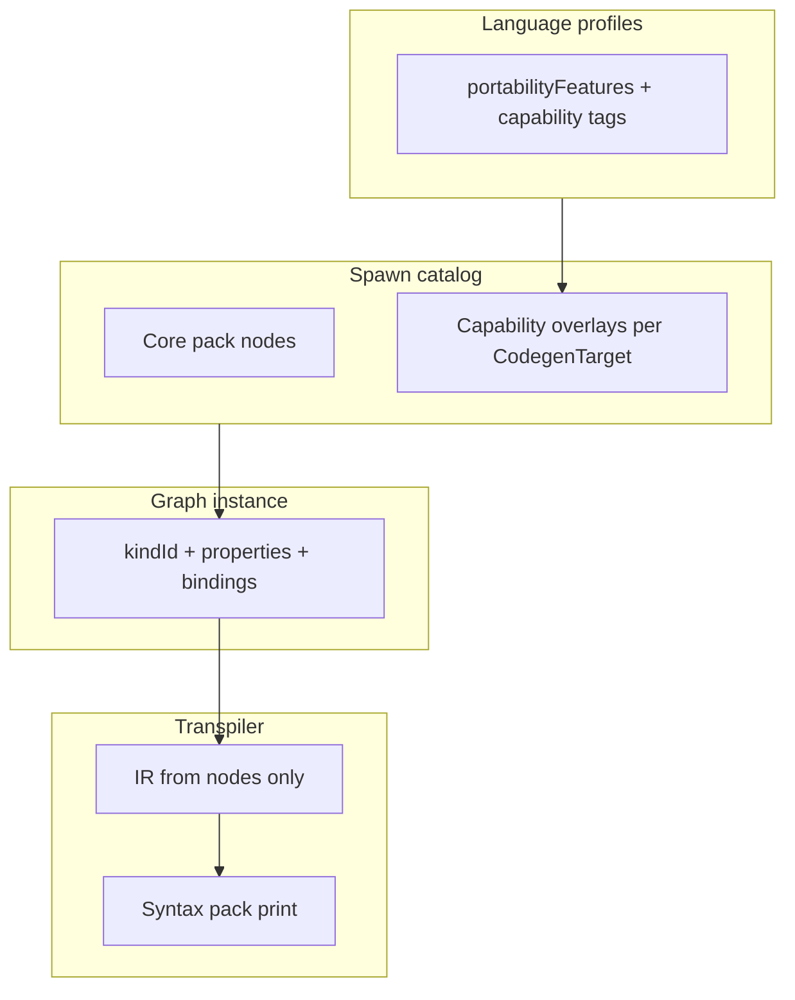

# Language capability catalog

**Status:** Living plan (July 2026) — drives unified, modular UI for all codegen targets.  
**Companion:** [language_neutral_vocabulary.md](language_neutral_vocabulary.md) · [terms_refactor_plan.md](terms_refactor_plan.md) · [node_system.md](../node_system.md) · [visual_to_text_fidelity.md](../visual_to_text_fidelity.md) · [language_profiles.md](../language_profiles.md)

---

## Purpose

VVS targets **seven pack-driven families** (python, javascript, cpp, verse, gdscript, rust, csharp) plus json preview. Languages differ in surface syntax and in **what members and expressions can express**. This document is the **single inventory** of those differences so we can:

1. Plan **one neutral UI** (spawn catalog, inspector, Project tree) that scales to every target.
2. Know which features need **new or extended canvas nodes** vs syntax-pack-only emission.
3. Track **usability example tests** that prove visual availability before we ship a capability.
4. Keep **AI / MCP agents** aligned — agents mutate graphs and registry data, never bypass canvas truth.

---

## Golden rule: canvas + registry are source of truth

```text
User / Agent
    → places nodes + inspector properties on graph JSON
    → dual-write define nodes when creating symbols from panels
    → Generate
    → transpiler lowers nodes → IR → syntax packs print text
```

| Rule | Meaning |
|------|---------|
| **No sidebar-only codegen** | `variables[]`, `functions[]`, `events[]` index CRUD; emitted declarations come from **Declare** nodes on the class home graph (`ir.members`). |
| **No implicit casts** | Use **Conversion** nodes on the graph; transpiler does not fold casts into Print/Set. |
| **Language options on nodes** | Visibility, `static`, overload sets, `const`, etc. live in **node `properties`** or symbol records that **mirror** define nodes — not hidden compiler flags. |
| **Syntax packs print only** | Packs emit idiomatic text for values already on the IR; they do not invent members the graph never declared. |
| **AI parity** | MCP tools (`list_syntax_packs`, graph/symbol CRUD, `run_rosetta_suite`) operate on the same JSON the editor saves. Agent prompts that "add a private method" must create **`function_define`** (Declare) + function tab + properties — not edit generated `.py` files. |

Strict errors that block Generate when fidelity breaks: `DEFINE_NODE_MISSING`, `DECLARATION_NOT_ON_CANVAS`, `ORPHAN_DEFINE_NODE`.

---

## Unified UI architecture (target)

Neutral vocabulary on canvas; **capability-aware** inspector and spawn catalog.



| Layer | Responsibility |
|-------|----------------|
| **Registry `propertySchema`** | Declares inspector fields (visibility, static, async, …) with neutral labels. |
| **Language profiles** | Which properties apply / warn / hide per `CodegenTarget`. |
| **Node effectiveness** | Dim or badge nodes ineffective for current target (planned — `terms_refactor_plan` V4). |
| **Usability example tests** | Fixed graphs that must compile and expose every shipped capability in the UI. |
| **Rosetta fixtures** | Pack-level golden strings; complement graph-driven tests. |

---

## Usability example test matrix

These fixtures live in `apps/web/src/lib/usabilityExampleTests/`. They are **not** tutorials — they regression-test **visual availability** and codegen fidelity.

| Fixture | File | Exercises today | Surfaces gaps for |
|---------|------|-----------------|-------------------|
| **Hello World** | `helloWorldUsabilityTest.ts` | Declare class, Declare entry event, On Start, Print | Entry event panel, handler spawn, highlight map |
| **Calculator** | `calculatorUsabilityTest.ts` | Member chain, vars, functions, custom events, Get User Input, Call, Dispatch, Branch, To String, multi-graph, `graph_ref`, second class | Overloads, visibility, static, lambdas, properties, generics, import options |

**Tests:** `calculatorUsabilityTest.test.ts`, `usabilityExampleSnapshots.test.ts`, `generate.test.ts`.

When a catalog row below moves to **Shipped**, add or extend a usability test assertion that the capability is set **on canvas** and appears in generated code.

---

## Capability catalog

**Columns:** `uiStatus` — `shipped` \| `partial` \| `planned` \| `n/a` (not applicable for target).  
**Node column:** registry `kindId` or planned id.  
**Families:** py, js, cpp, cs, rs, gd, verse (abbreviations).

### A — Member declaration (Declare chain)

| Capability | Neutral UI | Node / property | Families | uiStatus | Notes |
|------------|------------|-----------------|----------|----------|-------|
| Class / module shell | Declare Class `{name}` | `class_define` | all | shipped | `extendsType` on class + define node |
| Variable field | Declare `{name}` | `var_define` | all | shipped | type, default, binding |
| Function member | Declare `{name}` | `function_define` | all | shipped | links to function tab graph |
| Event member slot | Declare `{name}` | `event_member_define` | all | shipped | paired with On handler in flow |
| **Visibility** (public / private / protected) | Inspector on Declare nodes | `properties.visibility` on define kinds | cpp, cs, java-like, rs, gd | **planned** | C++ needs private `Add()`-style separation; calculator uses public-only today |
| **Static** vs instance | Modifier on Declare | `properties.static` | cpp, cs, java, py (@staticmethod path) | planned | Affects call syntax (`Type::` vs `self.`) |
| **Abstract** / pure virtual | Modifier on Declare function | `properties.abstract` | cpp, cs | planned | Emits `= 0` / `abstract` |
| **Override** / `virtual` | Modifier on Declare function | `properties.virtual`, `override` | cpp, cs, gd | planned | |
| **Const** / **readonly** field | Modifier on Declare var | `properties.const` | cpp, rs, cs | planned | |
| **Property** (getter/setter) vs field | Declare Property `{name}` | `property_define` (planned) | cs, cpp, gd | planned | Distinct from `var_define` when language has property syntax |
| **Function overload set** | One Declare node, N signatures in inspector | `function_define` + `overloads[]` on symbol | cpp, cs, rs | **partial** | Symbol model has `overloads[]`; UI does not expose multiple arities on one name yet |
| **Default parameter values** | Function tab entry pins / inspector | function graph + symbol metadata | py, cpp, cs, gd | partial | |
| **Return type** on Declare | Inspector | `returnType` on `function_define` | typed targets | partial | |
| **Constructor** | Declare Constructor | `constructor_define` (planned) | cpp, cs, rs | planned | Separate from `on_start` entry |
| **Destructor** | Declare Destructor | `destructor_define` (planned) | cpp | planned | |
| **Interface / trait impl** | Declare Implements | `implements_define` (planned) | cs, rs | planned | |
| **File extension per target** | Graph settings → **This graph** + **Project defaults** | `metadata.targetFileExtension` per graph; `targetFileExtensions` on snapshot for new graphs | all | **shipped** | User picks `.cpp`, `.hpp`, `.h`, etc.; code panel shows `.{ext}` beside language dropdown |
| **Per-graph codegen language** | Graph settings → **This graph**; code panel header | `metadata.targetLanguage` per graph; snapshot `targetLanguage` = default for new graphs | all | **shipped** | Multi-language projects: Calculator in Python, helper fn in Rust, etc. |
| **Generated files tree** | Output panel → **Files** tab | `useProjectTranspileResult` + `buildGeneratedFileTree` | all | **shipped** | Folder tree of all emitted paths; removed flat **Generated** list from project tree |

### B — Handlers & flow (On / Implement)

| Capability | Neutral UI | Node | Families | uiStatus | Notes |
|------------|------------|------|----------|----------|-------|
| Program entry | On Start | `event_define` + entry `events[]` | all | shipped | |
| Per-frame | On Update | `event_on_update` | game targets | shipped | |
| Custom event body | On `{name}` | `event_define` | all | shipped | |
| **Async** handler | Async toggle on On / function | `properties.async` | py, js, cs | planned | Emits `async def` / `async Task` |
| **Coroutine** / yield | Flow nodes | planned flow kinds | py, gd | planned | |

### C — Invoke (Call / Dispatch)

| Capability | Neutral UI | Node | Families | uiStatus | Notes |
|------------|------------|------|----------|----------|-------|
| Function call | Call `{name}` | `vvs.project.call_function` | all | shipped | |
| Event invoke | Dispatch `{name}` | `event_dispatch` | all | shipped | |
| **Static call** | Call on type name | call + `static` binding | cpp, cs | planned | |
| **Cross-class call** | Call after Import Class | `import_class` + Call | multi-class | partial | `CROSS_CLASS_CALL_WITHOUT_IMPORT` warning |
| **Super** / base call | Call Super | `super_call` (planned) | cpp, cs, py, gd | planned | |

### D — Expressions & data flow

| Capability | Neutral UI | Node | Families | uiStatus | Notes |
|------------|------------|------|----------|----------|-------|
| Explicit conversion | To String / To Number | `convert_*` | all | shipped | No implicit cast in Print/Set |
| User input | Get User Input | `action_get_input` | all | shipped | |
| Branch | Branch | `flow_branch` | all | shipped | |
| **Lambda / anonymous function** | Declare Lambda `{name}` or inline fn graph | `lambda_define` / `closure_define` (planned) | py, js, cs, rs | **planned** | Python `lambda x: x+1`; needs visible subgraph or pack-lowering from graph |
| **Closure capture** | Inspector on lambda | binding metadata | py, js, rs | planned | |
| **Null / optional** | Optional type + nodes | type system + `optional_*` | cs, rs | planned | |
| **Pattern matching** | Match node | `flow_match` (planned) | rs, py 3.10+, cs | planned | |
| **Try / catch** | Try region | `flow_try` (planned) | most | planned | |
| **Await** | Await node | `expr_await` (planned) | py, js, cs | planned | |
| Generics / templates | Type params on Declare | `type_params[]` | cpp, cs, rs | planned | `template<typename T>` / `fn foo<T>()` |

### E — Modules & imports

| Capability | Neutral UI | Node | Families | uiStatus | Notes |
|------------|------------|------|----------|----------|-------|
| Graph reference | Graph Reference | `graph_ref` | all | shipped | Organizational + future cross-graph |
| Import class | Import Class | `import_class` | multi-class | partial | |
| **Using / import statements** | Declare Import | `import_module` (planned) | py, js, cs, rs | planned | Must be Declare on canvas, not pack preamble |
| **Package visibility** | internal / pub | modifier on class | rs | planned | |

### F — Engine / environment (data-driven)

| Capability | Source | Families | uiStatus | Notes |
|------------|--------|----------|----------|-------|
| Godot lifecycle | `env.gdscript.godot-game` | gd | shipped | `_ready`, `_process` anchors |
| Console main | env pack (planned) | rs, cs | planned | `env.rust.console-app`, `env.csharp.console-app` |
| Verse / UE hooks | environment templates | verse | partial | |

---

## Per-language quick reference (special constructs)

Surface forms are owned by **syntax packs**; graph must still carry the decision.

| Construct | Python | JavaScript | C++ | C# | Rust | GDScript | Verse |
|-----------|--------|------------|-----|-----|------|----------|-------|
| Lambda | `lambda:` | `=>` | — | `=>` | `\|\|` closure | `func()` lambda | limited |
| Visibility | convention / `_` | `#` private fields | public/private/protected | same | `pub` / private | — | — |
| Overloading | — | — | yes | yes | yes | — | — |
| Properties | `@property` | getter/setter in object | — | `{ get; set; }` | — | `setget` | — |
| Static member | `@staticmethod` | `static` | `static` | `static` | `fn` in `impl` | `static func` | — |
| Async | `async def` | `async function` | coroutines (planned) | `async Task` | `async fn` | — | — |
| Module import | `import` | `import` | `#include` / module | `using` | `use` | `preload` | — |
| Inheritance | `class A(B)` | `extends` | `: public B` | `: B` | `impl Trait` | `extends` | — |

When adding a row to this table, add a matching **catalog §** entry with `uiStatus` and planned `kindId`.

---

## AI & agentic workflow

Users ask agents to change projects in natural language. Requirements:

| Principle | Implementation |
|-----------|----------------|
| **Same mutations as UI** | MCP graph/symbol tools; no direct file patch of generated source as primary path |
| **Fidelity gate** | Agent runs analyze + generate; surfaces `DEFINE_NODE_MISSING` etc. to user |
| **Capability awareness** | Agent reads this catalog + `language_profiles` before proposing "add private method" |
| **Pack changes** | `propose_syntax_delta` + `run_rosetta_suite` — not ad hoc string templates in transpiler |
| **Discover gaps** | Failing usability test = missing node or inspector field, not a one-off emit hack |

**Connect AI** modal exposes MCP URL; server tools must stay thin wrappers over pure functions (`vvs_backend_development` skill).

---

## Implementation workflow

For each **planned** catalog row:

1. **Registry** — add or extend `kindId`, `propertySchema`, semantics in `core-pack.json` (+ Go sync).
2. **Inspector** — neutral labels per `language_neutral_vocabulary.md`.
3. **Lowering** — IR member/expr shape from node properties only.
4. **Syntax pack** — print templates + Rosetta fixture lines.
5. **Profile** — mark capability supported / warn / hidden per family.
6. **Usability test** — set property on canvas in calculator (or new fixture); assert codegen + analyze clean.
7. **Docs** — update this row to `shipped`.

Phasing aligns with [terms_refactor_plan.md](terms_refactor_plan.md) (V0–V4) before unified symbol model Phase D/E.

---

## Related paths

| Artifact | Location |
|----------|----------|
| Usability fixtures | `apps/web/src/lib/usabilityExampleTests/` |
| StartScreen openers | `apps/web/src/lib/usabilityExampleProjects.ts` |
| Core node registry | `packages/syntax-registry/core-pack.json` |
| Language profiles | `packages/language-profiles/src/profiles.ts` |
| Capability tags | `packages/graph-types/src/codegenTarget.ts` |
| Agent skill | `.agents/skills/vvs_usability_example_tests/SKILL.md` |

---

## Changelog

| Date | Change |
|------|--------|
| 2026-07 | Per-graph codegen language + extension; project defaults for new graphs; Code \| Files output panel with folder tree; searchable selects + import graph pickers |
| 2026-07 | Initial catalog; renamed example templates → usability example tests; linked golden rule and AI workflow |
