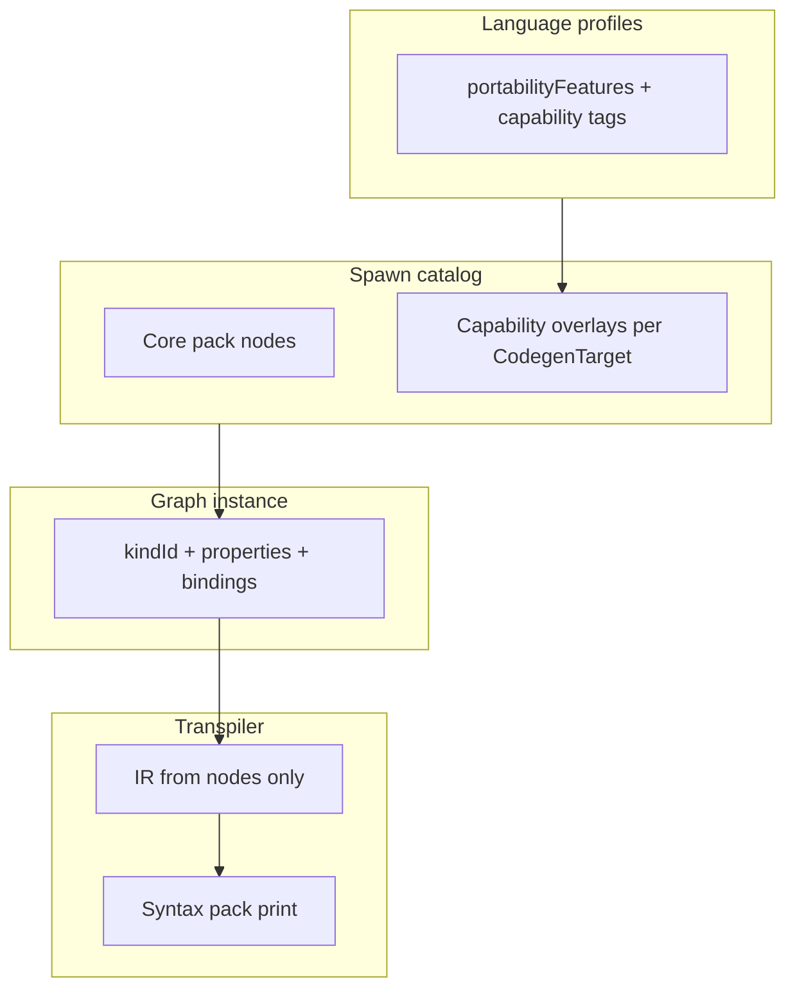

# Language capability catalog

**Status:** Living plan (July 2026) — drives unified, modular UI for all codegen targets.  
**Companion:** [language_neutral_vocabulary.md](language_neutral_vocabulary.md) · [terms_refactor_plan.md](terms_refactor_plan.md) · [fidelity_streamline.md](fidelity_streamline.md) · [node_system.md](../node_system.md) · [visual_to_text_fidelity.md](../visual_to_text_fidelity.md) · [language_profiles.md](../language_profiles.md)

---

## Purpose

VVS targets **eight pack-driven families** (python, javascript, cpp, verse, gdscript, rust, csharp, go) plus json preview. Languages differ in surface syntax and in **what members and expressions can express**. This document is the **single inventory** of those differences so we can:

1. Plan **one neutral UI** (spawn catalog, inspector, Project tree) that scales to every target.
2. Know which features need **new or extended canvas nodes** vs syntax-pack-only emission.
3. Track **usability example tests** that prove visual availability before we ship a capability.
4. Keep **AI / MCP agents** aligned — agents mutate graphs and registry data, never bypass canvas truth.

---

## Golden rule: canvas + registry are source of truth

```text
User / Agent
    → places nodes + inspector properties on graph JSON
    → dual-write define nodes when creating symbols from panels
    → Generate
    → transpiler lowers nodes → IR → syntax packs print text
```

| Rule | Meaning |
|------|---------|
| **No sidebar-only codegen** | `variables[]`, `functions[]`, `events[]` index CRUD; emitted declarations come from **Declare** nodes on the class home graph (`ir.members`). |
| **No implicit casts** | Use **Conversion** nodes on the graph; transpiler does not fold casts into Print/Set. |
| **Language options on nodes** | Visibility, `static`, overload sets, `const`, etc. live in **node `properties`** or symbol records that **mirror** define nodes — not hidden compiler flags. |
| **Syntax packs print only** | Packs emit idiomatic text for values already on the IR; they do not invent members the graph never declared. |
| **AI parity** | MCP tools (`list_syntax_packs`, graph/symbol CRUD, `run_rosetta_suite`) operate on the same JSON the editor saves. Agent prompts that "add a private method" must create **`function_define`** (Declare) + function tab + properties — not edit generated `.py` files. |

Strict errors that block Generate when fidelity breaks: `DEFINE_NODE_MISSING`, `DECLARATION_NOT_ON_CANVAS`, `ORPHAN_DEFINE_NODE`.

---

## Unified UI architecture (target)

Neutral vocabulary on canvas; **capability-aware** inspector and spawn catalog.


```mermaid
flowchart TB
  subgraph catalog ["Spawn catalog"]
    Core["Core pack nodes"]
    Cap["Capability overlays per CodegenTarget"]
  end

  subgraph instance ["Graph instance"]
    Node["kindId + properties + bindings"]
  end

  subgraph profiles ["Language profiles"]
    LP["portabilityFeatures + capability tags"]
  end

  subgraph emit ["Transpiler"]
    IR["IR from nodes only"]
    Pack["Syntax pack print"]
  end

  catalog --> Node
  profiles --> Cap
  Node --> IR --> Pack
```

| Layer | Responsibility |
|-------|----------------|
| **Registry `propertySchema`** | Declares inspector fields (visibility, static, async, …) with neutral labels. |
| **Language profiles** | Which properties apply / warn / hide per `CodegenTarget`. |
| **Node effectiveness** | Dim or badge nodes ineffective for current target (planned — `terms_refactor_plan` V4). |
| **Usability example tests** | Fixed graphs that must compile and expose every shipped capability in the UI. |
| **Rosetta fixtures** | Pack-level golden strings; complement graph-driven tests. |

---

## Usability example test matrix

These fixtures live in `apps/web/src/lib/usabilityExampleTests/`. They are **not** tutorials — they regression-test **visual availability** and codegen fidelity.

| Fixture | File | Exercises today | Surfaces gaps for |
|---------|------|-----------------|-------------------|
| **First Graph** | `firstGraphUsabilityTest.ts` | Simple StartScreen test — Declare → Get User Input → Print → Call | Newcomer path, function tab |
| **Coverage Lab** | `coverageLabUsabilityTest.ts` | **Primary golden** — Machine+Sensor one graph; modifiers; enum/switch/array; **shared imports once at file top** + conditional Import json in branch; event Y order; Get User Input; one graph → one file | Class shell, inheritance, enum access, import placement, Code panel single home module |
| Calculator / Async Fetcher / Dual Class Lab | *(retired as StartScreen cards)* | Historical migration narrative only | See Coverage Lab |

**Verify as the user sees:** `bun apps/web/scripts/extract_test_project_outputs.ts` → `apps/web/test_project_outputs/` (mirrors Code | Files).

**Tests:** `coverageLabUsabilityTest.test.ts`, `firstGraphUsabilityTest.ts`, `usabilityExampleSnapshots.test.ts`, `generate.test.ts`, `calculatorModifierRollout.test.ts`.

When a catalog row below moves to **Shipped**, add or extend a usability test assertion that the capability is set **on canvas** and appears in generated code.

---

## Capability catalog

**Columns:** `uiStatus` — `shipped` \| `partial` \| `planned` \| `n/a` (not applicable for target).  
**Node column:** registry `kindId` or planned id.  
**Families:** py, js, cpp, cs, rs, gd, verse (abbreviations).

### A — Member declaration (Declare chain)

| Capability | Neutral UI | Node / property | Families | uiStatus | Notes |
|------------|------------|-----------------|----------|----------|-------|
| Class / module shell | Declare Class `{name}` | `class_define` | all | shipped | `extendsType` on class + define node; extras on `extendsTypes`. Generate prints all Extends rows for python/cpp; others first parent. Extends is a **list** (locked visual). See [Multiple inheritance](#multiple-inheritance-locked-visual). |
| Component (game-talk) | same as Declare Class | `class_define` + field or Extends | all | **locked** | Not a second construct. See [Component = Class](#component--class). U103 closed. |
| Inheritance / Extends | Extends list on Declare Class | `class_define` Extends rows | py, cpp (two class rows); cs one class + Implements; js/gd/verse one; go/rs hidden | **partial** | List UI shipped. Generate prints all Extends rows for python/cpp; others first parent / stored only. C# extra types belong on Implements (shipped); Extends extras are not auto-moved. See [Multiple inheritance](#multiple-inheritance-locked-visual). |
| Variable field | Declare `{name}` | `var_define` | all | shipped | **TypeRef** (builtin / enum / class / array / map); legacy `enumType` migrates |
| Function member | Declare `{name}` | existence / signature / abstract | all | **shipped (U81)** | `function_define` — no method without Define (except abstract) |
| Function body place | Define `{name}` | body insert at chain position | all | **shipped (U81)** | `function_implement` on member chain + Edit function body tab |
| Event member slot | Declare `{name}` | `event_member_define` | all | shipped | paired with On handler in flow |
| **Enum declaration** | Declare Enum | `enum_define` | all | shipped | members on node; Dual Class Lab |
| **Enum-typed field** | Type picker → enum | `VariableSymbol.typeRef` `{ kind: 'enum' }` | all | **shipped** | Default = member name (`OK`); emit via pack `EnumMemberAccess` |
| **Class-typed field** | Type picker → class | `typeRef` `{ kind: 'class' }` | all | **shipped** | Dual Class Lab `Host: Machine` |
| **Typed Array / Map** | Type picker → `list[T]` / `dict[K,V]` | `typeRef` `{ kind: 'array'\|'map' }` | all | **shipped** | Dual Class Lab `Readings: list[float]` → `std::vector<float>` |
| Visibility (public / private / protected) | Details / symbol panels (`PropertySchemaPanel`) | `properties.visibility` on define kinds | cpp, cs, java-like, rs, gd, verse | **shipped** | C++ access sections; C# keywords; Rust `pub`; Verse `<public>`/`<private>`; JS `#` private — Dual Class Lab goldens |
| **Static** vs instance | Modifier on Declare | `properties.binding` (`static`) | cpp, cs, java, py, js, gd | **shipped** | C++ `inline static`; C#/JS/GDScript `static`; Python `@staticmethod` when set |
| **Abstract** / pure virtual | Modifier on Declare function | `properties.isAbstract` | cpp, cs | **shipped** | C++ `virtual … = 0`; C# `abstract` prototype (no body); do **not** invent class `abstract` |
| **Override** / `virtual` | Modifier on Declare function | `properties.isVirtual`, `isOverride` | cpp, cs, verse | **shipped** | Emit only when toggled on the node; ineffective langs omit keywords |
| **Const** / **readonly** field | Modifier on Declare var | `properties.isConst` | cpp, rs, cs | **shipped** (cpp/cs/rs when set) | C++ `const`; C# `readonly`; Rust `const` — only when node property set |
| **Property** (getter/setter) vs field | option on field / Function — not a node | property option on `var_define`; `@property` option on Function (py) | cs, gd; py `@property` on Function | planned | Not `property_define`. C# / GDScript `setget`: field written as property. Python `@property`: option on Function. C++ has no language property. |
| **Function overload set** | One Declare node, N signatures in inspector | `function_define` + `overloads[]` on symbol | cpp, cs, rs | **partial** | Symbol model has `overloads[]`; UI does not expose multiple arities on one name yet |
| **Default parameter values** | Function tab entry pins / inspector | function graph + symbol metadata | py, cpp, cs, gd | partial | |
| **Return type** on Declare | Inspector | `returnType` | typed targets | **planned** | Stored on overloads for future emit; UI removed until signatures are non-void |
| **Constructor** | Function Define + `role: constructor` | `function_define` / `function_implement` + **role** option | cpp, cs, js, py, gd | shipped | Same pattern as On `role: entry\|tick`. Not `constructor_define`. Spawn only where you type one: C++ ctor, C# ctor, JS `constructor`, Python `__init__`, GDScript `_init`. Rust `new` is a normal function (do not invent `impl Default`). Go has none. Super/init call stays `isSuper` on Call. |
| **Destructor** | Function Define + `role: destructor` | `function_define` / `function_implement` + **role** option | cpp (and langs that type one) | shipped | Not `destructor_define`. Spawn only where the language has a destructor. |
| **Interface / trait** | Class + `form` option; Implements list | `class_define` + `form: class\|interface\|trait`; `implementsTypes` on class + define node | cs, rs (form + Implements); others hidden / stored-not-printed | **shipped** | Not `implements_define`. C# `class Child : Base, IFoo` (Extends first parent, then Implements) or `interface IFoo`. Rust `pub trait` when form=trait; `impl Trait for Type` only when Implements has names (no invented `impl Default`). C++ stays abstract Class + `isAbstract`. Python/JS stay Class; Implements not printed. Extends extras are not auto-migrated to Implements. |
| **File extension per target** | Code panel **LanguageExtensionMenu** (hover submenu); graph settings defaults | `metadata.targetFileExtension` per graph; `targetFileExtensions` on snapshot for new graphs | all | **shipped** | Language-only click → first extension; hover submenu for `.cpp` / `.hpp` / etc. |
| **Per-graph codegen language** | Code panel top bar + graph settings | `metadata.targetLanguage` per graph; snapshot `targetLanguage` = default for new graphs | all | **shipped** | Multi-language projects: Calculator in Python, helper fn in Rust, etc. |
| **Generated files tree** | Output panel → **Files** tab | `useProjectTranspileResult` + `buildGeneratedFileTree` | all | **shipped** | Folder tree of all emitted paths; removed flat **Generated** list from project tree |


### Component = Class (locked)

Game-talk “component” is **not** a second VVS construct. A “Health / Inventory component” is a **Class**: **Declare Class** (`class_define`) plus either a **field** (composition) or **Extends**.

Same **node vs option vs pin** test: you do not type `component` in Python / JavaScript / Go / Rust / C++ / C#. You type a class or struct and a member, or `extends`. Host-only types (Unreal `UActorComponent`, Unity `MonoBehaviour`) stay in that host pack later — do not leak them onto the language canvas.

**Do not spawn a Component node.** There is no `component_define`. **U103 is closed** as this lock.

#### Health on Enemy (all eight shipped languages)

What you would type — `Health` composed onto `Enemy`.

**Python**

```python
class Health:
    hp: int = 100

class Enemy:
    def __init__(self):
        self.health = Health()
```

**JavaScript**

```javascript
class Health {
  hp = 100
}
class Enemy {
  constructor() {
    this.health = new Health()
  }
}
```

**C++**

```cpp
class Health { public: float hp = 100; };
class Enemy { Health health; };
```

**C#**

```csharp
class Health { public float Hp = 100; }
class Enemy { public Health health = new(); }
```

**Rust**

```rust
struct Health { hp: f32 }
struct Enemy { health: Health }
```

**GDScript**

```gdscript
class_name Health
var hp := 100

class_name Enemy
extends Node
var health := Health.new()
```

**Verse** (class + class-typed field; no invented player/device APIs)

```
health := class:
    hp: float = 100.0

enemy := class:
    Health: health
```

**Go**

```go
type Health struct{ HP int }
type Enemy struct{ Health }
```


### Multiple inheritance (locked visual)

Text-shaped: you type `class Child(Parent, Mixin)` / `class Child : public Parent, public Mixin`. The construct is still **one Declare Class**. Extra bases are more **Extends rows**, not a new node and not inheritance wires.

**Visual**

- Declare Class card: Extends is a **list** (UI shipped). Multiple inheritance = a second row (`+ Add base`, Python/C++ only). Generate prints all Extends rows for python/cpp; other languages still print the first parent only (extras stay stored).
- Each row: type picker. C++ also: public/protected/private + virtual on that row.
- **Implements** is a **second list** (interfaces/traits), already locked as a Class option. C# extra types go here, not as a second class Extends.
- Member chain / Project tree: inherited members from **every** base, dimmed, `from {Class}` chip, Get/Set/Call (U106 pattern).
- Call Super with two **class** bases: which-base choice on that Call (Python/C++ only). Still `isSuper`, not a Super node.
- References may draw a type tree as **navigation**. Generate reads the Extends list on the class node, not the picture.
- Diamond is not a node. Python MRO is implicit. C++ `virtual` is the checkbox on the Extends row.

**Language gate** (same as Function Declare / Constructor spawn)

- **Two class Extends rows:** Python, C++ only.
- **C#:** one class Extends + Implements list.
- **JS, GDScript, Verse:** one Extends. No "Add base".
- **Go, Rust:** Extends list hidden. Composition is fields (Component = Class). Rust traits = Implements.
- Extra Extends rows in a no-MI language dim / do not spawn.

**Do not add:** Inherit node, Multiple Inheritance node, Blueprint parent wires as source of truth, `implements_define` kind.

**Honesty:** extras are stored on `extendsTypes` (`[0]` mirrors `extendsType`). Generate now prints all Extends rows for **python** (`class Child(Parent, Mixin):`) and **cpp** (`class Child : public Parent, public Mixin`). javascript / gdscript / verse / csharp still print the first parent only — C# Extends stays first parent; Implements names print after it (`class Child : Base, IFoo`). C# extras already stored on `extendsTypes` are not auto-migrated to Implements. go / rust Extends list stays hidden. Super / inherited Get-Set-Call stay first-parent only. No which-base picker.

#### Child(Parent, Mixin) — Python and C++ only

**Python**

```python
class Child(Parent, Mixin):
    pass
```

**C++**

```cpp
class Child : public Parent, public Mixin {};
```

One Declare Class. Two Extends rows (`Parent`, `Mixin`). Not a second node.

### Leftover constructs (locked roles)

Node vs option vs pin still governs. Spawn a construct only where the language actually has it (same rule as Function Declare).

1. **Constructor / destructor** — Function Define with a **role** option (`constructor` / `destructor`), same pattern as On `role: entry|tick`. Not `constructor_define` / `destructor_define`. Spawn Constructor only where you type one: C++ ctor, C# ctor, JS `constructor`, Python `__init__`, GDScript `_init`. Rust `new` is a normal function (do not invent `impl Default`). Go has none. Super/init call stays `isSuper` on Call. Locked model; emit shipped for python / javascript / cpp / csharp / gdscript constructors and C++ destructor. Rust, Go, and Verse constructor/destructor stay dim (no invented APIs).

   Example: Python `def __init__(self):` is Function Define `role: constructor`, not a Constructor node.

2. **Interface / trait** — Class symbol + **form** option (`class` | `interface` | `trait`). **Implements** is an option on Class, like Extends (list). Not `implements_define`. **Shipped:** C# form + Implements emit; Rust form=trait + `impl Trait for Type` when Implements has names. C++ stays abstract Class + `isAbstract`. Python stays Class. JS emit has no interface.

   Example: C# `interface IFoo` is Class `form: interface`; `class Bar : IFoo` is Implements on Class.

3. **Lambda** — a **node** (expression). You type `lambda` / `=>` / `|x|`. Not a project symbol. Capture is an **option** on that node, not a second `closure_define`. Kind: `lambda_define` (shipped; spawn python / javascript / csharp / rust / gdscript).

   Example: JS `x => x + 1` is a Lambda node with a capture option, not `closure_define`.

4. **Try / catch** — a **flow node** like Branch (`flow_try`, shipped). Catch / finally are exec pins. Empty finally is omitted in print. Spawn python / javascript / cpp / csharp / gdscript. Do **not** spawn in Go or Rust (no try).

   Example: Python `try` / `except` / `finally` is one Try node with catch and finally exec pins.

5. **Property** — an **option**, not `property_define`. C# / GDScript `setget`: field written as property. Python `@property`: option on Function. C++ has no language property.

   Example: C# `public int Hp { get; set; }` is a field with a property option.

6. **Generics** — `type_params[]` **option** on Class or Function. Not a node.

   Example: C++ `template<typename T>` is `type_params[]` on Class or Function.

7. **Package visibility** — already a visibility option on Class. Not a node.

   Example: Rust `pub(crate)` is Class visibility, not a Package node.

8. **Static call** — existing Call + type-name callee + static binding. Not a new kind. Mark the planned “Static call” row as this model (shipped-as-Call or planned-as-option, not a new node).

   Example: C# `Math.Abs(x)` is Call with a type-name callee + static binding.

9. **Pattern matching** — Switch is the node. Native match/switch lowering is shipped where the language has it: Python `match` / `case` / `case _`; Rust `match` on value-equality cases; C# / JS / C++ already emit `switch`. GDScript / Go / Verse keep the shipped if-cascade (or comment). Drop planned `flow_match` as a kind. Do not add a Match node.

   Example: Rust `match x { ... }` lowers from Switch (CL-017), not `flow_match`.

10. **GetInput** — already a node (`action_get_input`); Verse stays honest `(x)`. No new symbol/option.

11. **Component** — already locked as Class. Do not reopen. See [Component = Class](#component--class).

12. **Multiple inheritance** — extra Extends rows on one Declare Class. Not an Inherit / Multiple Inheritance node. See [Multiple inheritance](#multiple-inheritance-locked-visual).

13. U93 / Library / UE / collab — not constructs. Do not add catalog rows.

### B — Handlers & flow (On / Implement)

| Capability | Neutral UI | Node | Families | uiStatus | Notes |
|------------|------------|------|----------|----------|-------|
| Program entry | On Start | `event_define` + entry `events[]` | all | shipped | |
| Per-frame | On Update | `event_define` + `role: tick` | game targets | shipped | Do not spawn `event_on_update` |
| Custom event body | On `{name}` | `event_define` | all | shipped | |
| **Async** handler | `isAsync` option on On / function / Wait | `properties.isAsync` | py, js, cs | shipped | Emits `async def` / `async Task`; C++/Go/Verse/GDScript function async dimmed (CL-018) |
| **Coroutine** / yield | Yield | `yield_stmt` | py, gd | shipped | Statement node where you type `yield`. Spawn python / gdscript. Hidden on cpp / js / cs / go / rust / verse. Optional empty value = bare `yield`. Function Define `isGenerator` is stored; Python `def` is enough. |

### C — Invoke (Call / Dispatch)

| Capability | Neutral UI | Node | Families | uiStatus | Notes |
|------------|------------|------|----------|----------|-------|
| Function call | Call `{name}` | `vvs.project.call_function` | all | shipped | |
| Event invoke | Dispatch `{name}` | `event_dispatch` | all | shipped | |
| **Static call** | Call + type-name callee + static binding | existing Call (`vvs.project.call_function`) — shipped-as-Call / planned-as-option | cpp, cs | planned-as-option | Not a new kind. This row is the Call + static-binding model, not a new node. |
| **Cross-class call** | Call after Import Class | `import_class` + Call | multi-class | shipped | `CROSS_CLASS_CALL_WITHOUT_IMPORT` warning |
| **Cross-class dispatch** | Dispatch after Import Class | `import_class` + Dispatch | multi-class | shipped | `CROSS_CLASS_DISPATCH_WITHOUT_IMPORT`; same-graph multi-class OK; inherited → `self` |
| **Super** / base call | `isSuper` option on Call / Dispatch | `properties.isSuper` | cpp, cs, py, gd, rs, js, vs, go | shipped | Idiomatic super/base emit; chip only when Extends is set. Two **class** bases: which-base choice on that Call (Python/C++ only). Still `isSuper`, not a Super node. |

### D — Expressions & data flow

| Capability | Neutral UI | Node | Families | uiStatus | Notes |
|------------|------------|------|----------|----------|-------|
| Explicit conversion | To String / To Number | `convert_*` | all | shipped | No implicit cast in Print/Set |
| User input | Get User Input | `action_get_input` | all | shipped | Already a node; Verse stays honest `(x)`. No new symbol/option. |
| Branch | Branch | `flow_branch` | all | shipped | |
| Switch | Switch | `flow_switch` | all | shipped | Enum type from canvas `enum_define`; member case labels → `EnumMemberAccess` |
| **Get Enum Member** | Get Enum Member | `expr_enum_member` | all | **shipped** | properties `enumName` + `member`; pure data pin |
| **Lambda / anonymous function** | Lambda expression node | `lambda_define` — not a project symbol | py, js, cs, rs, gd | **shipped** | You type `lambda` / `=>` / `\|x\|`. Capture is an **option**. Drop `closure_define`. |
| **Closure capture** | option on the Lambda node | capture option on `lambda_define` | py, js, rs | shipped | Not a second `closure_define` kind. Rust emit uses `move` when set. |
| **Null / optional** | Optional type + nodes | type system + `optional_*` | cs, rs | planned | |
| **Pattern matching** | Switch is the node | `flow_switch` + native match lowering (CL-017) | rs, py 3.10+ | **shipped** | Python `match` / Rust `match`. C# / JS / C++ keep `switch`. Drop planned `flow_match`. Do not add a Match node. |
| **Try / catch** | Try flow node (like Branch) | `flow_try`; catch / finally are exec pins | py, js, cpp, cs, gd | **shipped** | Not a symbol. Do **not** spawn in Go or Rust. Empty finally omitted. |
| **Await** | Wait `isAsync` option (or function async flag) | `action_wait` | all 8 packs | shipped | No `expr_await` node; C++/Rust keep std thread sleep; Verse `Sleep` |
| Generics / templates | `type_params[]` **option** on Class or Function | option — not a node | cpp, cs, rs | planned | `template<typename T>` / `fn foo<T>()`. Not a node. |

### E — Modules & imports

| Capability | Neutral UI | Node | Families | uiStatus | Notes |
|------------|------------|------|----------|----------|-------|
| Graph reference | Graph Reference | `graph_ref` | all | shipped | Project-map navigation only -- not in the spawn catalog |
| Import class | Import Class | `import_class` | multi-class | partial | |
| **Using / import statements** | Import Module | `vvs.project.import_module` | py, js, cs, rs, cpp | **shipped** | `modulePath` + `importStyle` + `importNames` + **`targetLanguages`**; place **once at file top**; flow Import for conditional (Python `import json`); optional `ownerClassId`. Coverage Lab: iostream/string/vector/unordered_map (cpp), System + Collections.Generic (csharp), enum + conditional json (python) |
| **Package visibility** | visibility option on Class | `properties.visibility` on `class_define` | rs | planned | Already a visibility option on Class. Not a node. |

### F — Engine / environment (data-driven)

| Capability | Source | Families | uiStatus | Notes |
|------------|--------|----------|----------|-------|
| Godot lifecycle | `env.gdscript.godot-game` | gd | shipped | `_ready`, `_process` anchors |
| Console main | env pack (planned) | rs, cs | planned | `env.rust.console-app`, `env.csharp.console-app` |
| Verse / UE hooks | environment templates | verse | partial | |

---

## Per-language quick reference (special constructs)

Surface forms are owned by **syntax packs**; graph must still carry the decision.

| Construct | Python | JavaScript | C++ | C# | Rust | GDScript | Verse |
|-----------|--------|------------|-----|-----|------|----------|-------|
| Lambda | `lambda:` | `=>` | — | `=>` | `\|\|` closure | `func()` lambda | limited |
| Visibility | convention / `_` | `#` private fields | public/private/protected | same | `pub` / private | — | — |
| Overloading | — | — | yes | yes | yes | — | — |
| Properties | `@property` | getter/setter in object | — | `{ get; set; }` | — | `setget` | — |
| Static member | `@staticmethod` | `static` | `static` | `static` | `fn` in `impl` | `static func` | — |
| Async | `async def` | `async function` | coroutines (planned) | `async Task` | `async fn` | — | — |
| Module import | `import` | `import` | `#include` / module | `using` | `use` | `preload` | — |
| Inheritance | `class A(B)` | `extends` | `: public B` | `: B` | `impl Trait` | `extends` | — |
| Component | same as Class (`class_define`) + field or Extends — not a separate node | same as Class (`class_define`) + field or Extends — not a separate node | same as Class (`class_define`) + field or Extends — not a separate node | same as Class (`class_define`) + field or Extends — not a separate node | same as Class (`class_define`) + field or Extends — not a separate node | same as Class (`class_define`) + field or Extends — not a separate node | same as Class (`class_define`) + field or Extends — not a separate node |

When adding a row to this table, add a matching **catalog §** entry with `uiStatus` and planned node or option (not a leftover-construct kind id). Go (8th family, not a column above): Component is the same lock — struct + field or embed; no Component node. Leftover constructs (constructor, interface, lambda, try, property, generics, package visibility, static call, pattern match) are locked roles — see [Leftover constructs](#leftover-constructs-locked-roles). Inheritance / Extends is list-shaped (locked visual): two class Extends rows for Python and C++ only; C# extra types are Implements; generate prints all Extends rows for python/cpp and first parent elsewhere — see [Multiple inheritance](#multiple-inheritance-locked-visual).

---

## AI & agentic workflow

Users ask agents to change projects in natural language. Requirements:

| Principle | Implementation |
|-----------|----------------|
| **Same mutations as UI** | MCP graph/symbol tools; no direct file patch of generated source as primary path |
| **Fidelity gate** | Agent runs analyze + generate; surfaces `DEFINE_NODE_MISSING` etc. to user |
| **Capability awareness** | Agent reads this catalog + `language_profiles` before proposing "add private method" |
| **Pack changes** | `propose_syntax_delta` + `run_rosetta_suite` — not ad hoc string templates in transpiler |
| **Discover gaps** | Failing usability test = missing node or inspector field, not a one-off emit hack |

Hosted agent is the in-page TS **Agent** panel (live canvas). Optional Go sidecar tools must stay thin wrappers over pure functions (`vvs_backend_development` skill).

---

## Implementation workflow

For each **planned** catalog row:

1. **Registry** — add or extend `kindId`, `propertySchema`, semantics in `core-pack.json` (+ Go sync).
2. **Inspector** — neutral labels per `language_neutral_vocabulary.md`.
3. **Lowering** — IR member/expr shape from node properties only.
4. **Syntax pack** — print templates + Rosetta fixture lines.
5. **Profile** — mark capability supported / warn / hidden per family.
6. **Usability test** — set property on canvas in calculator (or new fixture); assert codegen + analyze clean.
7. **Docs** — update this row to `shipped`.

Phasing aligns with [terms_refactor_plan.md](terms_refactor_plan.md) (V0–V4) before unified symbol model Phase D/E.

---

## C++ / Coverage Lab pilot (shipped — July 2026)

**Active fidelity program:** [fidelity_streamline.md](fidelity_streamline.md) · **Pilot fixture:** Coverage Lab (`coverageLabUsabilityTest.ts`).

**Goal:** 1:1 visual↔text fidelity for class shell + member modifiers + **canvas member order = source order**, proven on **Coverage Lab** (Machine + Sensor, one graph). Calculator / Dual Class Lab filenames retired as StartScreen fixtures.

### Success criteria (Coverage Lab — Machine module)

| Canvas | Expected C++ |
|--------|----------------|
| `class_define` Machine | `class Machine { … };` |
| Power `protected` | under `protected:` as typed field |
| Serial `static` + `public` | `inline static float Serial = …;` |
| MaxPower `const` + `public` | `const float MaxPower = …;` |
| Boot `virtual` + `public` | `virtual void Boot() { … }` |
| Shutdown `public` (`isAsync` set but **ineffective** for C++) | `void Shutdown() { … }` — no async keyword |
| Diagnose `abstract` + `protected` | `virtual void Diagnose() = 0;` |
| Event Declare + On | `void on_pulse` / `on_start` bodies (Y order among event peers); no `// Declare` noise |
| Member chain order | fields → Boot → Diagnose → Shutdown → events by canvas **Y** among peers (Coverage Lab: pulse above start) |
| Every line | `sourceMap` → canvas `nodeId` |

### Progressive confirmation (C++ before “shipped”)

1. Graph/UI — property on define node (`PropertySchemaPanel` / `propertySchema`)
2. Syntax pack — `cpp.base.json` template slots only (no inventing members)
3. Backend — JSON passthrough (no special-case schema)
4. Coverage Lab golden — **Code panel path** (`extract_test_project_outputs.ts` / `useProjectTranspileResult`) matches expected C++ for both Machine and Sensor files
5. Source map — selecting the node highlights the right line(s)

**Verify as the user sees:** never ship on raw `transpileGraph` dumps alone when multi-class or integration `moduleFile` is involved.
### Emit anti-patterns (do not ship)

| Anti-pattern | Location (known) | Correct behavior |
|--------------|------------------|------------------|
| Force class `abstract` because a member is abstract | `emit/classModule.ts` (C#) | Only `class_define.properties.isAbstract` |
| Always emit opening `public:` | `ClassPublicSection` | Emit access section only when visibility **changes** |
| Invent `impl Default` / hidden wrappers | `emit/classModule.ts` (Rust) | Rust `new` is a normal function — do not invent `impl Default`. Constructor is Function `role`, only where the language types one; omit if none. |
| Hardcode event `visibility: 'public'` | `emit/shell.ts` | Use `member.properties.visibility` |
| Always emit Verse `<override>` on events | `emit/shell.ts` | Only when `isOverride` |
| Inject `async` from body | `functionNeedsAsync` | **Removed** — async only from define-node `isAsync` |
| Hardcoded `float`/`f64` param types | `shell.ts` / `members.ts` | Pin / symbol types via `emitTypes.typeNameForPin` |
| `#include` / imports without Import node | any emit path | Explicit Import Declare on canvas |
| Two-phase declare stubs then bodies | (removed) | `appendIrMembersInOrder` only |
| Auto-open class shell from field/method | `classModule.ts` | Shell opens **only** on `ClassDecl` |
| Invent `public` when visibility unset | `resolveModifierSlots` | Unset omits keyword |

### Out of scope / follow-ons

- `#include <iostream>` without Import node
- Python switch case labels still use `Enum::MEMBER` text from canvas (not `Enum.MEMBER`)
- Symbol-panel modifiers still ungated by effectiveness table
- Hiding ineffective modifiers from schema (keep visible; **disable** in UI)

### PR sequence

1. **Docs/skills** (this section) — locked direction
2. **Golden + strip emit magic** — failing C++ assert; remove shared inventing paths
3. **C++ modifier fidelity** — access sections + keywords match calculator; tests green
4. **modifierEffectiveness UI** — disable ineffective fields in `PropertySchemaPanel.tsx`
5. **Rollout** — C# → Python → JS → Rust → GDScript → Verse using the same table

Agent skills: `vvs_cross_language_mapping` (parent + one `<lang>.md` per target), `vvs_visual_code_fidelity`, `vvs_transpiler_development`, `vvs_usability_example_tests`.

---

## Modifier effectiveness (language-aware UI)

**Policy:** Neutral `propertySchema` stays on define nodes for all targets. For the **current graph/project codegen language**, chips that do not affect generated code are **visible but disabled** (tooltip: not used for this language) — educational, not silent.

| Modifier key | cpp | csharp | python | javascript | rust | gdscript | verse | go |
|--------------|-----|--------|--------|------------|------|----------|-------|-----|
| `visibility` | effective | effective | ineffective | partial (`#` private) | effective (`pub`/omit) | ineffective | partial | ineffective |
| `binding` (static) | effective | effective | effective (`@staticmethod`) | effective | effective (no `self`) | effective | ineffective | ineffective |
| `isConst` | effective | effective | ineffective | ineffective | effective | ineffective | partial | ineffective |
| `isVirtual` | effective | effective | ineffective | ineffective | ineffective | ineffective | ineffective | ineffective |
| `isAbstract` | effective | effective | ineffective | ineffective | ineffective | ineffective | ineffective | ineffective |
| `isOverride` | effective | effective | ineffective | ineffective | ineffective | ineffective | effective | ineffective |
| `isAsync` | **ineffective** (coroutines planned) | effective | effective | effective | effective | ineffective | ineffective | ineffective |

**Policy (July 2026):** Show options that work for **≥1** language; disable for current language when ineffective. Remove schema/UI options that never change emit for any language (e.g. var virtual/abstract/override, event binding/abstract, get-input placeholder/required/password, function returnType until emit uses it).

**Implementation:** `packages/language-profiles` `modifierEffectiveness` + `apps/web/src/components/layout/RightSidebar/PropertySchemaPanel.tsx`. Same table gates Progressive Confirmation step 2.
Catalog §A rows for visibility / static / abstract / virtual / const / async move to **shipped** for a family only after that family’s calculator golden passes and chips disable correctly for `ineffective` keys.

---

## Related paths

| Artifact | Location |
|----------|----------|
| Usability fixtures | `apps/web/src/lib/usabilityExampleTests/` |
| StartScreen openers | `apps/web/src/lib/usabilityExampleProjects.ts` |
| Core node registry | `packages/syntax-registry/core-pack.json` |
| Language profiles | `packages/language-profiles/src/profiles.ts` |
| Capability tags | `packages/graph-types/src/codegenTarget.ts` |
| Node / Details modifiers | `apps/web/src/components/layout/RightSidebar/PropertySchemaPanel.tsx` |
| Agent skill | `.agents/skills/vvs_usability_example_tests/SKILL.md` |
| Cross-language emit map | `.agents/skills/vvs_cross_language_mapping/SKILL.md` (+ one of `cpp.md` / `python.md` / …) |

---

## Changelog

| Date | Change |
|------|--------|
| 2026-08-17 | **Implements list + Class form shipped** -- `form` (`class`/`interface`/`trait`) + `implementsTypes` on Class / `class_define`. C# `class Child : Base, IFoo` or `interface IFoo`; Rust `pub trait` + `impl Trait for Type` when Implements has names. Analyzer missing-target + cycle (picker). Extends extras not auto-migrated. Super stays first Extends parent. |
| 2026-08-17 | **Multi-base emit + Yield + Switch match** — generate prints all Extends rows for python/cpp; `yield_stmt` (py/gd); Switch lowers to Python `match` and Rust `match` (value-equality cases). C# extras still not printed. Super stays first-parent. |
| 2026-08-16 | **Extends list UI shipped (partial)** — list on Declare Class; extras stored; generate first parent only. Multi-base emit not shipped. See [Multiple inheritance](#multiple-inheritance-locked-visual). |
| 2026-08-16 | **Lambda + Try nodes shipped** — `lambda_define` (py/js/cs/rs/gd) and `flow_try` (py/js/cpp/cs/gd). Empty finally omitted. Yield and CL-017 stay planned. |
| 2026-08-16 | **Leftover constructs locked** — constructor/destructor = Function `role`; interface/trait = Class `form` + Implements option; lambda = one expression node (`lambda_define`, drop `closure_define`); try/catch = flow node (not Go/Rust); property/generics/package visibility = options; static call = existing Call; pattern match = Switch (drop `flow_match`). See [Leftover constructs](#leftover-constructs-locked-roles). |
| 2026-08-16 | **Component = Class locked (U103)** — game-talk component is `class_define` + field or Extends; no `component_define` node; Health-on-Enemy examples for all 8 families |
| 2026-07-16 | **Imports once at top + conditional flow Import** — Coverage Lab shared import chain; Python `import {mod}` pack; event defines Y-ordered peers; roadmap **U68–U77** |
| 2026-07-16 | **Graph = file locked** — one container graph → one module (all classes); no class-per-file split profile (user awareness / no hidden magic). U58 = migrate emit. |
| 2026-07-16 | **Code panel verification locked** — validate Test Projects via `extract_test_project_outputs.ts` / `useProjectTranspileResult`; Import `targetLanguages` + `enumType` / `EnumMemberAccess` |
| 2026-07-16 | **Fidelity streamline** — [fidelity_streamline.md](fidelity_streamline.md); Dual Class Lab primary golden; strip invent types/async/visibility; ClassDecl-only shell; dead declare helpers removed |
| 2026-07-16 | Dual Class Lab + emit anti-patterns + **modifier effectiveness** (Calculator retired as primary golden) |
| 2026-07 | Per-graph codegen language + extension; project defaults for new graphs; Code \| Files output panel with folder tree; searchable selects + import graph pickers |
| 2026-07 | Initial catalog; renamed example templates → usability example tests; linked golden rule and AI workflow |
