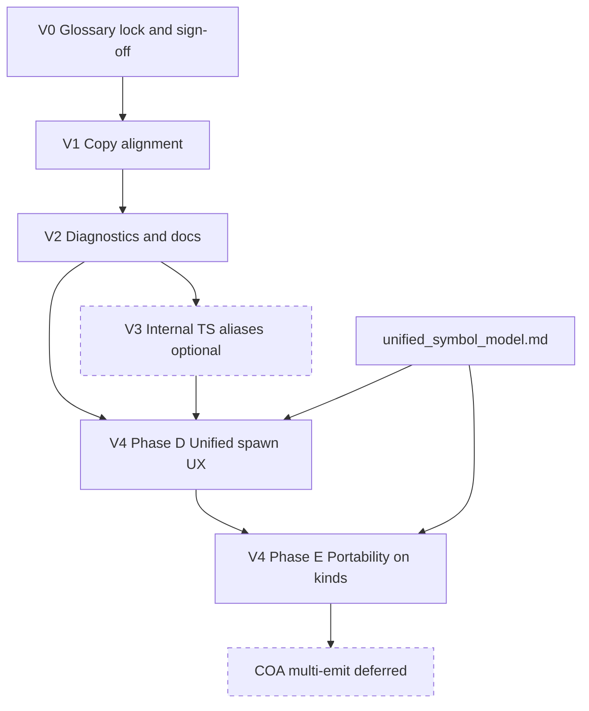

# Vocabulary refactor — implementation plan

**Status:** Action plan (July 2026) — **execute before unified symbol model Phase D/E system rework**.  
**Glossary source:** [language_neutral_vocabulary.md](language_neutral_vocabulary.md) · **Architecture tie-in:** [unified_symbol_model.md](unified_symbol_model.md) phases D/E

This document turns the glossary proposal into phased, verifiable work. **No code in this pass** — agents implement one phase at a time with acceptance criteria below.

---

## 1. Executive summary

### Goal

Align **user-facing vocabulary** across the VVS monorepo to a single language-neutral glossary — **Declare → On → Call/Dispatch** — while keeping **stable internals** (`kindId`, diagnostic codes, module names) until dedicated refactor phases.

### Non-goals

- Renaming `kindId`s (`var_define`, `function_define`, …)
- Renaming diagnostic codes (`DEFINE_NODE_MISSING`, `ORPHAN_DEFINE_NODE`, …)
- Renaming TypeScript modules (`defineNodeSync.ts`, `isMemberDefineNode`)
- Cross Over Architecture (COA) or multi-language emit rework
- Transpiler IR type renames (`VariableDecl`, `IrMemberDecl`, …)
- Blueprint / UE jargon cleanup beyond locked glossary rules (already enforced in product direction)

### Success criteria

| Criterion | Verification |
|-----------|--------------|
| All registry `title` fields for member kinds use **Declare**, never `Define ` | Registry drift test (V1+) |
| Go `core-pack.json` matches TS canonical pack (titles + `symbolRole`) | Byte-level or field diff in CI |
| User-visible diagnostic strings use **Declare** / **member chain** | `analyze.ts` grep + test assertions (V2) |
| No user-facing UI string says **Define** for member slots | Grep gate in CI or review checklist |
| Docs, skills, and agent memory link glossary; implementation sections may note `(Declare)` once | Doc audit (V2) |
| Snapshot and Rosetta goldens unchanged by copy-only phases | `bun test` in transpiler + syntax-packs |
| Team sign-off recorded on open questions before V2 | V0 checklist in `decisions.md` |
| Phase D/E spawn UX built on locked terms, not ad hoc copy | V4 entry criteria |

### Current baseline (July 2026)

**Partial V1 complete:**

- Web display titles (`nodeKind.ts`), Project tree buttons, catalog grouping — mostly **Declare** / **On** / **Call** / **Dispatch**
- TS `packages/syntax-registry/core-pack.json` — **Declare** titles + `symbolRole` ✓
- Go `server/internal/core/registry/core-pack.json` — titles synced to **Declare** ✓; **`symbolRole` still missing**
- In-app roadmap item `symbol-declare-vocabulary` marked **done**; remaining drift is diagnostics, starters, legacy label inference, docs, and internal enums

---

## 2. Locked vocabulary reference

Full glossary, principles, and rejected terms: **[language_neutral_vocabulary.md](language_neutral_vocabulary.md)**.

| User-facing term | Role | Stable `kindId` / code (unchanged) |
|------------------|------|-------------------------------------|
| **Declare** `{name}` | Member exists on member chain | `var_define`, `function_define`, `event_member_define`, `class_define` |
| **On** `{name}` | Handler / implement body | `event_define`, `event_on_update` |
| **Call** `{name}` | Function invoke | `vvs.project.call_function` |
| **Dispatch** `{name}` | Event invoke | `event_dispatch` |
| **Get** / **Set** `{name}` | Variable read / write | `variable_get`, `variable_set` |
| **Member chain** | Ordered Declare sequence on class home graph | `MEMBER_DEFINE_KINDS`, `collectMemberDefineNodeIds` (internal) |
| **Declare node** | Canvas node for a member slot (docs) | `isMemberDefineNode`, `DEFINE_NODE_*` codes (internal) |

Product table (shorter): [naming_and_product_direction.md](../naming_and_product_direction.md) § Canvas source of truth.

---

## 3. Open decisions

Resolve in **V0**; defaults below unblock work if the user does not object.

| # | Question | Recommended default | Sign-off before V2+? |
|---|----------|---------------------|---------------------|
| 1 | **Member chain** vs declare chain | Lock **member chain** in UI/docs/diagnostics | **Yes** — affects V2 messages and all contributor docs |
| 2 | Catalog section **Handlers** vs node title **On** | Section: **Handlers**; node title: **On** `{name}` | No — already shipped; confirm only if redesigning catalog |
| 3 | **Dispatch** permanent for event invoke? | **Yes** in UI; syntax packs emit idiomatic code | **Yes** — product-facing invoke split |
| 4 | Event member label: **Declare Event** vs **Declare** `{name}` | Dynamic **Declare** `{name}` everywhere (typed catalog templates OK) | **Yes** — affects spawn titles and tree copy |
| 5 | Rename `DEFINE_NODE_*` → `DECLARE_NODE_*`? | **Never** (or separate RFC); change **messages only** | No — internal stability |
| 6 | Remove `symbolRole: 'define'` from type? | **Yes** in V3; unused in core-pack | No — type cleanup only |
| 7 | Go registry sync strategy? | **CI drift check** + optional `tools/sync-core-pack` copy script; TS pack is source of truth | No — engineering default |
| 8 | Program entry panel display: **On Start** vs stem | Align with `eventDisplayName()` — **On Start** for `role: 'entry'` | **Yes** — Events panel + tree labels |

**V0 deliverable:** User confirms rows marked **Yes** (or accepts defaults in writing in `decisions.md`).

---

## 4. Phases

### V0 — Glossary lock & sign-off

**Objectives:** Freeze glossary, resolve open questions, authorize phased execution.

**Prerequisites:** [language_neutral_vocabulary.md](language_neutral_vocabulary.md) reviewed.

**Tasks:**

- [ ] Review locked glossary table (§2 above + full doc)
- [ ] Resolve open questions §3 (defaults or explicit overrides)
- [ ] Record sign-off in `.agents/memory/decisions.md` § Language-neutral vocabulary
- [ ] Link this plan from `docs/current_state.md` and `docs/naming_and_product_direction.md`

**Acceptance criteria:**

- All four **Sign-off before V2+** questions have documented decision (default or override)
- No parallel vocabulary edits in feature PRs without referencing this plan

**Test commands:** None (docs only).

**Risks / rollback:** Low — documentation only. Rollback = revert decision bullets.

---

### V1 — Copy alignment

**Objectives:** User-visible strings and registry copies say **Declare** / **On** / **Call** / **Dispatch**; Go pack matches TS; starter snapshots use glossary labels.

**Prerequisites:** V0 sign-off.

**File checklist (audit):**

| Area | File | Status / action |
|------|------|-----------------|
| Registry (canonical) | `packages/syntax-registry/core-pack.json` | ✓ Declare titles; verify all member kinds |
| Registry (Go) | `server/internal/core/registry/core-pack.json`, `server/data/core-pack.json` | Sync titles; **add `symbolRole`** from TS |
| Registry logic | `packages/syntax-registry/src/registry.ts` | Keep legacy `Define *` inference for old graphs; document |
| Display titles | `apps/web/src/lib/nodeKind.ts` | ✓ Verify complete |
| Project tree | `apps/web/src/components/layout/ProjectTree.tsx` | ✓ Buttons; verify tooltips |
| Floating inspector | `apps/web/src/components/layout/GraphFloatingDetails.tsx` | ✓ Badges |
| Roadmap copy | `apps/web/src/lib/developmentRoadmap.ts`, `RoadmapView.tsx` | ✓ Vocabulary item done; scan for stray Define |
| Starters | `packages/graph-types/src/snapshot.ts`, `fidelityMigration.ts` | Change `Define start` → `Declare start` or title from registry |
| Test fixtures | `packages/transpiler/src/testEntryGraph.ts`, example graphs | Align labels where user-visible |
| Legacy inference | `packages/graph-types/src/normalizeGraphNodeData.ts` | Keep `Define *` → `kindId` for migration; no new UI strings |

**Tasks:**

- [ ] Add `symbolRole` to Go embedded `core-pack.json` (copy from TS)
- [ ] Add `tools/sync-core-pack.ts` (or shell script) copying TS → Go paths
- [ ] Fix starter label `Define start` in snapshot + fidelity migration
- [ ] Grep monorepo for user-facing `Define Variable|Function|Event|Class` in UI strings; fix stragglers
- [ ] Add registry test: no member-kind `title` contains `Define ` (see §8 Drift prevention)
- [ ] Wire registry sync check into CI (fail on drift)

**Acceptance criteria:**

- `rg 'Define (Variable|Function|Event|Class)' apps/web packages/syntax-registry --glob '!*.test.*'` — zero UI/registry title hits
- Go and TS core-pack member titles + `symbolRole` match (automated test)
- Starter projects load with **Declare start** (or registry-resolved title)
- `bun test packages/syntax-registry` passes including new drift test

**Test commands:**

```bash
bun test packages/syntax-registry
bun test packages/graph-types
bun run --filter web test
```

**Risks / rollback:**

- **Risk:** Old saved graphs with `Define *` labels still resolve via inference — intentional.
- **Rollback:** Revert JSON copy + starter label commits; no `kindId` impact.

---

### V2 — Diagnostics messages + docs / skills / memory pass

**Objectives:** Compiler log and analyzer messages use glossary; contributor docs distinguish user vs internal terms.

**Prerequisites:** V1 complete; V0 sign-off on member chain, Dispatch, event Declare label, program entry display.

**File checklist:**

| Area | File | Action |
|------|------|--------|
| Diagnostics | `packages/graph-types/src/analyze.ts` | User messages → Declare / member chain; keep `kindId` in dev-only detail if needed |
| Diagnostic tests | `packages/graph-types/src/analyzeDefineNodes.test.ts` | Update expected `message` strings |
| Fidelity doc | `docs/visual_to_text_fidelity.md` | Glossary link; “Declare node (`var_define`)" pattern |
| Node system | `docs/node_system.md` | § fidelity table: user terms + kindId in parentheses |
| Multi-class design | `docs/design/multi_class_symbols.md` | Prefer **member chain** in narrative |
| Unified model | `docs/design/unified_symbol_model.md` | Cross-link plan; keep internal diagram labels OK with glossary note |
| Skills | `.agents/skills/vvs_visual_code_fidelity/SKILL.md`, `vvs_transpiler_development/SKILL.md`, others per audit | Link glossary; user-facing bullets use Declare |
| Memory | `.agents/memory/workspace-facts.md` | Diagnostic table: user message column |
| Memory | `.agents/memory/decisions.md` | Mark vocabulary phases progress |
| Transpiler comments | `packages/transpiler/src/ir/types.ts`, `emit/members.ts` | Optional: “declare (define) nodes” once |

**Diagnostic message mapping (representative):**

| Code | Current phrasing (avoid in UI) | Target user message |
|------|-------------------------------|---------------------|
| `ORPHAN_DEFINE_NODE` | “Define node references unknown…” | “Declare node references unknown…” |
| `DEFINE_NODE_MISSING` | “has no var_define node…” | “has no **Declare** node for variable … on member chain” |
| `DECLARATION_NOT_ON_CANVAS` | “no define nodes…” | “no **member chain** / Declare nodes…” |
| `PROGRAM_ENTRY_NOT_ON_CANVAS` | “missing event_member_define…” | “missing **Declare** node for program entry on member chain” |

**Tasks:**

- [ ] Rewrite user-facing strings in `analyze.ts` (preserve `code` fields)
- [ ] Update `analyzeDefineNodes.test.ts` assertions
- [ ] Doc pass per checklist (implementation sections may retain `kindId` names)
- [ ] Skill pass: link [language_neutral_vocabulary.md](language_neutral_vocabulary.md)
- [ ] Update `workspace-facts.md` diagnostic descriptions

**Acceptance criteria:**

- No analyzer `message` string contains “define node” or “define chain” (case-insensitive) unless quoting `kindId`
- All graph-types analyzer tests pass
- Snapshot / Rosetta tests unchanged (no codegen diff)

**Test commands:**

```bash
bun test packages/graph-types
bun test packages/transpiler
bun test packages/syntax-packs
bun run --filter web test
cd server && go test ./...
```

**Risks / rollback:**

- **Risk:** MCP/agents parsing exact diagnostic text — codes remain stable; prefer code-based handling.
- **Rollback:** Revert message strings + test expectations only.

---

### V3 — Optional internal TS aliases (symbolRole cleanup, event role enum)

**Objectives:** Reduce developer confusion without breaking public graph JSON or MCP contracts.

**Prerequisites:** V2 complete. **Optional** — skip if bandwidth limited before V4.

**File checklist:**

| Area | File | Action |
|------|------|--------|
| Symbol role type | `packages/syntax-registry/src/registry.ts` | Remove `'define'` from `SymbolRole` union |
| Event helpers | `apps/web/src/lib/eventHelpers.ts` | `role: 'define'` → `'declare'` with migration shim for loaded snapshots |
| Graph canvas | `apps/web/src/components/graph/GraphCanvas.tsx` | Event spawn role enum |
| Floating details | `apps/web/src/components/layout/GraphFloatingDetails.tsx` | Same |
| Project tree | `apps/web/src/components/layout/ProjectTree.tsx` | Same |
| Aliases (optional) | `packages/graph-types/src/defineNodes.ts` | Export `isDeclareNode` alias → `isMemberDefineNode` |
| Lifecycle hooks | `apps/web/src/hooks/useSymbolLifecycle.ts` | Optional `addVariableWithDeclare` aliases (re-export old names deprecated) |

**Tasks:**

- [ ] Remove unused `symbolRole: 'define'` from type + validation
- [ ] Migrate event UI role enum `'define' \| 'dispatch'` → `'declare' \| 'dispatch'` with normalize on load
- [ ] Add deprecated re-exports for `*WithDefine` hook names (one release) or document keep-until-V4
- [ ] Update tests referencing internal role strings

**Acceptance criteria:**

- `SymbolRole` is exactly `declare | implement | invoke`
- Saved projects with legacy role values still load (normalizer)
- No user-visible string changes beyond V2 (this phase is internal)
- Full monorepo test suite green

**Test commands:**

```bash
bun test packages
bun run --filter web test
```

**Risks / rollback:**

- **Risk:** Subtle breakage in event binding if normalizer misses edge case — add round-trip test on example snapshots.
- **Rollback:** Revert enum + type changes; V2 user copy remains valid.

---

### V4 — System rework (unified symbol model phases D & E)

**Objectives:** Catalog, inspector, Project tree, and registry metadata embody **Declare → implement → invoke** as one spawn mental model; portability badges on kinds.

**Prerequisites:** V0–V2 complete (V3 recommended). Coordinated with [unified_symbol_model.md](unified_symbol_model.md).

**Scope (from unified model):**

| Sub-phase | Focus | Key files |
|-----------|--------|-----------|
| **D** | Unify spawn UX: role chips, tree declare/handler status, Event panel Declare vs On vs Dispatch | `nodeCatalog.ts`, spawn menus, `EventPropertiesPanel.tsx`, `developmentRoadmap.ts` id `unified-spawn-ux` |
| **E** | Workflow polish + registry `portabilityFeatures`; expand profiles | `core-pack.json`, `language-profiles`, catalog dimming (Phase C effectiveness UI may precede or overlap) |

**Tasks:**

- [ ] Phase D: spawn catalog grouped by `symbolRole` (Declare / Handlers / Calls) with consistent titles from registry only — no hardcoded Define
- [ ] Phase D: Project tree rows show declare/handler/dispatch status from canvas truth
- [ ] Phase D: Event properties panel: explicit **Declare on member chain** vs **On handler** vs **Dispatch** actions
- [ ] Phase E: optional `portabilityFeatures[]` on registry kinds; effectiveness badges (see unified model § Node effectiveness)
- [ ] Re-run full glossary grep + registry drift test after UX changes

**Acceptance criteria:**

- New user can spawn full symbol lifecycle using only glossary terms
- Catalog titles 100% from `core-pack.json` / `getNodeDisplayTitle` — no duplicate string tables
- Phase D roadmap item criteria met per `developmentRoadmap.ts`
- Fidelity errors unchanged in behavior; only UX paths improved

**Test commands:**

```bash
bun test packages
bun run --filter web test
bun run build
cd server && go test ./...
```

**Risks / rollback:**

- **Risk:** Scope creep into COA / multi-emit — defer per unified model (COA_SHIPPED = false).
- **Rollback:** UX flags; registry kindIds unchanged so graphs remain valid.

---

## 5. Dependency graph



**Notes:**

- V1 can start after V0 defaults accepted; partial V1 already landed.
- V4 must not start before V2 (diagnostics teach the same terms as spawn UX).
- Phase C (node effectiveness dimming) from unified model can parallel V4E but is not a vocabulary phase.

---

## 6. Verification matrix

| Phase | graph-types | syntax-registry | transpiler | syntax-packs | web unit | web build | Go test | Manual smoke |
|-------|-------------|-----------------|------------|--------------|----------|-----------|---------|--------------|
| V0 | — | — | — | — | — | — | — | Review glossary doc |
| V1 | ✓ snapshot starters | ✓ + **drift test** | ✓ | — | ✓ | ✓ | ✓ registry embed | Spawn Declare nodes from catalog |
| V2 | ✓ analyze messages | ✓ | ✓ snapshots | ✓ Rosetta | ✓ | ✓ | ✓ | Trigger DEFINE_NODE_MISSING → read message |
| V3 | ✓ role normalize | ✓ SymbolRole | ✓ | — | ✓ event flows | ✓ | — | Load legacy project with event roles |
| V4 | ✓ | ✓ | ✓ | ✓ | ✓ | ✓ | ✓ | End-to-end declare → on → dispatch graph |

**Monorepo quick gate (any phase after V1):**

```bash
bun test packages && bun run --filter web test && bun run build
```

---

## 7. Drift prevention

### Source of truth

**`packages/syntax-registry/core-pack.json`** is canonical. Go embeds copies at:

- `server/internal/core/registry/core-pack.json`
- `server/data/core-pack.json`

### CI / sync strategy (implement in V1)

1. **Copy script** — `tools/sync-core-pack.ts` (or `scripts/sync-core-pack.sh`): copy TS JSON → both Go paths; run in pre-commit or documented release step.
2. **Drift test** — in `packages/syntax-registry/src/registry.test.ts` (or dedicated `corePackSync.test.ts`):
   - Load TS pack and Go pack paths via filesystem
   - For each kind in `MEMBER_DECLARE_KINDS` (`class_define`, `var_define`, `function_define`, `event_member_define`):
     - Assert `title` does not match `/Define /`
     - Assert `title` starts with `Declare` (or allowed exceptions documented in test)
   - Assert Go kinds include same `symbolRole` as TS for shared `kindId`s
3. **CI job** — add step to root or syntax-registry workflow:

   ```bash
   bun test packages/syntax-registry/src/registry.test.ts
   # optional: bun run tools/sync-core-pack --check
   ```

4. **Lint rule (optional follow-up)** — ESLint `no-restricted-syntax` or custom script in CI:

   ```bash
   rg '"title":\s*"Define ' packages/syntax-registry server/internal/core/registry server/data
   ```

   Exit non-zero if matches found for member kinds.

### Agent checklist (ongoing)

- New registry kinds: `symbolRole` + glossary-compliant `title`
- New UI strings: grep against rejected terms in [language_neutral_vocabulary.md](language_neutral_vocabulary.md) § Rejected
- PR template note: “Vocabulary alignment — see terms_refactor_plan.md”

---

## 8. Out of scope

Explicitly deferred to separate RFCs or later product phases:

| Item | Reason |
|------|--------|
| `kindId` renames (`var_define` → `var_declare`) | Breaks saved graphs, MCP, tests |
| Diagnostic code renames (`DEFINE_NODE_*` → `DECLARE_NODE_*`) | Breaks CI, agents, docs references |
| Module renames (`defineNodeSync.ts`, `defineNodes.ts`) | Large import churn; V3 aliases sufficient |
| COA authoring, multi-target export, effectiveness for all languages | [unified_symbol_model.md](unified_symbol_model.md) Phase F; requires Phase E |
| Multi-language emit / syntax pack template rework | Unrelated to vocabulary; syntax pack architecture owns emit surface |
| Pin → Port rename in TypeScript types | Document preference only |
| Blueprint / BeginPlay / BP_* in code identifiers | Already forbidden in UI; internal test fixtures may keep historical graph labels via inference |

---

## Related documents

| Document | Role |
|----------|------|
| [language_neutral_vocabulary.md](language_neutral_vocabulary.md) | Full glossary, audit, principles |
| [naming_and_product_direction.md](../naming_and_product_direction.md) | Product-facing table |
| [unified_symbol_model.md](unified_symbol_model.md) | Phase D/E architecture |
| [visual_to_text_fidelity.md](../visual_to_text_fidelity.md) | Canvas source of truth |
| [current_state.md](../current_state.md) | Implementation snapshot |

---

## Agent checklist (post-lock)

- [ ] New UI strings use glossary — no **Define** for member slots
- [ ] Functions → **Call**; events → **Dispatch**
- [ ] Docs: **symbol** (index) vs **member** (canvas chain)
- [ ] `kindId` renames require explicit RFC — not vocabulary alignment
