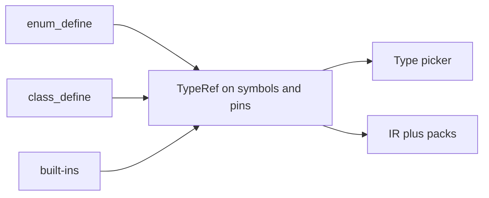

# User types (TypeRef)

**Status:** Shipped teaching slice (July 2026) — enums, classes, Array/Map  
**North star:** [visual_to_text_fidelity.md](../visual_to_text_fidelity.md) · canvas source of truth  
**Fixture:** Coverage Lab (`SensorStatus`, `Host: Machine`, `Readings: list[float]`)

---

## Rule

Every selectable type in the picker must come from:

1. A **built-in** (`str` / `float` / `bool` / …), or  
2. A **canvas declare** — `enum_define` or `class_define`.

No invented type names in pickers or emit. Pins and variables share the same **TypeRef** identity the emitter prints.

---

## TypeRef shape

Defined in `@vvs/graph-types` (`typeRef.ts`):

| Kind | Identity | Wire pin |
|------|----------|----------|
| `builtin` | `VariableDataType` (`data_*`) | same |
| `enum` | `name` (+ optional `enumId`) | `data_any` |
| `class` | `classId` (+ optional `name`) | `data_object` |
| `array` | `of: TypeRef` | `data_array` |
| `map` | `key` + `value` TypeRefs | `data_object` |

**Compatibility:** when both ends of a wire carry a TypeRef, match requires the same enum/class identity (or matching container structure). Otherwise fall back to `PinType` / `data_any` wildcard.

---

## Declare → type → use

1. Place **Declare Enum** / **Declare Class** on a class home graph.  
2. Pick that type on a variable, pin, or switch (picker lists canvas enums/classes).  
3. Emit prints the type name (`SensorStatus`, `Machine`, `list[float]`, `std::vector<float>`, …) via `typeNameForTypeRef` — no parallel free-text overlay required.

### Legacy `enumType`

Old snapshots with `VariableSymbol.enumType` migrate to `typeRef: { kind: 'enum', name }` in `migrateLegacyVariable`. The string field remains a dual-write mirror for one release.

### Locals

Function-scoped locals (`graphTabId` / `scopedNodeId`) are **not** class members — no `var_define` dual-write. Body emit uses `DeclareLocal`.

---

## Dual Class Lab locks

| Symbol | TypeRef | Example emit |
|--------|---------|--------------|
| `Status` | enum `SensorStatus` | `SensorStatus Status = SensorStatus::OK` |
| `Host` | class `Machine` | `Machine Host = {}` / `Host = None` |
| `Readings` | `array` of `float` | `std::vector<float> Readings` |

Verify via Code panel / `bun apps/web/scripts/extract_test_project_outputs.ts`.

---

## Out of scope (this program)

- Interfaces/traits as pin types  
- Typed callables / delegates  
- Events as data types  
