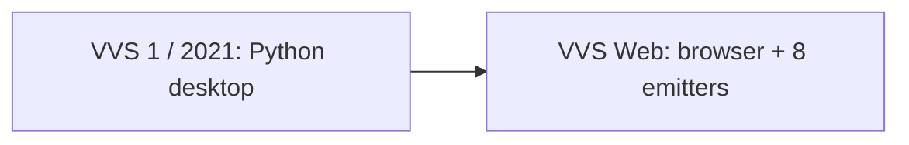

# The Story of VVS

Vision Visual Scripting did not begin as a product pitch - it began as a **university graduation project** with a simple, ambitious question:

> *What if anyone could hop in and start programming with visual modular blocks - and the graph could become **real code** in **whatever language you choose**?*

That question became the first Vision Visual Scripting codebase - an open-source Python desktop application where nodes and wires on a canvas translate into ordinary source syntax. The interaction model drew from professional node editors (including the kind of flow-and-data graph familiar from Unreal Engine's Blueprint system), but the **goal was never engine lock-in**. From day one, the graph was meant to be **logic**; the target language was a **choice**.

**Original / demo repository:** [github.com/Sheriff99yt/Vision_Visual_Scripting](https://github.com/Sheriff99yt/Vision_Visual_Scripting). [vvscodes.com](https://www.vvscodes.com/) is the 2021 marketing page for that demo, not the VVS Web Pages app.

---

## VVS 1 - the graduation prototype

| | |
|--|--|
| **When** | First public repo December 2021 |
| **Stack** | Python desktop app (`vvs_app/main.py`), PyCharm workflow |
| **Core idea** | All-in-one visual scripting - compose with nodes, export to a selected programming language |
| **License** | MIT (same spirit as today) |

The prototype proved the concept: **visual authoring and text code are not opposites**. You can design on a graph and still end up with readable Python, or another syntax, in files you own.

It also surfaced the hard problems that any serious visual programming system must solve - separating logic from syntax, keeping graphs maintainable, and avoiding a proprietary runtime trap.

---

## Why VVS Web exists

The world moved on - and so did the requirements.

**Open systems.** Visual logic should not belong to one editor, one engine, or one vendor. Graphs should be **portable data**: shareable, versioned in git, inspectable, and extensible by the community.

**The AI era.** Developers already use Cursor, Claude, Codex, and other assistants daily. VVS should **plug into that ecosystem** - today via the **in-page TypeScript agent** (bring-your-own key), later a thin MCP wrapper for other apps - not ship a bundled LLM or a walled garden. AI arranges **registered logic blocks**; the transpiler handles **syntax**. The optional Go MCP sidecar is a local experiment, not the hosted path.

**Every engine, every workflow.** The long-term vision is an **open visual scripting language** - a graph schema and transpiler pipeline that works across:

- The **browser** (author anywhere, offline Generate, no install via GitHub Pages)
- **Repos and CI** (generated source as the integration layer; folder / `.vvs/` / git)
- **AI agents** (in-page tools on the same graph model; later MCP wrapper)
- **Game engines** (starting with a planned **Unreal Engine 6 plugin** and **Verse** emission as Blueprint-era workflows sunset)
- **Future targets** - Godot, custom tools, education, automation - without rewriting the graph

**That is why we started VVS Web** (VVS 2.0): not to abandon the original idea, but to **carry it forward** on a modern, open, web-native foundation where the graph format, transpiler, and integrations can grow with the ecosystem.

---

## What we are building toward

VVS Web is the **current home** of active development. The original repo remains part of the project's history; this repository implements the next chapter:

1. **A portable graph document** - JSON schema shared across web, the in-page agent, and (roadmap) an in-engine plugin.
2. **A client-side transpiler** - logic analysis, intermediate representation, language profiles. **Eight generate targets today:** Python, JavaScript, C++, Verse, GDScript, Rust, C#, Go. JavaScript is one target, not "JS/TS".
3. **Honest integration** - Generate real files, use the in-page agent, stay offline-capable. No VVS runtime. No PWA product path.
4. **Engine paths without forked logic** - same IR, different emitters; UE6/Verse as a first-class target, not a separate visual system.

We are supporting the **open system** and the **AI era**: visual programming that respects text code, respects your toolchain, and aims to become a **common visual layer** teams can adopt whether they work in a browser, an IDE, or inside Unreal.

---

## Related reading

| Document | Content |
|----------|---------|
| [vision.md](vision.md) | Philosophy - logic vs syntax, UE6/Verse direction |
| [roadmap.md](roadmap.md) | Phased delivery including UE6 plugin |
| [current_state.md](current_state.md) | What is implemented in **this** repository |
| [../README.md](../README.md) | Project overview and quick start |

**Original project:** [Sheriff99yt/Vision_Visual_Scripting](https://github.com/Sheriff99yt/Vision_Visual_Scripting)
