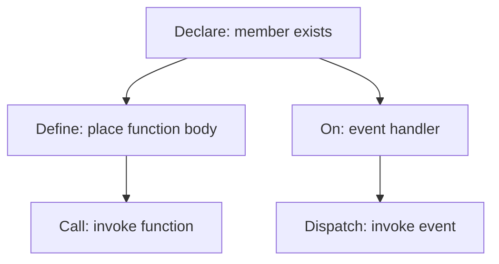
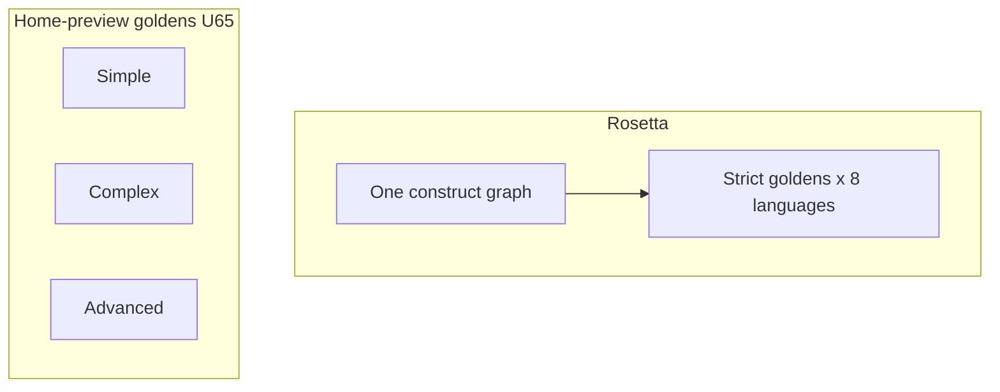

# VVS - Naming & Product Direction

Canonical vocabulary and product principles. **Do not use Unreal Engine Blueprint terminology** in user-facing UI, docs, or generated code labels - even though the interaction model is inspired by node-based visual programming.

Companion: [vision.md](vision.md). [visual_to_text_fidelity.md](visual_to_text_fidelity.md). [roadmap.md](roadmap.md). [project_requirements.md](project_requirements.md). [current_state.md](current_state.md). [design/language_neutral_vocabulary.md](design/language_neutral_vocabulary.md) (glossary). [design/terms_refactor_plan.md](design/terms_refactor_plan.md) (phased rollout).

---

## Product principles

### 1. Visual layer on top of code - not a replacement

VVS is a **visual way to compose logic** that **generates ordinary source code** with **text-shaped fidelity** - every behavioral node maps to visible text ([visual_to_text_fidelity.md](visual_to_text_fidelity.md)).

- The graph is the authoring view; **text code remains the integration layer** for git, IDE, CI, and third-party embedding.
- No proprietary runtime required to use exported code.
- Generated output should look like a human wrote it in the target language - **and match what the graph shows**.

### 2. Beginner-friendly, professional depth

- Labels use **plain programming words** (variable, function, if, loop) - not engine jargon.
- Progressive disclosure: simple defaults first; advanced options in properties panels.
- Errors should read like compiler messages, not graph-engine internals.

### 3. Integrates with existing systems

- **Generate** to the eight targets: Python, JavaScript, C++, Verse, GDScript, Rust, C#, Go. Default extensions `.py`, `.js`, `.cpp`, `.verse`, `.gd`, `.rs`, `.cs`, `.go`. JSON graph is the project document. TypeScript is **not** a generate target.
- Embed in **any** product - generated modules import like hand-written code; no VVS VM.
- **Bring your own AI** via the **in-page Agent** (optional local key). A later MCP wrapper can reach other apps. The optional Go sidecar is local only. Predictable text diffs when graphs change.
- **Bring your own tools** - Generate ordinary source into **local / git** workflows; IDEs, engines, and CI own compile and run. VVS does **not** require a dedicated app server or VVS accounts ([roadmap.md](roadmap.md)).

### 4. Familiar to anyone who has seen node editors

The UX borrows **canvas patterns** from node editors (wires, typed ports, flow) but **semantics follow text code** - functions, calls, handlers - not Unreal Blueprint VM rules (macro expand, latent delay).

### 5. Canvas source of truth - symbol table is not codegen

| Vocabulary | Meaning |
|------------|---------|
| **Declare** | Place a member-existence node on the member chain - variables, **functions** (signature / "exists"), class, event slot |
| **Define** (functions) | Place the function **body** into generated code at this position. Body authored in **Edit function body** tab |
| **Edit function body** | Open the function graph tab to author the body (not a second file; U80 same-file emit) |
| **Handler (On ...)** | Place an event handler entry on the class graph (`event_define`) |
| **Call** | Invoke a function at a call site (`vvs.project.call_function`) |
| **Dispatch** | Invoke an event handler at a call site (`event_dispatch`) |
| **Bind** | Visible event registration line (`event_bind`) - C# `+=`, JavaScript `.on`, GDScript `.connect` only. Other langs unspawned or leftover `(x)` |
| **Get** / **Set** | Read or write a variable where logic runs |
| **Project panel row** | Index + CRUD shortcut - dual-writes the canvas correlate; **not** a second source of truth for codegen |

UI copy must not imply that adding a row in the Project tree alone puts a declaration in generated code. If it is not on the canvas, it is not in the export. Canonical spec: [visual_to_text_fidelity.md](visual_to_text_fidelity.md).

**Functions (locked, U81 shipped):** release menu = **Call** / **Declare** / **Define** - parallel to variables **Get** / **Set** / **Declare**. Declare is not Define. `function_define` is existence / abstract signature only. `function_implement` is body placement. No invented stub body without Define. Not about `.h` / `.cpp` splits (see [language_neutral_vocabulary.md](design/language_neutral_vocabulary.md)).

---
## Official vocabulary

Use the **Preferred term** in UI, docs, and agent prompts. **Avoid** Unreal-specific or misleading terms.

| Concept | Preferred term | Avoid | Notes |
|---------|----------------|-------|-------|
| Whole visual program | **Graph** | Blueprint, Asset | One canvas of nodes + wires |
| Workspace / file | **Project** | Blueprint, Level | Container for graphs, variables, settings |
| Left symbol tree | **Project** panel | My Blueprint | Variables, functions, node list |
| Sub-canvas | **Graph tab** | Blueprint tab | e.g. Main graph, function graphs |
| Node catalog spawn | **Add node** / context menu | - | From `nodeCatalog` |
| Connection point | **Port** (or pin in code types) | - | `execution` = **flow** port in UI copy when helpful |
| Execution wire | **Flow** connection | Exec wire | **Linear** - one in / one out per handle; rewire breaks chain (see [node_system.md](node_system.md)) |
| Data wire | **Data** connection | - | Typed by value (string, number, ...) |
| Run entry hook | **On Start** | BeginPlay, Event BeginPlay | Program / graph entry |
| Per-frame hook | **On Update** | Event Tick, Tick | Optional; name for loop/frame |
| User-defined entry | **Custom event** | - | |
| Local state | **Variable** | - | Standard CS term |
| Reusable subgraph | **Function** | Macro, Blueprint Macro | **Declare** + **Define** (body place) + **Edit function body** + **Call** |
| Function exists (member) | **Declare** `{name}` | Define (for existence) | Signature / "there is a function" |
| Function body placement | **Define** `{name}` | Declare (for body) | Insert/place body in code at this position |
| Function body tab | **Edit function body** | Define (for the tab) | Author body only; not a separate export file (U80) |
| Event member on chain | **Declare** `{name}` | Define Event | `event_member_define` - `kindId` unchanged |
| Event handler entry | **On** `{name}` / **Handler** | - | `event_define` - flow entry, not the member declare |
| Function invoke | **Call** `{name}` | - | `vvs.project.call_function` |
| Event invoke | **Dispatch** `{name}` | Call (events), Emit | `event_dispatch` - not "Call" or "Emit" in UI copy |
| Event registration | **Bind** `{name}` | Subscribe, Listen | `event_bind` - one visible line; csharp / javascript / gdscript |
| Variable member on chain | **Declare** `{name}` | Define Variable | `var_define` |
| Class member on chain | **Declare** `{name}` / **Declare Class** | Define Class | `class_define` |
| Macro (legacy UI tab) | **Function** *(migrate)* | Macro | Deprecated as codegen concept |
| Build graph to source | **Generate code** | Compile (OK in toolbar shorthand) | User action and the full path: graph -> analyze -> IR -> emit -> Code panel. Button says **Generate** |
| Stage C (printers write text) | **Emit** (docs only) | Emit Event; toolbar **Emit** | Not a UI label. Event invoke is **Dispatch** |
| Same construct in every language | **Rosetta** | Calling Start-screen examples Rosetta | Pack fixtures in `packages/syntax-packs/rosetta/`. One graph, eight prints |
| Expected generated text in tests | **Golden** | Snapshot (for these files) | Tests generate and compare. Rosetta goldens are not Simple / Complex / Advanced home-preview goldens |
| Generated artifact name | **Module name** | Class name, BP_* | Maps to class/module in target language |
| Optional base type | **Extends** | Parent class, Super | List on Declare Class. Generate prints all Extends rows for python/cpp; others first parent |
| Community item (full graph) | **Script** | Blueprint | Library filter category |
| Community item (single node) | **Node pack** | - | Library filter |
| Community template | **Template** | - | Library filter |
| AI / agent | **Agent** | Connect AI, Integrations page | In-page TS agent panel. Optional sidecar paste is not the hosted path |

**Generate vs emit.** Generate is the button and the whole pipeline. Emit is only the last stage (printers). **Rosetta** proves a construct in every language. A **golden** is the expected text those tests compare against. Start-screen Simple / Complex / Advanced use **home-preview goldens** (U65), not the Rosetta suite. Glossary: [language_neutral_vocabulary.md](design/language_neutral_vocabulary.md#generate-emit-and-goldens).

A game-talk **component** is **Declare Class** plus a field or **Extends** - not a Component node ([catalog](design/language_capability_catalog.md#component--class)).

### Library categories (community)

| Filter | Meaning |
|--------|---------|
| **All** | Everything |
| **Scripts** | Full graph / visual program shared by community |
| **Node packs** | Reusable node definitions |
| **Templates** | Starter graphs |

---

## Code-generation field names (internal / API)

Use language-neutral names in project metadata:

| Field | Type | UI label |
|-------|------|----------|
| `moduleName` | string | Module name |
| `extendsType` | string | Extends (list; generate prints all rows for python/cpp, first parent elsewhere) |
| `description` | string | Description |
| `targetLanguage` | enum | Target language (one of the eight; plus JSON dump) |

Do not use `BP_` prefixes, `BeginPlay`, or `AActor` in defaults or examples unless documenting a **game** sample explicitly.

**Default demo values:** `PlayerController`, `On Start`, `playerHealth` - not `BP_PlayerCharacter`, `BeginPlay`.

---

## Node naming conventions

| Category | Pattern | Examples |
|----------|---------|----------|
| Entry events | `On ...` | On Start, On Update, Custom event |
| Flow control | Plain English | Branch, Loop, Switch |
| Data | Verb or noun | Get variable, Set variable, Add, Concat Strings |
| Actions | Verb phrase | Print message, Call function |

Node `type` ids stay snake_case (`event_define`, `event_member_define`); legacy `event_on_start` is deprecated - use `role: 'entry'` on `events[]` instead. **Labels** are user-facing.

---

## Messaging snippets (for README, onboarding)

**One-liner:**
*VVS is visual programming that generates real code - use your editor, your repo, and your AI tools.*

**With history:**
*From a university graduation project to an open web platform - one graph, eight languages, every workflow.*

**Not:**
*A Blueprint system for the web* / *Replace your codebase with graphs* / *Import from existing code* (U93 is research, not the default)

**Integration:**
*Use the in-page Agent with your own key. A later MCP wrapper can reach Cursor or Claude. The Go sidecar is local only.*

---

## What stays Unreal-adjacent (internal only)

- Early design notes may mention Unreal as inspiration - describe outward-facing copy in **compiler/graph** terms.
- Pin type `execution` in TypeScript types is fine; prefer **flow** in beginner-facing copy where space allows.

---

## Unreal Engine 6 plugin (roadmap - separate surface)

The **web editor** stays engine-neutral in user-facing copy. The planned **UE6 editor plugin** is a different authoring surface for the **same graph schema**, with **Verse** as the primary codegen target.

| Context | Vocabulary |
|---------|------------|
| Web app UI | Graph, function, variable, flow - per table above |
| UE plugin (in-engine) | Same **text-shaped** Verse output; canvas may feel familiar - **not** Blueprint VM semantics |
| Generated Verse | Normal Verse idioms; not web UI labels |
| Public messaging | "UE6 integration", "Verse output", "Blueprint transition" - see [vision.md](vision.md) |

Do not describe the **web product** as "a Blueprint system for the browser." Do describe the **roadmap** as **Verse-oriented output with honest visual-to-text mapping** - not Blueprint simulation.

---

## Agent checklist

Before adding UI or docs:

- [ ] No "Blueprint", "BeginPlay", "BP_", or engine jargon in user-facing strings
- [ ] Generated code examples use normal language idioms
- [ ] No Blueprint VM semantics (macro expand, latent delay without text) in transpiler or docs
- [ ] New nodes pass fidelity checklist in [visual_to_text_fidelity.md](visual_to_text_fidelity.md)
- [ ] Hosted AI is the in-page **Agent** panel (optional local key). Do not frame localhost Go MCP / Connect AI as the product path. A later MCP wrapper for other apps is fine to mention as deferred
- [ ] **Generate** for the pipeline; **Emit** only for Stage C printers; event invoke is **Dispatch**
- [ ] U81 Declare vs Define is shipped. Do not describe the split as future work
