# VVS Node System — Architecture & Extensibility

Canonical spec for the **data-driven node model**, **port strategy**, **pin types**, **code generation contracts**, and **selection → code UX**. Complements [vision.md](vision.md) (logic vs syntax), [project_requirements.md](project_requirements.md) (transpiler stages), and [current_state.md](current_state.md) (what ships today).

**Status:** Approved direction (July 2026). **Text-shaped graphs** locked July 2026 — see [visual_to_text_fidelity.md](visual_to_text_fidelity.md). Cross-language redesign shipped: shared packages, `FunctionSymbol`, unified registry, portability warnings, transpiler package.

---

## 1. Problem statement (historical → current)

The editor shell originally outpaced the node model. **July 2026 redesign** shipped shared packages, `kindId` registry, and `@vvs/transpiler` — many gaps below are **resolved**; remaining work is IR split and label-free hot paths.

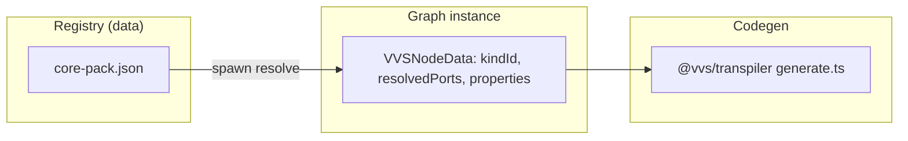

| Gap | Status |
|-----|--------|
| No stable **node kind ID** on instances | **Fixed** — spawn sets `kindId`, `kindVersion`, `resolvedPorts` |
| **Definition duplicated** into instance | **Partial** — hybrid port strategy; pack updates need re-resolve UX |
| **Semantics in UI strings** | **Partial** — registry semantics + `kindId` lowering; legacy label adapters remain |
| **Multiple catalogs** | **Fixed** — `core-pack.json` + `expandProjectSymbols` for project calls |
| **Logic + syntax coupled in mock** | **Fixed** — transpiler package; per-language helpers (`convertExprs.ts`, etc.) |
| **Types only in apps/web** | **Fixed** — `@vvs/graph-types`, `@vvs/syntax-registry`, `@vvs/language-profiles` |

---

## 2. Target model: definition → instance → IR

Three layers, one graph schema — same model for web, MCP, and UE plugin ([roadmap.md](roadmap.md) Phase 5).

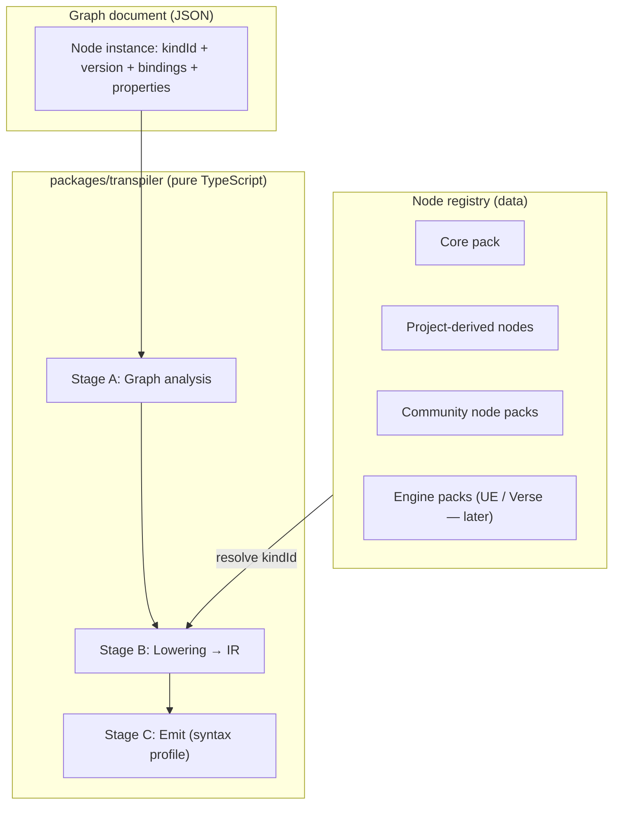

### 2.1 Node definition (registry)

Lives in `packages/syntax-registry` (fixture JSON in repo today; later JSONB + IndexedDB). **Not** in React components.

| Field | Purpose |
|-------|---------|
| `kindId` | Stable id, e.g. `vvs.flow.branch` |
| `version` | Schema evolution / migration |
| `display` | Title, category, description (UI only) |
| `ports` | Pin schema: id, label, direction, logical type |
| `propertySchema` | Inspector settings schema (see §2.2a) — stored in `node.data.properties` |
| `semantics` | **Lowering rule** — data, not label strings |

**Extension rule (Open/Closed):** a new node = new registry row (+ IR shape if needed). No edits to `GraphCanvas` or DAG analysis.

**Semantics examples:**

| `semantics` | Example |
|-------------|---------|
| `{ lowering: 'builtin', rule: 'flow.branch' }` | Branch |
| `{ lowering: 'builtin', rule: 'action.print' }` | Print String |
| `{ lowering: 'builtin', rule: 'action.input.blocking' }` | Get User Input |
| `{ lowering: 'call_graph', linkKind: 'call_function' }` | Call Function |
| `{ lowering: 'variable', mode: 'get' \| 'set' }` | Variable nodes |
| `{ lowering: 'event', role: 'entry' \| 'tick' \| 'custom' }` | Program entry (`role: 'entry'`), On Update, custom events |

### 2.2 Node instance (graph JSON)

What the user placed on the canvas:

```typescript
interface GraphNodeInstance {
  id: string;                      // canvas id
  kindId: string;                  // "vvs.flow.branch"
  kindVersion: number;
  labelOverride?: string;          // display only
  properties: Record<string, unknown>;
  graphBinding?: {                  // project / cross-graph
    graphId: string;
    linkKind: 'call_function' | 'use_macro' | 'import_module';
  };
}
```

Wires remain **edges** (React Flow). Ports are resolved from registry + optional snapshot (see §4).

### 2.2a Pins, inline values, and property settings

Node instance data uses three complementary stores:

| Store | UI surface | Purpose |
|-------|------------|---------|
| **`inputs` / `outputs`** | Canvas pins | Execution + data flow between nodes |
| **`inlineValues`** | Inspector pin fields (when unwired) | Default literal for a pin |
| **`properties`** | Inspector **Settings** section | Per-node behavior not worth wiring (enum, flags, binding ids) |

**`propertySchema`** on a registry kind defines the Settings form generically (`PropertySchemaPanel` in `apps/web`). Helpers live in `@vvs/syntax-registry` (`propertySchema.ts`: defaults, conditional `when` visibility).

Example — **`action_get_input`** (Get User Input):

| Pin / field | Role |
|-------------|------|
| `exec_in` → `exec_out` | Blocking read; flow continues after input |
| `prompt` (string, optional wire) | Message shown to the user |
| `value` (out) | Result read by downstream nodes |
| `properties.inputKind` | `text` \| `number` — syncs `value` pin type |

Codegen assigns a handler-local temp (`_vvs_input_<nodeId>`) and wires the **Value** output to that symbol. Semantics: `action.input.blocking`.

**Extension pattern:** add `propertySchema` to a new core-pack kind → spawn applies defaults → inspector renders Settings → transpiler lowers by `semantics`. Symbol pickers (events, functions) remain **inspector plugins** when the schema alone is not enough.

### 2.2b Pin type compatibility and portable examples

**Wiring rules** (`apps/web/src/lib/graphWiring.ts`):

| Rule | Behavior |
|------|----------|
| Execution ↔ execution | Allowed |
| Execution ↔ data | **Rejected** |
| Same data type (e.g. `data_number` → `data_number`) | Allowed |
| Either side is `data_any` | Allowed (acts as wildcard) |
| Different concrete types (e.g. `data_number` → `data_string`) | **Rejected in the editor** |

The transpiler does **not** insert automatic casts — it emits the wired expression as-is. **`analyzeProject`** now reports **`PIN_TYPE_MISMATCH`** errors when saved graphs contain wires the editor would reject (shared rules in `@vvs/graph-types` / `pinCompatibility.ts`, same as `graphWiring.ts`).

**Print String** (`action_print`) requires a **`data_string`** input — use an explicit **To String** node instead of implicit casts. Emitters map to each language’s print/log (`print`, `console.log`, `std::cout`, `Print`).

**Conversion nodes** (pure expression — visible on graph, highlighted in codegen):

| kindId | Title | In → Out | Emits (examples) |
|--------|-------|----------|------------------|
| `convert_to_string` | To String | `data_any` → `data_string` | `str(x)`, `String(x)`, `std::to_string(x)`, `ToString(x)` |
| `convert_to_number` | To Number | `data_string` → `data_number` | `float(x)`, `parseFloat(x)`, `std::stof(x)`, `ParseFloat(x)` |

Each conversion is **one graph node = one call in source**. The transpiler never folds `str()` / `String()` into Print or other consumers; `wrapExpr` registers **expression spans** so selecting **To String** highlights the call in the code panel (same as Get / Math).

**No implicit coercion policy:** mismatched pin types are rejected by the editor and by `analyzeProject` (`PIN_TYPE_MISMATCH`). Examples must wire **Get Result → To String → Print String** to display numeric results.

**Writing examples that work on all targets (Python, JavaScript, C++, Verse):**

| Do | Avoid |
|----|--------|
| Stick to core-pack kinds with emitters in `@vvs/transpiler` | `import_module`, engine-only nodes |
| Use portable types: `data_number`, `data_string`, `data_boolean` | `data_object`, `data_array`, `data_any` on **variables** |
| Wire same types or through **Conversion** nodes | Hand-authoring edges the UI would reject |
| Use **To String** before Print for numeric values | Wiring number directly to Print String |
| Use **Get User Input** `number` + **Set** for numeric vars | Hardcoded literals when demonstrating input |
| Use **Branch** on `data_boolean` | Comparison nodes (not in core pack yet) |
| Keep events **parameterless** until param emit is uniform | Cross-language param naming edge cases |
| Prefer inline string literals on Print when message is fixed | String concat nodes (not in core pack yet) |

**Known gaps (no core node yet):** string concat, comparisons, loops, explicit **Wait** / async graphs. Use **Conversion** for type changes — never rely on transpiler casts.

### 2.2c Text-shaped fidelity (locked)

Canonical spec: [visual_to_text_fidelity.md](visual_to_text_fidelity.md) — **Canvas is the source of truth** for generated code.

#### Sidebar vs canvas (strict)

| Surface | Role in codegen | Emits text? |
|---------|-----------------|-------------|
| Project panel `variables[]` / `functions[]` / `events[]` | Index + CRUD; dual-writes define nodes | **No** — metadata only |
| `var_define`, `function_define`, `event_member_define`, `class_define` | Declaration on class home graph exec chain | **Yes** — ordered `ir.members` |
| `variable_get` / `variable_set`, Call Function, dispatch | Usage where logic runs | **Yes** — statements / expressions |

Panel create paths must call `defineNodeSync` / `add*WithDefine` — never push symbol rows without a canvas correlate.

#### Strict analyzer codes (block Generate)

| Code | Meaning |
|------|---------|
| `DEFINE_NODE_MISSING` | Symbol in table but no matching define node on `classHomeGraphId` |
| `DECLARATION_NOT_ON_CANVAS` | Symbols exist but class graph has no define chain |
| `ORPHAN_DEFINE_NODE` | Define node on canvas with `symbolId` not in symbol table |
| `HIDDEN_EVENT_RUNTIME_UNSUPPORTED` | `event_emit` or `event_subscribe` on canvas — hidden runtime helper |
| `MULTICAST_REQUIRES_SUBSCRIBE` | Multiple `event_define` handlers for same event without visible multicast |

#### Visual → text mapping

| Visual | Text | Notes |
|--------|------|-------|
| **Call Function** | `self.foo(args)` | One call node → one call site |
| **Define** (event handler) | `def on_foo(self, …):` | Handler body |
| **Dispatch** | `self.on_foo(…)` | Direct handler call — one visible line per dispatch node |
| **Conversion** | `str(x)`, etc. | Never folded into consumers |
| **var_define** / **function_define** | `self.x = …` / `def foo(…):` | Declaration position from exec chain order |
| **Macro (legacy)** | **Deprecated** | Must become **Function + Call** — no compile-time paste |

**Not supported:** Blueprint latent Delay, macro inline expansion, sidebar preamble (`appendLegacyPreamble`), behavior that requires a VVS/UE VM to match the graph.

### 2.3 IR (transpiler internal)

Language-agnostic structures from [project_requirements.md](project_requirements.md) §2.2:

`IfStatement`, `CallFunction`, `AssignVariable`, `BinaryOp`, `Print`, `Sequence`, …

Each IR node carries **`sourceGraphNodeId`** for source maps and selection highlighting (§6).

---

## 3. Registry composition

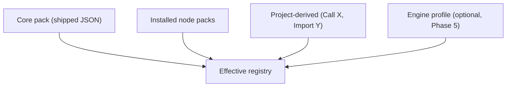

| Source | Example | How produced |
|--------|---------|--------------|
| **Core pack** | Branch, Print, Math Add | Repo JSON |
| **Environment pack** | `env.call_native`, manifest events | `@vvs/environment-templates` JSON |
| **Project-derived** | Call ApplyDamage | Template `vvs.project.call_function` + `functions[]` |
| **Community pack** | Movement templates | Pack manifest + definitions |
| **Engine pack** | Verse API nodes | Separate pack; web UI stays engine-neutral |

`NodeContextMenu` becomes **`registry.list({ graphId, filterPin })`** — not hardcoded `MOCK_CATEGORIES`.

MCP `ListAvailableNodes` returns the **same registry view** so AI cannot hallucinate nodes ([project_requirements.md](project_requirements.md) §3.4).

**Dynamic nodes:** one kind `vvs.project.call_function` + `graphBinding` (not one kindId per function).

---

## 4. Port strategy (locked: hybrid)

**Ports** are input/output sockets on a node (execution, Condition, A, B, …). The port strategy answers: *when reopening a project, where do port definitions come from?*

### Options compared

| Strategy | Behavior | Pros | Cons |
|----------|----------|------|------|
| **A — Derive live** | Ports always from registry `kindId` | Pack fixes apply everywhere | Breaking pack changes break old graphs |
| **B — Snapshot on save** | Ports copied at spawn, never change | Maximum stability | Duplication; no live pack improvements |
| **C — Hybrid** ✅ | Instance stores `kindId` + `kindVersion`; registry resolves ports; optional snapshot on save | Stable + evolvable | Slightly more loader logic |

### Hybrid behavior (approved)

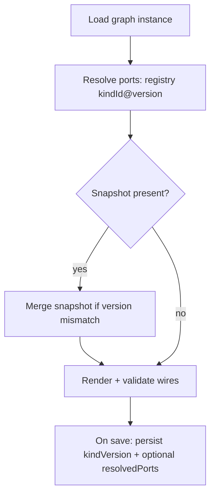

| Concern | Behavior |
|---------|----------|
| User reopens project | Pins match what they saved |
| Pack adds optional pin | Old nodes unchanged until upgrade |
| Pack breaking change | Bump `kindVersion`; migrate or show “outdated node” |
| Wire validation | Uses **resolved** port list |
| User effort | **None** — users never edit port JSON |

---

## 5. Pin type system (locked: logical types)

**Goal:** least user effort, maximum compatibility across Python, JavaScript, C++, Verse, and future emitters. Users ask *“can I plug this wire here?”* — not *“is this Verse `logic`?”*

### Three layers

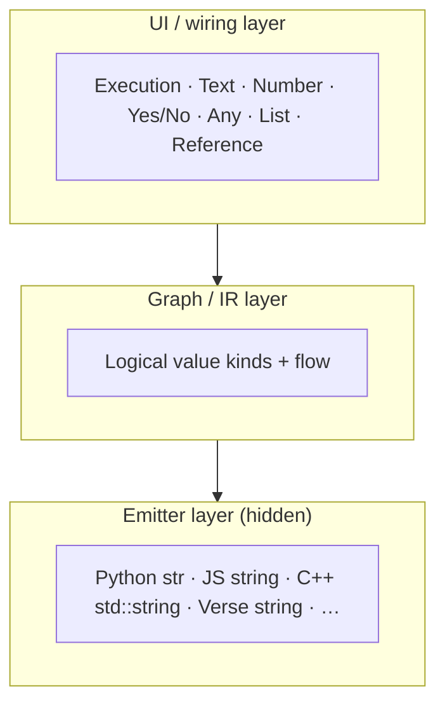

The graph is **language-agnostic** ([vision.md](vision.md)). Only Stage C maps logical types to language types.

### User-facing pin kinds (v1)

| Logical type | User sees | Wires to |
|--------------|-----------|----------|
| **Execution** | Chevron / square pin | Execution only |
| **Text** | Circle (string) | Text, **Any** |
| **Number** | Hexagon | Number, **Any** |
| **Yes/No** | Diamond | Yes/No, **Any** |
| **Any** | Generic data | Any non-execution |
| **List** | Grid / stack | List, **Any** |
| **Reference** | Object handle | Reference, **Any** |

Current code names (`data_string`, `data_number`, …) map to this table; product copy uses friendly names per [naming_and_product_direction.md](naming_and_product_direction.md).

### Wiring rules (maximum forgiveness)

1. **Execution is strict** — exec ↔ exec only.
2. **Any is permissive** — connects to any non-execution pin.
3. **Same family connects freely** — number ↔ number, text ↔ text, etc.
4. **No user cast nodes in v1** — emitter inserts conversions; optional compiler log warning.
5. **Shape + color** convey type — do not rely on text labels alone ([vvs_ui_development](../.agents/skills/vvs_ui_development/SKILL.md)).

### Flow chain semantics (intentional — not Unreal Blueprint)

VVS uses **linear flow chains**, not Blueprint-style wire splicing or implicit merge.

| Rule | Behavior |
|------|----------|
| **One flow in** | Each execution **input** accepts one wire. A new connection **replaces** the previous upstream link. |
| **One flow out** | Each execution **output** (per handle) drives **one** next node. Rewiring replaces the old downstream link. |
| **Insert in the middle** | Wiring `A → B → C` then connecting `X → B` **drops** `A → B`. `A` is no longer in that sequence — it is not auto-merged or spliced like UE. |
| **Branch nodes** | `true` / `false` (or equivalent) are separate output handles; each obeys the same single-wire rule. |

**Why:** Copy-pasting long linear chains produces redundant generated code. Breaking the chain on rewire pushes authors toward **functions** (Call Function) for repeated behavior — not invisible macro paste.

Implementation: `apps/web/src/lib/graphWiring.ts` (`edgesWithoutTargetHandle`, `edgesWithoutSourceHandle`).

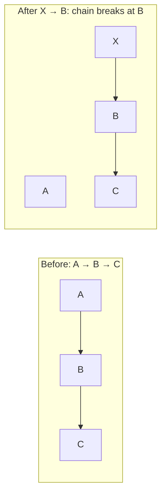

**Do not** add Blueprint-style “drop on wire to insert” without an explicit product decision — it conflicts with this principle.

### Language mapping (emitter only)

| Logical | Python | JavaScript | C++ | Verse |
|---------|--------|------------|-----|-------|
| Text | `str` | `string` | `std::string` | `string` |
| Number | `int` / `float` | `number` | `float` | `float` |
| Yes/No | `bool` | `boolean` | `bool` | `logic` |
| Any | untyped / `Any` | `unknown` | `auto` | loose |
| List | `list` | `Array` | `std::vector` | (profile) |

Variables use the **same logical types**; Get/Set inherit the variable type on their data pin.

### Avoid (too much user effort)

- Per-language pin types on the canvas
- Mandatory cast nodes for common mismatches
- Different wire rules per target language
- Large numeric subtyping in the UI (int32, float64, …)

---

## 6. Code generation contract & selection UX

### Code panel default (locked)

The **generated code panel is open by default** in Canvas mode. It is part of the primary authoring loop (graph + code together). The **compiler log** stays collapsed until errors or compile events.

Do **not** re-collapse code on mount. See [current_state.md](current_state.md).

### Do not regenerate on selection

Passing `selectedNodeId` into the transpiler couples codegen to UI state — violates Dependency Inversion and breaks multi-language emitters.

**Approved approach:** one transpile per Generate → structured result → UI highlights from metadata.

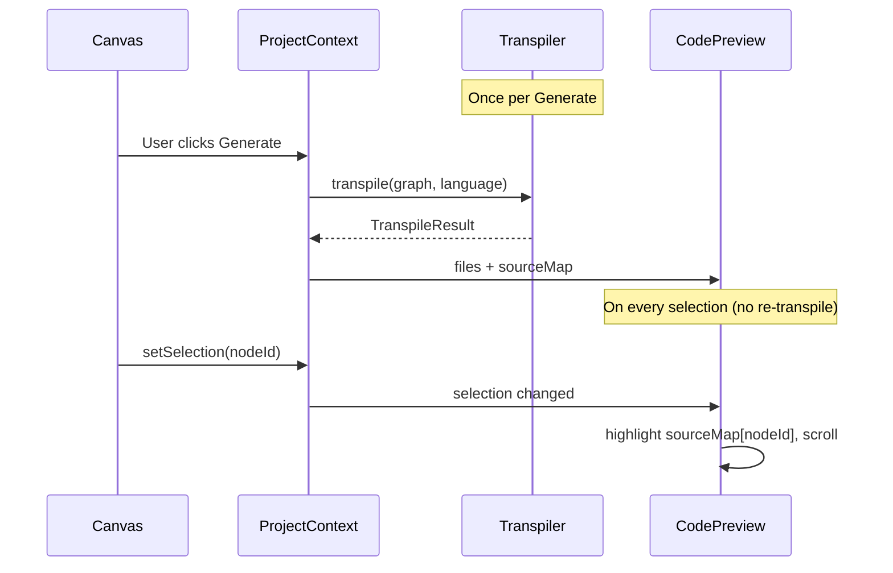

### TranspileResult (canonical contract)

Defined in `packages/graph-types` (stub today: `apps/web/src/types/transpile.ts`).

```typescript
interface TranspileResult {
  files: { path: string; content: string }[];
  sourceMap: Record<string, SourceRange[]>;
  fragments?: Record<string, string>;  // optional inspector snippets
}

interface SourceRange {
  filePath: string;
  startLine: number;
  startCol: number;
  endLine: number;
  endCol: number;
}
```

| Piece | Owner | When |
|-------|-------|------|
| Language formatting (indent, braces) | Emitter + syntax profile | Generate |
| Selection highlight (CSS on lines) | `CodePreviewPanel` | Select node |
| Inspector snippet | `fragments[nodeId]` | Select node |
| Re-transpile on select | **Not used** | — |

### Selection UX rules

| Rule | Behavior |
|------|----------|
| Code panel | Open by default in Canvas |
| Highlight | Uses last **successful** Generate when graph is clean or auto-generate on |
| Dirty graph | Show “out of date”; highlight stale map or dim |
| Pure expression nodes (Get) | `fragments` or “used on line N” in inspector |
| Branch | Highlight full `if` block |
| Later | Click line → select node (reverse `sourceMap`) |

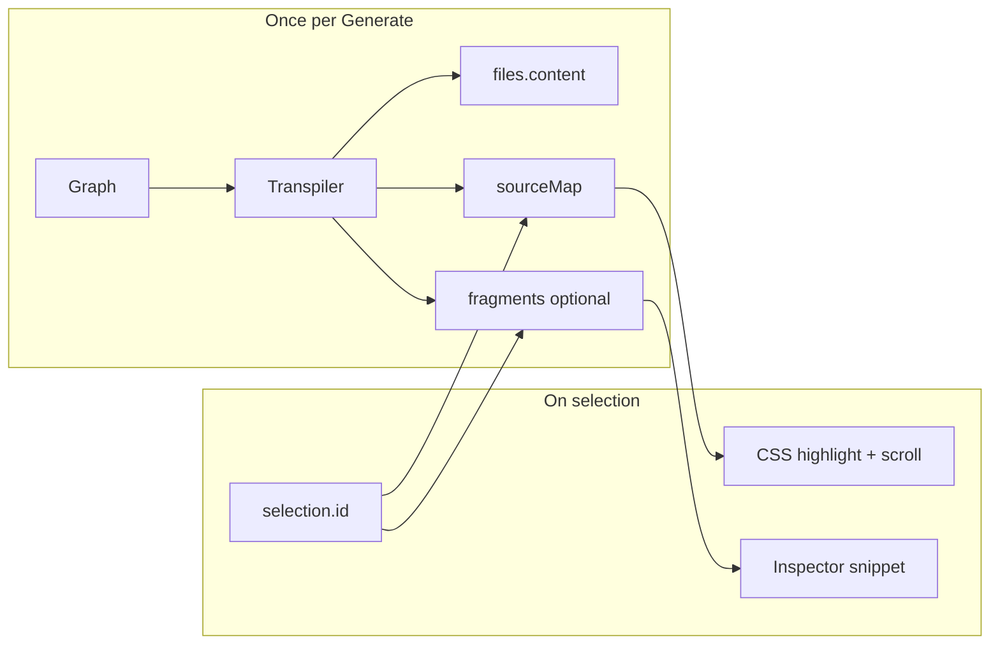

---

## 7. Package boundaries

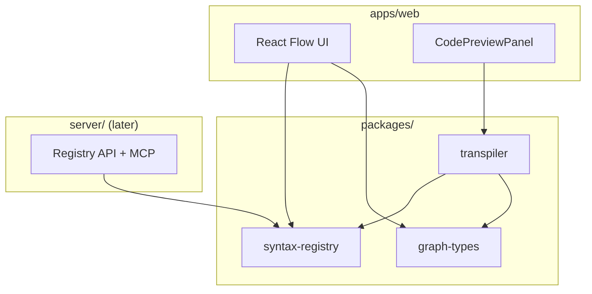

| Package | Responsibility |
|---------|----------------|
| `graph-types` | `GraphDocument`, `NodeInstance`, `TranspileResult`, `ProjectSnapshot` |
| `syntax-registry` | `NodeDefinition`, packs, `resolve()`, project expansion |
| `transpiler` | analyze → lower → emit; **zero React** |
| `apps/web` | Render instances; highlight from `sourceMap` |
| `server` | Serve registry; MCP `ListAvailableNodes` (Phase 2) |

---

## 8. Migration path (frontend-first)

No backend required for early phases.

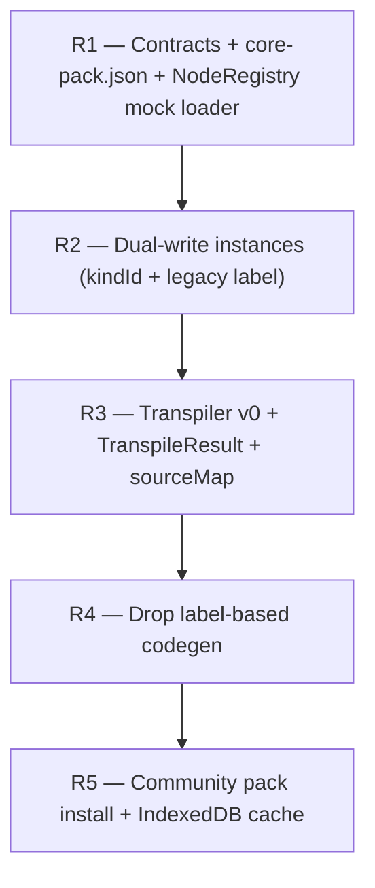

| Phase | Deliverable |
|-------|-------------|
| **R1** | Types, `core-pack.json` mirroring `nodeCatalog`, `NodeRegistry` interface |
| **R2** | Spawn sets `kindId`; adapter infers from label for old saves |
| **R3** | `packages/transpiler` scaffold; snapshot tests; `sourceMap`; code highlight UX |
| **R4** | Ports from registry; remove `mockCodegen` label switches |
| **R5** | Pack manifests; offline cache |

---

## 9. How the pieces connect

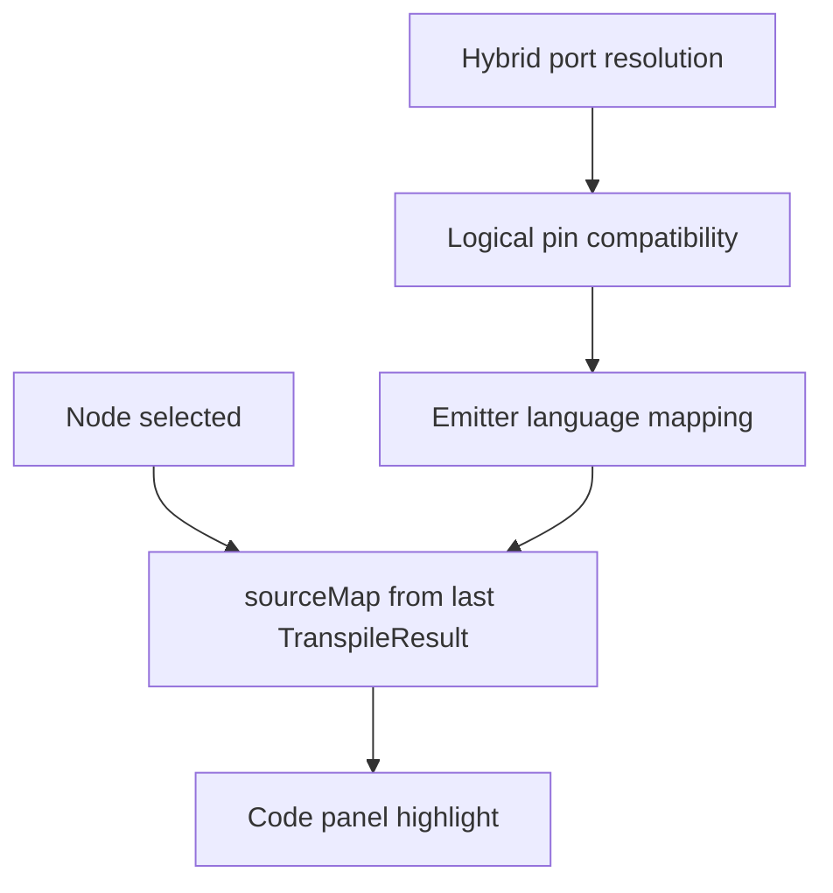

---

## 10. Decisions log

### Locked (approved July 2026)

| Decision | Choice |
|----------|--------|
| Port strategy | **Hybrid** — `kindId` + `kindVersion`; resolve from registry; optional snapshot on save |
| Pin types | **Logical types** at wire layer; language mapping in emitter only |
| Dynamic call nodes | **One kind** `vvs.project.call_function` + `graphBinding` |
| Selection → code | **`TranspileResult.sourceMap`**; no re-transpile on select |
| Code panel | **Open by default** in Canvas |
| Regenerate for highlight | **Rejected** — presentation stays in UI |

### Still open (recommendations)

| Question | Recommendation | Why |
|----------|----------------|-----|
| **First implementation slice** | **Done (July 2026):** `TranspileResult`, `sourceMap`, CodeMirror panel, selection highlight, `kindId` dual-write on spawn |
| **Code panel package** | **CodeMirror 6** behind `GeneratedCodeView` facade — see §11 |
| **`docs/node_system.md` maintenance** | Update when R1–R5 land | This file is canonical |
| **Dev-only source markers** (`// @vvs:node-id`) | **No** for export; use `sourceMap` only | Keeps copy/paste clean |
| **Monorepo workspaces** | Add root `package.json` workspaces when extracting `packages/*` | Not blocking R1 in `apps/web` |
| **Progressive disclosure vs code panel** | Code panel exempt — always visible in Canvas; log stays event-driven | Product decision July 2026 |

---

## 11. Code panel technology (locked)

The generated code panel uses a **swappable view** behind `GeneratedCodeViewProps` — transpiler output stays independent of the editor widget.

### Choice: CodeMirror 6 (via `@uiw/react-codemirror`)

| Option | Pros | Cons | Verdict |
|--------|------|------|---------|
| **CodeMirror 6** ✅ | Modular bundle, line decorations, read-only mode, widely adopted, good React bindings | Verse has no official grammar (interim: Python-like) | **Default implementation** |
| **Monaco** | VS Code parity, rich IDE features | Heavy bundle (~2MB+), worker setup in Next.js | Swap-in later if needed |
| **Prism / `<pre>`** | Tiny | No line decorations API; DIY scroll/highlight | Retired |

### Architecture

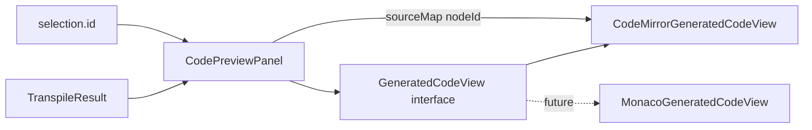

| File | Role |
|------|------|
| `types/transpile.ts` | `TranspileResult`, `SourceRange` |
| `components/code/types.ts` | `GeneratedCodeViewProps` |
| `components/code/GeneratedCodeView.tsx` | Facade — swap implementation here |
| `components/code/CodeMirrorGeneratedCodeView.tsx` | CodeMirror 6 + line highlight |
| `lib/codeEditorLanguages.ts` | `TargetLanguage` → CM language extensions |

**Rules:**

- UI passes `value`, `language`, `highlightRanges` only — never `selectedNodeId` into transpiler.
- Highlight = CSS line decoration from `sourceMap`, not regenerated formatted text.
- Copy/export uses raw `files[].content` (no UI markers).
- To switch to Monaco: implement `MonacoGeneratedCodeView` with the same props; change one export in `GeneratedCodeView.tsx`.

---

## 12. Event dispatchers (custom events)

**Status:** Shipped (July 2026) — project-level `events[]`, **Declare** (member chain) + **On** (handler) + **Dispatch** node kinds, direct-call emit in `@vvs/transpiler`. **Emit** / **Subscribe** kinds exist in the registry for legacy graphs only — **blocked** from spawn and codegen (`HIDDEN_EVENT_RUNTIME_UNSUPPORTED`); transpiler does **not** inject `_emit` / `_subscribe` helpers.

Unreal **Event Dispatchers** are one engine’s name for a universal pattern: **named signals with typed parameters, subscribers, and a broadcast**. VVS models that in the **graph + IR**; language-specific idioms live only in the **emitter**.

### 12.1 Program entry vs custom events

| Kind | `events[]` role | Canvas pattern | Codegen |
|------|-----------------|----------------|---------|
| **Program entry** | `role: 'entry'` | **Declare** (`event_member_define`) + **On** (`event_define`) | `def on_start(self):` — only when user declared entry on the class graph |
| **Custom event** | `role: 'custom'` (default) | **Declare** + **On** + **Dispatch** | `def on_{name}(self, …)` + `self.on_{name}(…)` at dispatch |
| **Lifecycle (deprecated)** | — | `event_on_start` node | **Removed** — analyzer error `LIFECYCLE_NODE_DEPRECATED` |

Program entry is **first-class project data** (`events[]` with `role: 'entry'`), not a hidden lifecycle shortcut. The transpiler **never** injects an empty `on_start()`; host runners still call `App().on_start()` but that method exists only if the user wired an entry handler on canvas.

Custom events remain listed in the project Events tree. Entry events appear there too (one per class when the class has symbols).

### 12.2 Abstract model (language-neutral)

```text
EventDefinition(id, name, parameters)
Declare(eventId)    → event_member_define on define chain (member slot)
On(eventId)         → event_define handler entry + output pins = parameters
Dispatch(eventId)   → event_dispatch — exec + input pins = parameters
```

Same idea across ecosystems:

| Ecosystem | Usual name | VVS IR equivalent |
|-----------|------------|-------------------|
| Unreal | Event Dispatcher | `EventHandler` + `DispatchEvent` |
| C# / .NET | `event`, `EventHandler` | `EventHandler` + `DispatchEvent` |
| JavaScript | `EventEmitter` | `DispatchEvent` → `emitter.emit` |
| Python | signals / callbacks | `DispatchEvent` → `self.on_*()` |

### 12.3 Project data

```typescript
interface ProjectEventDefinition {
  id: string;              // stable: "evt_on_damage"
  name: string;            // display stem: "damage" → UI "On damage"
  parameters: { id: string; label: string; type: PinType }[];
  role?: 'entry' | 'custom'; // entry → codegen on_start; custom → on_{name}
  classId?: string;        // owning class (multi-class projects)
}
```

Stored in `ProjectSnapshot.events[]` alongside `variables[]` and `functions[]`. Legacy graphs without `events[]` are repaired on load by inferring definitions from existing declare/handler nodes.

### 12.4 Node kinds (registry)

| kindId | UI title | Role |
|--------|----------|------|
| `event_member_define` | Declare … | Member slot on define chain; `properties.eventId` |
| `event_on_start` | On Start | **Deprecated** — use `role: 'entry'` event + define chain |
| `event_on_update` | On Update | Lifecycle tick (engine hook) |
| `event_define` | On … | Handler entry; `properties.eventId` |
| `event_dispatch` | Dispatch … | Direct handler call; `properties.eventId` — **supported** |
| `event_emit` | Emit … | **Blocked** — hidden runtime helper; `HIDDEN_EVENT_RUNTIME_UNSUPPORTED` |
| `event_subscribe` | Subscribe … | **Blocked** — hidden runtime helper; `HIDDEN_EVENT_RUNTIME_UNSUPPORTED` |
| `action_print` | Print String | Sync stdout/log |
| `action_get_input` | Get User Input | Blocking input; `propertySchema` + `value` out |
| `convert_to_string` | To String | Explicit `str()` / `String()` / `std::to_string` — expression node |
| `convert_to_number` | To Number | Explicit parse to number from string |
| `event_custom` | *(legacy alias)* | Migrated to `event_define` |

Semantics (not label strings):

```json
{ "lowering": "event", "role": "define" | "dispatch" | "entry" | "tick" }
```

### 12.5 Authoring → IR → emit

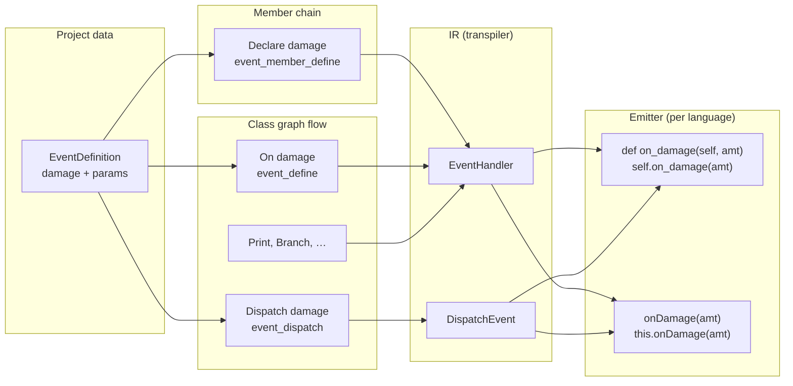

**Enforced model (direct call):** one `event_define` handler per event → emitter generates a method and `self.on_<name>(args)` at dispatch sites. Multiple handlers for the same event without a visible multicast pattern → `MULTICAST_REQUIRES_SUBSCRIBE` error (no hidden callback list).

**Rejected:** `event_emit` / `event_subscribe` and transpiler-injected `_emit` / `_subscribe` helpers — violate text-shaped fidelity ([visual_to_text_fidelity.md](visual_to_text_fidelity.md)). Future multicast must be explicit, highlightable lines — not hidden runtime.

### 12.6 Selection → code highlight

Uses the same `TranspileResult.sourceMap` contract (§6):

| Node | Highlight target |
|------|------------------|
| **Declare** (`event_member_define`) | Method **signature** line of the paired handler (`def on_x` / `void on_x() {`) — same construct as On; dual-node fidelity |
| **On** (`event_define`) | Full handler block (`def on_x(self):` …) |
| **Dispatch** | Dispatch call line |
| **Parameter pins** | Argument sub-expressions (`ExprSpan`) |

No re-transpile on selection. Emit is **single-pass**: member-chain order = source order (`appendIrMembersInOrder`); no `# Declare` comment stubs.

### 12.7 Cross-language emit (phase 1)

| Target | Declare + On (same method) | Dispatch |
|--------|----------------------------|----------|
| Python | `def on_damage(self, amount):` … | `self.on_damage(amount)` |
| JavaScript | `on_damage(amount) {` … | `this.on_damage(amount);` |
| C++ | `void on_damage(float amount) { … }` | `on_damage(amount);` |
| Verse | `on_damage(…) : void =` … | `on_damage(Amount)` |

`event_member_define` and `event_define` both map to the **same** method (signature vs full span). Canvas chain position of the Declare node controls where that method appears in the class body.

Parameter names are derived from event parameter labels (snake_case in Python, camelCase optional later in profiles).

### 12.8 Naming (locked)

| Layer | Term |
|-------|------|
| **UI** | **Declare …** (member chain) / **On …** (handler) / **Dispatch …** (invoke) |
| **Project JSON** | `events[]`, `eventId` |
| **Registry** | `event_member_define`, `event_define`, `event_dispatch` — `kindId`s stable |
| **IR** | `EventDefinition`, `EventHandler`, `DispatchEvent` |
| **Tree section** | Event Dispatchers (UE-familiar label; canonical type is `events[]`) |

---

## 13. Symbols, bindings, and portability (July 2026)

**Canonical types:** `@vvs/graph-types` — `FunctionSymbol`, `GraphBinding`, `ProjectSnapshot` v2.

| Symbol | Inspector | Pin sync |
|--------|-----------|----------|
| Variable | `VariablePropertiesPanel` | Get/Set nodes |
| Event | `EventPropertiesPanel` | Declare / On / Dispatch |
| Function | `FunctionPropertiesPanel` | Call nodes + function entry |

**Portability:** `@vvs/language-profiles` + `runProjectAnalysis()` warn when graph features are unsupported for the selected target. See [language_profiles.md](language_profiles.md).

**Registry:** `@vvs/syntax-registry` + `core-pack.json` — single spawn catalog; dynamic `vvs.project.call_function` + `graphBinding`.

---

## Related documents

| Document | Topic |
|----------|-------|
| [visual_to_text_fidelity.md](visual_to_text_fidelity.md) | **Text-shaped graphs** — locked direction |
| [vision.md](vision.md) | Logic vs syntax, three layers |
| [project_requirements.md](project_requirements.md) | Transpiler stages, syntax registry |
| [roadmap.md](roadmap.md) | Phases, UE plugin |
| [current_state.md](current_state.md) | Shipped vs planned |
| [naming_and_product_direction.md](naming_and_product_direction.md) | UI vocabulary |
| `.agents/skills/vvs_solid_principles/SKILL.md` | OCP, DIP for registry + transpiler |
| `.agents/skills/vvs_transpiler_development/SKILL.md` | Pipeline + snapshot tests |
