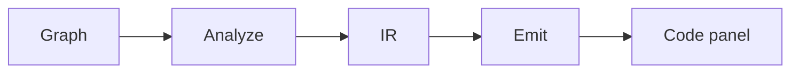

# Quickstart

Get the VVS editor running in a few minutes. First-time machine setup: **[setup.md](setup.md)**.

You do not need an account, Postgres, or the Go sidecar. Hosted **[GitHub Pages](https://sheriff99yt.github.io/VVS-Web/)** plus a local folder / `.vvs/` is the product path.

---

## Start the app

### Windows (recommended)

```powershell
# One-time setup (if you haven't already)
.\tools\setup_env.ps1

# Start frontend. Optional Go sidecar (API + local MCP) in new windows
.\tools\start_app.ps1
```

### Manual (any OS)

```bash
# From repository root (installs apps/web + packages/*)
bun install
bun run dev
```

Or from `apps/web`:

```bash
cd apps/web
bun install          # first time only
bun run dev
```

Open **[http://localhost:3000](http://localhost:3000)**.

**Live preview (GitHub Pages):** [https://sheriff99yt.github.io/VVS-Web/](https://sheriff99yt.github.io/VVS-Web/) - static build. Projects save to browser `localStorage` only (separate from localhost).

The terminal prints a **Network** URL for LAN access (for example `http://192.168.x.x:3000`). That needs `DEV_ALLOWED_ORIGIN` in `apps/web/.env.local`. `setup_env.ps1` creates this on Windows.

---

## First session (2 minutes)

1. **New project** - empty class graph with a program entry (Declare start + On start)
2. **Start cards** - Simple, Complex, Advanced (the only shipped examples)
3. **Right-click canvas** - spawn nodes (Action, **Conversion**, Math, Variables, ...)
4. **Connect pins** - same-type wires only; use **To String** before Print for numbers
5. **Generate** (TopNav) - analysis plus `@vvs/transpiler` preview (per-graph language; **Code** and **Files** tabs on the right)
6. **Functions** - add in the Project tree; spawn **Call {name}**, **Declare**, or **Define** from the release menu
7. **File / Save** - persists the project snapshot to browser **localStorage**, or to a folder / `.vvs/` when you opened from disk

Projects appear under **Recent projects** on the start screen.



**Generate** is that whole path. **Emit** is the last stage only.

---

## URLs & storage

| URL | Notes |
|-----|--------|
| `http://localhost:3000` | Default local dev |
| `http://192.168.x.x:3000` | Same machine or device on Wi-Fi - needs `.env.local` |

**Important:** Projects saved on `localhost` are **not** visible on the LAN IP URL (and vice versa). Pick one and stick with it.

---

## Build check

```bash
cd apps/web
bun run build
bun run lint
```

---

## What works today vs leftover

| Works now | Leftover / not product |
|-----------|------------------------|
| Graph editor, tabs, References | Cloud sync, VVS accounts |
| localStorage, folder, `.vvs/` save | Hosted MCP URL / remote deploy |
| **Generate** for Python, JavaScript, C++, Verse, GDScript, Rust, C#, Go | TypeScript is not a generate target. JSON dump is a preview language |
| Conversion nodes, **Concat Strings**, pin validation, loops | **Compare** is not a node |
| **Get User Input** on targets with stdin / prompt | Verse GetInput is Print + `(x)` + empty string. Do not invent a player API |
| Start-screen Simple / Complex / Advanced | Dual Class / Calculator / Async Fetcher and the five labs are retired |
| Bind on C# `+=`, JavaScript `.on`, GDScript `.connect` | Other languages: Bind unspawned or leftover `(x)` |
| In-page TypeScript agent | Go MCP sidecar is local only |
| Offline honest UI | Session collab, UE6 plugin |
| Optional local Go API + MCP sidecar (`start_app.ps1`) | Self-hosted Supabase + `pgx` is a frozen experiment, not setup |

Details: **[current_state.md](current_state.md)**. Roadmap: **[roadmap.md](roadmap.md)**.

---

## Stop dev servers

Close the PowerShell windows opened by `start_app.ps1`, or stop the `bun run dev` process (Ctrl+C).

---

## Going further

| Doc | Topic |
|-----|--------|
| [setup.md](setup.md) | Toolchain, `.env.local`, git safety, Pages |
| [code_panel.md](code_panel.md) | Code panel highlight, hover, Files pin |
| [node_system.md](node_system.md) | Nodes, pins, conversion, property schema |
| [language_profiles.md](language_profiles.md) | Per-target portability |
| [vision.md](vision.md) | Product direction |
| [CONTRIBUTING.md](../CONTRIBUTING.md) | How to contribute |
| [deployment.md](deployment.md) | Legacy self-host notes (not product direction) |
