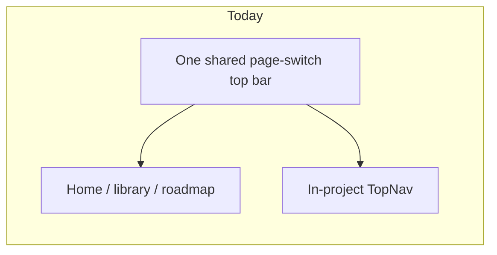
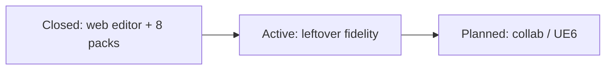

# VVS - Public Roadmap

Directional phases - not schedule commitments.
**Ships today:** [current_state.md](current_state.md). **North star:** [visual_to_text_fidelity.md](visual_to_text_fidelity.md). **Code panel UX:** [code_panel.md](code_panel.md).

**Product default (locked):** client-first editor. **No VVS accounts**, **no dedicated app server**, **no live code execution**. Edit graphs, **Generate** ordinary source, run **logical checks**. Reading existing source into a graph (U93) is **research**, not a product default.

In-app: **Development roadmap** with **Open / Done / Research**, grouped frontend / backend (mirrors this doc). Research tab holds studies for leftover Open items (U93, COA, Bind remaining langs, native VS Code / UE6 hosts, interactive node docs).

---

## Now (August 2026)

### Active / Open

| Focus | IDs | Status |
|-------|-----|--------|
| Verse GetInput | CL-014 (`verse-getinput-cl014`) | **Open** - honest `(x)` + Print + empty string. No invented player API. Research tab: keep stub (ship), invent Player.GetInput (reject), pack device input (later) |
| Library remaining (auth / upload) | U90 | **Frozen** - client-first; no accounts as product. Do not unfreeze upload or GoTrue. Research tab: git catalog (ship), VVS accounts (reject) |
| Event Bind | event-bind-honest | **Partial** - C# `+=`, JavaScript `.on`, GDScript `.connect`. Other langs unspawned or leftover `(x)` |

### Long-term / Research

| Focus | IDs | Notes |
|-------|-----|--------|
| Code to visual (reverse of Generate) | U93 | Research tab. Not shipped. Do not advertise "import from existing code" |
| Compile-once-all | COA | `COA_SHIPPED = false`. Single-target Generate only |
| Session collab | Phase 4 | Planned. Session client/host, not account cloud |
| UE6 Verse plugin | Phase 5 | Planned. Same graph, Verse text, not Blueprint VM |
| Interactive node / option / feature docs | \interactive-node-docs\ | Planned. Research tab. HTML-first catalog on existing Pages (SEO + GEO). Playground later. Do not ship the catalog in this row. |

### Just shipped (August 2026)

Eight-language Generate, Simple / Complex / Advanced home-preview goldens (U65), in-page TypeScript agent, folder / `.vvs/` persist, Code panel hover and Files pin, U81 Declare vs Define, Concat Strings, Bind on csharp / javascript / gdscript, Switch match, Yield, Extends multi-base (python/cpp), Implements list + Class form (cs/rs), first-party env templates, Library token search + language chips (no embeddings), host skip/emit + Refresh merge. Dual Class / Calculator / Async Fetcher and the five labs are retired as Start cards.

Not current focus: dedicated VPS / self-hosted auth-Postgres product; any live code execution / Play / interpreter / runner.

---

## Next (open only)

Agent IDs in `.agents/memory/incomplete-ui.md`. In-app: Development roadmap -> **Open**.
Emit-fidelity findings: **CL-*** log in [`.agents/skills/vvs_cross_language_mapping/SKILL.md`](../.agents/skills/vvs_cross_language_mapping/SKILL.md).

### Priority

| # | Item | Notes |
|---|------|--------|
| **CL-014** (`verse-getinput-cl014`) | Verse GetInput | Honest `(x)` + prompt shipped. Real player/string read is not a plain-class API. Research tab: keep stub (ship). |
| **folder-os-path** | Reveal in Explorer / Finder | Planned. |
| **env-engine-packs** | Engine environment packs | Planned. Do not invent UE6 APIs. |
| **interactive-node-docs** | Interactive documentation | Planned. Public catalog of each node / option / feature. Research tab (SSG ship, playground later, SPA/hosted reject). Do not ship the catalog in this docs-only row. |

### Editor & AI

| # | Item | Notes |
|---|------|--------|
| **U90** | Library remaining | Templates / git import shipped. **Auth / upload frozen.** Remaining is a public git catalog and browse/search, not an upload form or GoTrue accounts. |
| **U93** (`code-to-visual-u93`) | Code to visual | Long-term reverse-import **research**. Not a default. |

### Library (U90)

Shipped: Library page (templates, git import), token search, language chips, first-party env packs.

**Frozen (not Next):** upload form, GoTrue / JWT auth, VVS accounts. Do not unfreeze.

Still open on the Research tab: git catalog as the community source (ship) vs hosted accounts (reject).

### Leftovers that stay honest

| Item | Notes |
|------|--------|
| **Event Bind** | Partial. Printers and spawn for C# `+=`, JavaScript `.on`, GDScript `.connect`. Other langs unspawned or `(x)`. Not U100 (hidden subscribe/emit was cut). |
| **Verse GetInput** | Print + `(x)` + empty string. Advanced leftover. |
| **Compare** | Not a node. |
| **COA** | Settings show Planned. `COA_SHIPPED` is false. |

Also strengthening: analyzer / portability / `(x)` / dim / compiler log. **No** live run.

Validate: `bun apps/web/scripts/validate_test_projects_folder.ts`.

---

## Recently completed

User-facing waves (detail lives in [current_state.md](current_state.md) and the in-app **Done** tab):

| Wave | Items |
|------|--------|
| **U81** | Function Declare is not Define. `function_define` = existence; `function_implement` = body. Symbol delete / deleteClass drop both |
| **Examples** | Simple / Complex / Advanced home-preview goldens. Five labs retired |
| **Agent** | In-page TypeScript agent (hosted path). U91 dual-consent / MCP Ready are not product chrome |
| **Code panel** | Selection highlight, double-click to node, hover yellow outline, Files pin |
| **Bind** | Honest registration on csharp / javascript / gdscript |
| **Emit / OOP** | Switch match, Yield, Extends multi-base, Implements + Class form, ctor/dtor Function role, overload codegen |
| **Library client** | Token search, language chips, 17 first-party env packs. Community catalog stays Phase 3 and auth/upload stays frozen |
| **Chrome** | Undo, settings, shortcuts, audio, virtualization, References redesign |
| **Global top bar** (`start-topbar-consistent`) | Page-switch tabs (Project / References / Library / Roadmap / Packs) on **every route**, including the homepage. Project / References / Packs with no project or standalone route go home. File / Edit / View / Save / Generate stay in-project only |

---

## Phase notes

| Phase | Status | One-liner |
|-------|--------|-----------|
| **1** Web editor & transpiler | Closed | Eight packs, `.vvs/`, canvas source of truth |
| **2** Persistence & AI | **Redirected** | Client-first: local / folder / `.vvs/`; **in-page TS agent** (hosted); optional localhost Go sidecar for other apps; **no dedicated server** as product |
| **6** Fidelity, canvas scale & polish | **Active** | Open: CL-014 honest `(x)`, U93 long-term, U90 frozen, Bind partial. Global top bar (`start-topbar-consistent`) is Done. |
| **3** Community library | **Partial** | Client browse/search/templates shipped. Auth / upload **frozen**. Git catalog still research |
| **4** Collaboration | Planned | Session client/host, not account cloud. Research tab |

### High priority: native hosts

| Item | Status | Gate |
|------|--------|------|
| Native VS Code plugin (`vscode-native-plugin`) | **Open** — high priority. Research tab. Not an “open Pages” button. No VSIX this pile. iframe Pages reject. | Workspace paths + ordinary Generate |
| Native Unreal Engine 6 plugin (`ue6-native-plugin`) | **Open** — high priority, **after UE6 releases**. Epic public EA end of 2027. Not released as of 22 August 2026. GitHub `ue6` stream is not Alpha. | Do not invent UE6 APIs. Do not start Slate before the engine exists. |

| **5** UE6 plugin | Planned | Same graph to Verse text; not Blueprint VM. Research tab |

Detail: [design/fidelity_streamline.md](design/fidelity_streamline.md). Backlog `.agents/memory/incomplete-ui.md`. Lang emit [cross_language_mapping/SKILL.md](../.agents/skills/vvs_cross_language_mapping/SKILL.md).

---

### Docs & discoverability

| Item | Status | Notes |
|------|--------|-------|
| Interactive documentation (`interactive-node-docs`) | **Open** — catalog of every node, option, and feature. HTML-first, bot/AI + SEO + GEO. Research tab. Architecture: [design/interactive_docs_architecture.md](design/interactive_docs_architecture.md). | Existing CI + GitHub Pages. Playground later. Not a JS-only SPA. |

---

## Non-goals (for now)

- Bundled LLM - bring your own via the in-page agent (optional local key) or a later MCP wrapper
- Proprietary runtime / Blueprint VM
- Hidden transforms or invented emit without canvas nodes
- **Live code execution** - no Play, interpreter, runner, or "run from VVS"
- Reviving mock Play/Pause graph simulation
- **Dedicated server hosting** - static Pages + local projects only
- **Compile-once-all** until `COA_SHIPPED` is true
- **Import from existing code** as a product default (U93 stays research)
- **Library upload / GoTrue accounts** (frozen)

---

## Client-first direction (locked)

Product default: **no VVS accounts, no dedicated app server**. Browser/editor + local / folder / git; optional GitHub for packs, library links, and **static** web hosting (Pages).

**Do not delete** legacy hosted/cloud/`server/` paths - keep for reference and local experiments; they are **not** an active product track.

| Pillar | Direction |
|--------|-----------|
| **Edit + Generate** | Entirely client-side; **no** required backend |
| **Persist** | Local storage, **folder / `.vvs/`**, git |
| **Checks** | In-app **logical** analysis and **warnings** only |
| **Execution** | **Out of scope** - third-party IDEs, engines, CI |
| **Hosting** | **No dedicated server** - static showcase (Pages) OK |
| **Canvas scale** | Virtualization (U83) shipped |
| **Pack updates** | Fetch from GitHub; versions **accumulate**; Pack versions view (U78) |
| **Library** | First-party templates + git import. Auth / upload **frozen** |
| **MCP / AI** | Hosted app = **in-page TS agent**. Other apps / Cursor = later thin MCP wrapper; today optional localhost Go sidecar |
| **Collab** | Session **client/host**, not account cloud. See in-app Research tab |

---

## Follow progress

| Source | Role |
|--------|------|
| [current_state.md](current_state.md) | Implementation truth |
| [code_panel.md](code_panel.md) | Code panel navigation and highlight UX |
| [design/fidelity_streamline.md](design/fidelity_streamline.md) | Fidelity program |
| In-app **Development roadmap** | Open / Done / Research |
| [deployment.md](deployment.md) | Legacy self-host notes - **not** product direction |
