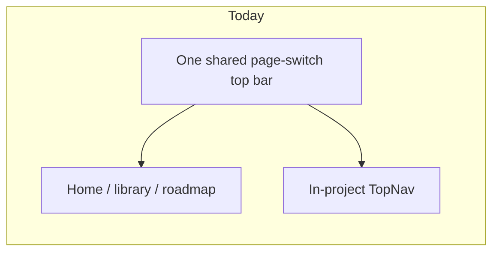
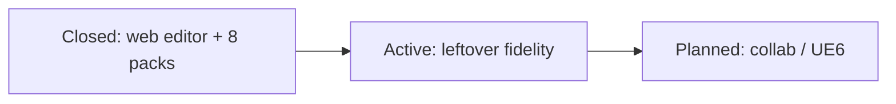

# VVS - Public Roadmap

**Research refreshed 30 September 2026 after merged [PR #8](https://github.com/Sheriff99yt/VVS-Web/pull/8), at commit `513d0afa`.** Priorities are recommendations, not schedule commitments or claims that the recommended fixes shipped.

**September 2026 implementation note:** The Start page now explains graph-to-code with one illustrative preview and no duplicate welcome overlay. Node docs have practical guidance for Branch, Print String, and Math Add. Library Git catalogs can fetch a validated static `catalog/vvs-catalog.json` index and show repository links; automatic community installation is still open. `apps/vscode` contains an initial native VS Code extension with a graph text editor and Generate; full graph editing and extension-host validation remain open. See [development_worklist.md](development_worklist.md).

## Contents

- [Product law](#product-law)
- [Selected live-docs route](#selected-live-docs-route)
- [Research follow-through](#research-follow-through)
- [Now (September 2026)](#now-september-2026)
- [Next (open only)](#next-open-only)
- [Recently completed](#recently-completed)
- [Phase notes](#phase-notes)
- [Docs & discoverability](#docs--discoverability)
- [Non-goals (for now)](#non-goals-for-now)
- [Client-first direction (locked)](#client-first-direction-locked)

### Product law

**[Product law]** Client-first editor. **No VVS accounts**, **no dedicated app server**, **no live code execution**. Canvas is the source of truth. **Generate** is the user action. Leftover `(x)` stays honest. Ships today: [current_state.md](current_state.md).

### Selected live-docs route

**[Selected]** Public catalog = **HTML-first SSG from `syntax-registry` `list()`** on existing GitHub Pages (`https://sheriff99yt.github.io/VVS-Web/`, `basePath` `/VVS-Web`). Playground later. JS-only SPA / hosted-key docs: **Rejected** (empty HTML fails crawlers, GEO, and client-first Pages).

**Partial:** `/docs` catalog + node/feature pages, `docsUrl()`, shared top bar, registry hover on info icons (node + options), and initial guidance for three common nodes. Remaining prose and playground are open. Architecture: [design/interactive_docs_architecture.md](design/interactive_docs_architecture.md). Research card `interactive-node-docs`.

### Research

**[Research]** Studies for leftover Open items (U93, COA, Bind remaining langs, native VS Code / UE6 hosts, interactive node docs). Do not collapse a research verdict into a shipped claim.

---

## Research follow-through

**[Research]** The existing 13 [Research cards](https://sheriff99yt.github.io/VVS-Web/roadmap) now record a current baseline, three alternatives, dependencies, a bounded next experiment, proposed acceptance gates and primary/pinned sources. Static code findings are risks to reproduce, not new runtime failures or benchmark results. PR #8's standalone JavaScript Library pilot is implemented; broad reverse import remains open.

**[Recommendation]** Work in this order, with independent improvements in parallel:

1. **Revision-safe persistence.** Track saved and generated revisions separately, serialize/coalesce saves, and prove interrupted multi-file writes recover a complete generation. Protect existing work before widening import/native/session scope.
2. **Small shared graph-edit contract.** Extract connection validation and edge replacement first; parity-test browser, in-page agent and native adapters. Extend to symbol lifecycle and conditional undo only after that seam works.
3. **Native project/buffer correctness.** Harden the existing VS Code editor: dirty-input snapshots, explicit initiating URI/root, revision-keyed source maps, dirty-output protection and extension-host tests. Keep its restricted editing set while doing this.
4. **Bounded target/host conformance.** Align Verse GetInput diagnostics with typed placeholders, verify real Bind receiver/lifetime contracts, and compile one complete UEFN Verse fixture. Use semantic requirements rather than printer presence. This is not a requirement to finish COA or certify all eight targets first.
5. **Narrow Python Library-import pilot.** First prove target-correct file-level `def` ownership and independently validate output. Compare parser candidates on a tiny subset. Repeat the existing JS production-browser accept/reload flow alongside steps 1–3 rather than waiting for Python.

**Parallel:** asset-level Library search and catalog robustness; touch-end/pan/select correctness on real devices; truthful docs/examples/static-artifact checks; native reveal after document/root identity is correct. Collaboration waits for shared command/revision semantics. UE6 native implementation retains the actual-release gate. Model search, radial menus and docs playgrounds remain evidence-gated.

### Revision-safe persistence

- **Current evidence:** save completion clears dirty state after an awaited write without checking intervening edits; folder persistence writes the manifest before graph/symbol files. These are source-inspected concurrency/recovery risks, not reproduced failures
- **Alternatives:** first add a minimal revision/save coordinator; then evaluate recoverable folder generations; an IndexedDB recovery journal is useful later but cannot by itself fix stale-save bookkeeping
- **Dependencies:** define content revision versus selection/layout changes; introduce a minimal persisted generation/version contract without a server
- **Experiment:** delay save N, edit N+1, complete N, issue another save, then inject a failure after each individual file write
- **Acceptance:** N never marks N+1 saved/generated; concurrent saves cannot regress data; reopen yields a complete old or new generation; permission/quota failures preserve unsaved state; Generate and Save advance separate markers; recovery does not rely solely on beforeunload
- **Evidence:** [save completion](https://github.com/Sheriff99yt/VVS-Web/blob/513d0afa1d7c6a26f877100cd4146be72553f8f0/apps/web/src/components/layout/TopNav.tsx#L272-L433), [folder writes](https://github.com/Sheriff99yt/VVS-Web/blob/513d0afa1d7c6a26f877100cd4146be72553f8f0/apps/web/src/lib/projectFolder/io.ts#L205-L267), [file writable semantics](https://fs.spec.whatwg.org/#api-filesystemwritablefilestream), [beforeunload limitations](https://developer.mozilla.org/en-US/docs/Web/API/Window/beforeunload_event)

### Shared graph-edit contract

- **Current evidence:** browser wiring checks detailed types/cycles and replacement policy; agent/native paths have different admission rules. Whole-project local undo is not safe to broadcast over later peer changes
- **Alternatives:** pure commands plus host adapters are recommended; importing the browser helper unchanged would retain UI dependencies; immediate CRDT adoption does not establish graph invariants
- **Dependencies:** stable command/revision identities, deterministic IDs, explicit policy and invariant ownership; incomplete programs must remain editable
- **Experiment:** replay one connect/reconnect/delete corpus through browser, agent and native adapters, comparing accepted commands, graph structure, diagnostics and generated source
- **Acceptance:** identical self-wire/cycle/missing-pin/type rejection; consistent occupied-input/exec-output rewiring; visible Declare/Define and references remain synchronized; undo avoids unrelated later edits; core imports no React, Next, VS Code or Go
- **Evidence:** [browser rules](https://github.com/Sheriff99yt/VVS-Web/blob/513d0afa1d7c6a26f877100cd4146be72553f8f0/apps/web/src/lib/graphWiring.ts), [agent rules](https://github.com/Sheriff99yt/VVS-Web/blob/513d0afa1d7c6a26f877100cd4146be72553f8f0/apps/web/src/lib/agent/toolRuntime.ts#L261-L305), [native editor](https://github.com/Sheriff99yt/VVS-Web/blob/513d0afa1d7c6a26f877100cd4146be72553f8f0/apps/vscode/src/extension.ts), [history model](https://github.com/Sheriff99yt/VVS-Web/blob/513d0afa1d7c6a26f877100cd4146be72553f8f0/apps/web/src/lib/graphHistory.ts)

## Now (September 2026)

### Active / Open

| Focus | IDs | Status |
|-------|-----|--------|
| Verse GetInput | CL-014 (`verse-getinput-cl014`) | **Partial** - prompt + `(x)` + typed empty-string/zero placeholder exist. Next align effectiveness/diagnostics; player-action APIs are a separate host contract |
| Library remaining (auth / upload) | U90 | **Partial** - read-only catalog links shipped; hardening/reviewed consumption open. Auth/upload **frozen**; no GoTrue or product accounts |
| Event Bind | event-bind-honest | **Partial** - C# `+=`, JavaScript `.on`, GDScript `.connect`. Other langs unspawned or leftover `(x)` |

### Open / Research

| Focus | IDs | Notes |
|-------|-----|--------|
| Code to visual (reverse of Generate) | U93 | JavaScript class and closed standalone Library-function pilots implemented; verify current browser flow, then a narrow Python pilot. General reverse import stays open. |
| Compile-once-all | COA | `COA_SHIPPED = false`. Single-target Generate only |
| Session collab | Phase 4 | Planned. Session client/host, not account cloud |
| UE6 Verse plugin | Phase 5 | Planned. Same graph, Verse text, not Blueprint VM |
| Interactive node / option / feature docs | `interactive-node-docs` | Partial. `/docs` catalog on Pages. Overlay + playground later. |

```mermaid
flowchart LR
  subgraph today [Today]
    Shared[One shared page-switch top bar]
    Home[Home / library / roadmap]
    Editor[In-project TopNav]
  end
  Shared --> Home
  Shared --> Editor
```

### Just shipped (August 2026)

Eight-language Generate, Simple / Complex / Advanced home-preview goldens (U65), in-page TypeScript agent, folder / `.vvs/` persist, Code panel hover and Files pin, U81 Declare vs Define, Concat Strings, Bind on csharp / javascript / gdscript, Switch match, Yield, Extends multi-base (python/cpp), Implements list + Class form (cs/rs), first-party env templates, Library token search + language chips (no embeddings), host skip/emit + Refresh merge. Dual Class / Calculator / Async Fetcher and the five labs are retired as Start cards.

```mermaid
flowchart LR
  Closed[Closed: web editor + 8 packs]
  Active[Active: leftover fidelity]
  Planned[Planned: collab / UE6]
  Closed --> Active --> Planned
```

Not current focus: dedicated VPS / self-hosted auth-Postgres product; any live code execution / Play / interpreter / runner.

---

## Next (open only)

Agent IDs in `.agents/memory/incomplete-ui.md`. In-app: Development roadmap -> **Open**.
Emit-fidelity findings: **CL-*** log in [`.agents/skills/vvs_cross_language_mapping/SKILL.md`](../.agents/skills/vvs_cross_language_mapping/SKILL.md).

### Priority

The ordered foundation/conformance sequence and acceptance gates are in [Research follow-through](#research-follow-through). The rows below remain open or partial and can progress according to those dependencies.

| # | Item | Notes |
|---|------|--------|
| **CL-014** (`verse-getinput-cl014`) | Verse GetInput | Honest `(x)` + prompt shipped. Real player/string read is not a plain-class API. Research tab: keep stub (ship). |
| **folder-os-path** | Reveal in Explorer / Finder | Planned. |
| **env-engine-packs** | Engine environment packs | Planned. Do not invent UE6 APIs. |
| **interactive-node-docs** | Interactive documentation | Partial. Public `/docs` catalog from CORE_NODE_REGISTRY. Overlay + playground later. |

### Editor & AI

| # | Item | Notes |
|---|------|--------|
| **U90** | Library remaining | Templates, token search and read-only public Git catalog links shipped. **Auth / upload frozen.** Next: catalog hardening, consistent asset search and reviewed immutable consumption. |
| **U93** (`code-to-visual-u93`) | Code to visual | Source-linked, preview-first **research with implemented narrow pilots**. Implementation plan in [code_to_visual_import.md](design/code_to_visual_import.md); experimental JavaScript class and closed standalone Library-function importer in Start; other languages, module exports, general syntax and re-import remain open. Not a default. |

### Library (U90)

Shipped: Library page (templates, git import), token search, language chips, first-party env packs.

**Frozen (not Next):** upload form, GoTrue / JWT auth, VVS accounts. Do not unfreeze.

Read-only static catalog fetching and source links are implemented. Research now covers robustness, publisher/curator workflows and immutable reviewed consumption. Automatic community installation remains open; hosted accounts/upload remain rejected.

### Leftovers that stay honest

| Item | Notes |
|------|--------|
| **Event Bind** | Partial. Printers and spawn for C# `+=`, JavaScript `.on`, GDScript `.connect`. Other langs unspawned or `(x)`. Not U100 (hidden subscribe/emit was cut). |
| **Verse GetInput** | Print + `(x)` + empty-string/zero placeholder. Align canvas/diagnostics with this unsupported behavior. |
| **Compare** | Not a node. |
| **COA** | Settings show Planned. `COA_SHIPPED` is false. |

Also strengthening: analyzer / portability / `(x)` / dim / compiler log. **No** live run.

Validate: `bun apps/web/scripts/validate_test_projects_folder.ts`.

---

## Recently completed

User-facing waves (detail lives in [current_state.md](current_state.md) and the in-app **Done** tab):

| Wave | Items |
|------|--------|
| **U81** | Function Declare is not Define. `function_define` = existence; `function_implement` = body. Symbol delete / deleteClass drop both |
| **Examples** | Simple / Complex / Advanced home-preview goldens. Five labs retired |
| **Agent** | In-page TypeScript agent (hosted path). U91 dual-consent / MCP Ready are not product chrome |
| **Code panel** | Selection highlight, double-click to node, hover yellow outline, Files pin |
| **Bind** | Honest registration on csharp / javascript / gdscript |
| **Emit / OOP** | Switch match, Yield, Extends multi-base, Implements + Class form, ctor/dtor Function role, overload codegen |
| **Library client** | Token search, language chips, 17 first-party env packs. Read-only static community catalogs/source links exist; installation remains open and auth/upload stays frozen |
| **Chrome** | Undo, settings, shortcuts, audio, virtualization, References redesign |
| **Global top bar** (`start-topbar-consistent`) | Page-switch tabs (Project / References / Library / Roadmap / Packs) on **every route**, including the homepage. Project / References / Packs with no project or standalone route go home. File / Edit / View / Save / Generate stay in-project only |

---

## Phase notes

| Phase | Status | One-liner |
|-------|--------|-----------|
| **1** Web editor & transpiler | Closed | Eight packs, `.vvs/`, canvas source of truth |
| **2** Persistence & AI | **Redirected** | Client-first: local / folder / `.vvs/`; **in-page TS agent** (hosted); optional localhost Go sidecar for other apps; **no dedicated server** as product |
| **6** Fidelity, canvas scale & polish | **Active** | Open: revision/save safety, shared edit semantics, CL-014 diagnostic truth, U93 expansion, U90 consumption and Bind conformance; auth/upload frozen. Global top bar (`start-topbar-consistent`) is Done. |
| **3** Community library | **Partial** | Client browse/search/templates shipped. Auth / upload **frozen**. Read-only catalog shipped; reviewed consumption still research |
| **4** Collaboration | Planned | Session client/host, not account cloud. Research tab |

### High priority: native hosts

| Item | Status | Gate |
|------|--------|------|
| Native VS Code plugin (`vscode-native-plugin`) | **Partial** — initial VSIX in `apps/vscode`. Workspace files + ordinary Generate are implemented; visual editor currently edits positions and inline inputs. Full graph editing and extension-host verification remain open. | Workspace paths + ordinary Generate |
| Native Unreal Engine 6 plugin (`ue6-native-plugin`) | **Open** — strategic priority, **after UE6 releases**. Epic targets EA end-2027; no superseding official release found in 30 September research. Development stream is not Alpha; target date is not a release commitment. | Do not invent UE6 APIs. Do not start Slate before the engine exists. |

| **5** UE6 plugin | Planned | Same graph to Verse text; not Blueprint VM. Research tab |

Detail: [design/fidelity_streamline.md](design/fidelity_streamline.md). Backlog `.agents/memory/incomplete-ui.md`. Lang emit [cross_language_mapping/SKILL.md](../.agents/skills/vvs_cross_language_mapping/SKILL.md).

---

### Docs & discoverability

| Item | Status | Notes |
|------|--------|-------|
| Interactive documentation (`interactive-node-docs`) | **Partial** - `/docs` catalog + per-kind pages live. Overlay essays and playground still open. Architecture: [design/interactive_docs_architecture.md](design/interactive_docs_architecture.md). | Existing CI + GitHub Pages. Playground later. Not a JS-only SPA. |

---

## Non-goals (for now)

- Bundled LLM - bring your own via the in-page agent (optional local key) or a later MCP wrapper
- Proprietary runtime / Blueprint VM
- Hidden transforms or invented emit without canvas nodes
- **Live code execution** - no Play, interpreter, runner, or "run from VVS"
- Reviving mock Play/Pause graph simulation
- **Dedicated server hosting** - static Pages + local projects only
- **Compile-once-all** until `COA_SHIPPED` is true
- **Import from existing code** as a product default (U93 stays research)
- **Library upload / GoTrue accounts** (frozen)

---

## Client-first direction (locked)

Product default: **no VVS accounts, no dedicated app server**. Browser/editor + local / folder / git; optional GitHub for packs, library links, and **static** web hosting (Pages).

**Do not delete** legacy hosted/cloud/`server/` paths - keep for reference and local experiments; they are **not** an active product track.

| Pillar | Direction |
|--------|-----------|
| **Edit + Generate** | Entirely client-side; **no** required backend |
| **Persist** | Local storage, **folder / `.vvs/`**, git |
| **Checks** | In-app **logical** analysis and **warnings** only |
| **Execution** | **Out of scope** - third-party IDEs, engines, CI |
| **Hosting** | **No dedicated server** - static showcase (Pages) OK |
| **Canvas scale** | Virtualization (U83) shipped |
| **Pack updates** | Fetch from GitHub; versions **accumulate**; Pack versions view (U78) |
| **Library** | First-party templates + git import. Auth / upload **frozen** |
| **MCP / AI** | Hosted app = **in-page TS agent**. Other apps / Cursor = later thin MCP wrapper; today optional localhost Go sidecar |
| **Collab** | Session **client/host**, not account cloud. See in-app Research tab |

---

## Follow progress

| Source | Role |
|--------|------|
| [current_state.md](current_state.md) | Implementation truth |
| [code_panel.md](code_panel.md) | Code panel navigation and highlight UX |
| [design/fidelity_streamline.md](design/fidelity_streamline.md) | Fidelity program |
| In-app **Development roadmap** | Open / Done / Research |
| [deployment.md](deployment.md) | Legacy self-host notes - **not** product direction |
