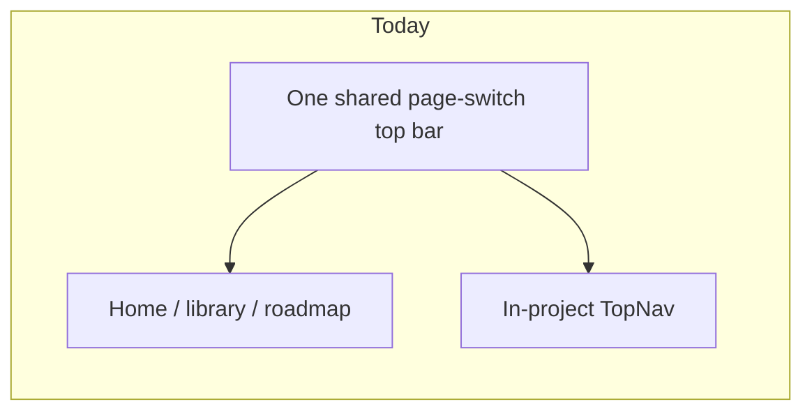
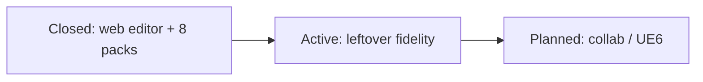

## Native inference deduction and inspector reconciliation (October 7, 2026)

Native inference reconciliation now derives initializer types and expression output domains from actual ordered graph operands, updating owned declarations, indexes/typeRef mirrors, references and source-edge metadata together. C++ auto groups require common deduction; a conflicting group retains the authored edit atomically and can recover by correcting its initializer. Native signature and literal/operator/conversion inspectors invoke the transaction within existing history edits. Binding/source identities, authored inference spelling, unknown runtime values and incompatible wires remain. Strict generation still rejects invalid native semantics. Verified: 4,371 package tests, 1,342 web tests, public API types, lint (99 existing warnings), production/Pages builds, established group/local workflows, and nine new deduction-edit/invalid-reload/return-recovery/reimport workflows in each artifact across C++/Rust/GDScript. Native Code-panel evidence totals 151 inputs: initial 52 fresh plus 98 exact retained; a final group-recovery witness added one fresh input with 150 retained. C++/Rust positive and false-type calibrations independently check local deduction; Godot evidence remains validity/applicability, not independent exact inferred-type proof. Forty-eight visible source owners were checked across nine actual disk graph/output pairs. The initial new browser failures were a test using native select interaction for a custom dropdown; focused corrected browser checks passed, restoring the normal production build and retaining the unchanged Pages export. Final group-recovery expansion changed tests/witnesses only and passed focused web/native checks. Unchanged inference/local-body/initialization and usability golden/extraction evidence remain retained; no fixture programs execute. Arbitrary wire edits, typed-local edit reconciliation, central history boundaries, inferred source worker admission, full forward/default/deferred inference, wider language/project semantics and authoritative Verse access remain required. Historical broader browser/docs failures remain unresolved; the full goal remains active.

## Native inference editing recovery (October 7, 2026)

Recovery-oriented flow inspection now separates structural ownership from strict native body validation. C++/Rust/GDScript declaration-mode edits can retain unrelated invalid assignment/constant/body semantics while independently checking selected initializers and every preceding inferred type mirror. Strict generation still rejects those invalid bodies; malformed flow and stale inferred widths reject atomically. Four added web regressions cover all three languages, invalid JSON reload/recovery, input immutability and stale preceding inference. Verified: 4,371 package and 1,331 web tests, public API types, lint (99 existing warnings), production and Pages builds, C++ group workflows and local workflows for all three native adapters in both artifacts. C++/Rust browser cases additionally switch to inference during a readonly-assignment error, persist/reload the invalid graph, and recover mutability. Native Code-panel checks verify all 98 exact unchanged inputs with zero recompilation; unchanged inference/local-body/initialization and golden/extraction evidence remain retained. A review-driven stale-mirror guard extended the initial passing checks, followed by an affected consolidated retry. No fixture programs execute. Automatic deduction reconciliation after initializer/operator/parameter edits, inferred worker admission, wider language/project contracts and authoritative Verse access remain required. Historical broader browser/docs failures are unresolved; this packet does not certify the full suite or full goal.

## Native authored mode transactions and inspectors (October 7, 2026)

Typed/Inferred mode transactions and collapsed inspectors now coordinate C++/Rust/GDScript locals and entire C++ groups, including child selections. Inference derives from actual initializer wiring without the previous declaration type as a hint; unsupported Rust constraints and GDScript inferred constants reject atomically. Typed conversion preserves incompatible body wires for recovery. Combined 4,371 package tests, 1,327 web tests, public API types, lint (99 existing warnings), production and Pages builds pass. Native Code-panel checks pass 98 inputs: 13 fresh and 85 exact retained. Production and Pages local workflows for all three languages and the C++ group workflow pass mode switches, active inferred-mode save/reload, invalid edits/recovery and both reimport choices. The final persistence-only test expansion used focused browser checks, restoring the normal production build and retaining the unchanged Pages export; compiler and unit checks were not repeated. Existing inference 28/local-body 18/initialization 45 and unchanged goldens/extraction evidence remain retained. No fixture programs execute. Automatic deduction reconciliation after initializer/operator/parameter edits, recovery-oriented flow analysis, inferred worker admission, broader language/project semantics and authoritative Verse access remain open. This is a bounded completed packet; the full goal remains active.

## Visible inferred graph/IR foundation (October 7, 2026)

Opt-in C++/Rust/GDScript inferred source graphs now retain visible authored inference modes and exact spelling instead of substituted explicit types. Saved function analysis recomputes initializer types without the declaration cache as an inference hint, checks mirrored types/ports, and shares bounded Rust fixed-initializer constraints with source analysis. C++ auto groups preserve one ordered owner and common deduction; IR v21 and language packs preserve auto/unannotated let/:= output. Ten composed disk-backed Code-panel fixtures cover chains, Boolean shadowing, C++ unsigned-char promotion and inferred groups; exact full-file goldens, node spans, normalized reload, individual renames, stale same-domain widths/foreign modes and unsupported Rust unsuffixed edits pass. Combined4,371 package/1,322 web tests, public API types, lint99, production build, existing usability goldens and canonical disk extraction pass. Native source/Code-panel85 checks pass:22 fresh inferred generated/renamed and new C++ original inputs,63 exact retained inputs. Inference28/local-body18/initialization45 are verified exact retained evidence. Initial failures were TypeScript union narrowing, wrong Rust/Godot fixture extensions and a Boolean mutation that left the type unchanged; focused repairs passed affected gates while retaining unchanged checks. No fixture execution. Public previews require inferredLocals:true; worker/sealed reviews remain unchanged and do not admit inference yet. Complete mode/deduction reconciliation, inspectors, sealed lifecycle/production/Pages workflows, forward/default/deferred contexts, broader all-eight-language scope/projects and authoritative Verse access remain open. Full goal stays active.

Continue [inference transactions and admission](design/native_inferred_initialization_batch.md).

## Native inferred-local source prerequisite (October 7, 2026)

The shared source-analysis prerequisite now distinguishes C++ auto, fixed-type Rust inferred lets and GDScript := from authored scalar types through explicit inferredLocals opt-in. Ordered bindings/references, native result types, authored inference modes, exact spans and unknown runtime values are retained. Mixed C++ auto-group deductions reject; Rust unconstrained numeric locals with later i8/i64 constraints remain unsupported rather than becoming fabricated i32 locals. GDScript initialization now recognizes := as an inference marker, while dynamic = and native defaults retain separate boundaries. Sixteen source fixtures and28 independent pinned compiler inputs pass, including C++ decltype/Rust fixed-type positive and false-type calibrations. Godot evidence covers native validity/applicability, not independent exact inferred-type or runtime-default observations. Combined4,371 package tests and public API types pass. Exact unchanged native evidence is retained:63 saved Code-panel inputs,18 local-body contrasts and45 initialization cases; no fixture execution. The initial failure exposed the GDScript initialization marker, then a diagnostic expectation was corrected to the actual BINARY_DOMAIN code. Affected retries pass. Production/Pages builds,1,312 web tests,lint99 and established group/local browser evidence remain retained; no new inferred graph/UI/worker/browser acceptance is claimed. Visible inferred declaration modes, saved recomputation, IR/packs/inspectors/lifecycle, forward constraints, deferred/default contexts, wider language semantics/projects and Verse access remain required. Full goal stays active.

Continue [the shared inference/initialization batch](design/native_inferred_initialization_batch.md), including visible graph ownership and lifecycle before admission.

## C++ declaration groups and shared local regression batch (October 7, 2026)

C++ typed initialized comma declarations now import as a visible group owner with ordered declaration children, exact binding identities and separate group/child source spans. Saved readers reconstruct actual order and initialization; IR v20 and C++ pack templates preserve authored grouping while retaining the C# contract. Coordinated group and child type/mutability edits update indexes/ports together and retain incompatible wiring for blocking diagnostics and recovery. Sealed worker acceptance, invalid-type save/reload/recovery, individual rename, valid persistence, unchanged reimport and both conflict choices pass in production and Pages. Shared typed-local workflows also pass for C++/Rust/GDScript in both artifacts. Combined 4,355 package tests, 1,312 web tests, public API types, lint (99 existing warnings), production and Pages builds pass. Native source/Code-panel checks pass all63 inputs:6 fresh C++ composed original/generated/renamed/alias/incoming/const-write-rejection checks and57 exact retained inputs. Earlier foundation compiled4 group inputs while retaining53; initial goldens/canonical disk extraction passed and remain retained. No fixture source executes. This closes only the supported C++ group packet; inferred/deferred/default bindings, membership/split/merge, conversions, broader control/effects/types/projects, existing-adapter audits and authoritative Verse access remain open. The full eight-language goal remains active.

[Group contract](design/native_declaration_groups_batch.md). Next: [inference and initialization](design/native_inferred_initialization_batch.md).

## Shared variable binding identity audit (October 7, 2026)

The shared variable lookup and synchronization audit now preserves explicit declaration/reference identity across same-name indexes. UI legacy-name lookup requires one exact matching index; core legacy case-folded name references require one matching index. Missing/empty IDs or the wrong explicit binding kind remain unresolved rather than becoming name references. Synchronizing one symbol cannot rewrite a same-name reference bound to another or missing symbol. The main document lifecycle already uses exact symbol IDs and retains that behavior. Added ambiguity, malformed JSON, foreign binding and immutable synchronization contrasts pass with4,354 package and1,309 web tests, public API types and production build. Lint99 from the initial audit batch remains retained; all53 native source/graph inputs are verified unchanged with zero recompilation. All three production local browser workflows pass, including invalid-type reload/recovery and conflict choices. Pages was not rebuilt in this audit packet; its earlier local lifecycle evidence remains bounded. This closes these shared identity gaps, not the full scope/capture/project audit or any language. Continue declaration-group ownership and native inference/initialization prerequisites across the readiness matrix; broader language/master-plan and Verse requirements remain open.

[Binding audit](design/reverse_import_binding_identity_audit.md). Next: [declaration groups](design/native_declaration_groups_batch.md).

## Native local worker admission and lifecycle verified (October 7, 2026)

Rust/C++/GDScript ordinary Library modules now admit reviewed typed initialized locals, exact binding reads, ordinary assignments and final explicit/Rust-tail returns through sealed worker preview/review/acceptance. Three composed modules/nine functions pass private seals, single-use receipts, tampered index rejection, canonical persistence and unchanged/conflicting reimport; Rust shadowing and GDScript constants also pass sealed acceptance. Actual production and Pages workflows pass all three languages: local rename, readonly/type invalid-recovery, invalid Boolean type save/reload/recovery, valid save/reload and both reimport conflict choices. The shared declaration inspector lookup now uses symbolId rather than a same-name fallback; seven current adapters have identity regression cases. Native local type edits now coordinate the structured typeRef mirror as well as the domain, declaration and reference ports. Combined 4,353 package tests, 1,307 web tests, public API types, lint (99 existing warnings), production and Pages builds pass. Native source/graph53 inputs pass:3 fresh incoming local modules and50 exact retained cases; the final type-mirror repair retained all53 with zero recompilation. No fixture programs execute. Initial browser failures exposed the missing declaration lookup and remain historical failures. C++ grouped graph declarations, inferred/deferred/default locals, assignment conversions, broader control/effects/types/projects, existing-adapter semantic audit and authoritative Verse access remain open; no full-language or goal-completion claim.

[Local admission contract](design/native_local_source_admission_contract.md).

## Native local inspector transaction checkpoint (October 7, 2026)

Rust/C++/GDScript native local declarations now have immutable coordinated name/authored-type/mutability transactions and a collapsed dedicated inspector. The transaction validates declaration/function/body/index ownership, updates only the matching variable index and visible declaration/read/write names and ports, refreshes edge type metadata only for changed source outputs, and preserves all wiring, provenance and unrelated malformed metadata. Readonly/type edits can leave blocking body diagnostics and recover through later edits. Generic variable/default/style controls are replaced for these native declarations and their selected indexes. Three composed cross-language tests cover rename, readonly/type invalid-recovery, canonical normalized reload, damaged owners, duplicate declarations, input immutability and inspector rendering. Combined4,347 package/1,297 web/public API types/lint(99 existing warnings)/production build gates pass. Native source/graph50 inputs pass:3 new normalized renamed Code-panel modules and47 exact retained cases; no fixture programs execute. Initial host checks pass and are retained for the focused type/panel repair. The initial build caught an overly broad native pin return type; it now declares its actual Boolean/number domain. A new panel effect warning was repaired without changing compiler inputs. Inspector rendering/unit transactions are not live browser evidence. Local worker review/acceptance and production/Pages edit/save/reload/conflict-aware reimport remain next; grouped/inferred/deferred locals, wider control/effects/types/projects, existing-adapter audit and authoritative Verse access remain open.

[Local transaction contract](design/native_local_transaction_contract.md).

## Native local graphs and Code-panel checkpoint (October 7, 2026)

Rust/C++/GDScript typed scalar locals now materialize as visible declarations, reads, ordinary writes and final returns through explicit localStatements:true previews. Saved graph analysis derives native types, initialization order, mutability and Rust shadowing from actual declarations and execution/operand edges; variable indexes cannot supply hidden values or types. IR v19 and pack-owned templates produce canonical Code-panel output with source maps for three composed modules/nine functions, Rust shadowing and Godot constants. The actual normalizeProjectSnapshot load path preserves emitted files and maps; a mutable-index flag mismatch was repaired to honor the existing omitted-readonly convention while retaining blocking readonly/type/owner checks. Combined 4,347 package tests, 1,294 web tests, public source-import types and production build pass. Native source/graph validation covers47 inputs: eight new local generated/edited/special modules plus39 established inputs; the final normalization follow-up retained all47 exact inputs with zero recompilation. Established75 runtime,18 local-source and45 initialization checks remain exact retained evidence; prior disk goldens/extraction and lint (99 existing warnings) remain bounded earlier evidence. No fixture programs execute. Default sealed worker acceptance for local bodies remains closed; canonical loader tests do not certify browser persistence. Local inspector transactions, worker admission and actual production/Pages edit/save/reload/reimport are next. C++ grouped graph declarations, inferred/deferred locals, implicit assignment conversions and broader all-eight-language control/effects/types/projects, existing-adapter audit and authoritative Verse access remain open.

[Local graph contract](design/native_local_graph_code_panel_contract.md).

## Native local source-body ownership verified (October 7, 2026)

Rust/C++/GDScript source analysis now retains immutable ordered typed local declarations, local assignments and final explicit/Rust-tail returns, with exact parameter/local declaration identities, expression spans, canonical native types and unknown runtime values. Three composed modules/nine functions cover successive initializers, mutable writes, Boolean conditions and explicit conversions; contrasts cover C++ grouped/own-initializer policy, Rust shadowing/discarded returns and Godot constants/shadowing. The shared AST decoder/inference also backs established runtime imports. Initialization traversal now retains reviewed conversion and Godot not operand reads. Combined 4,343 package tests, 1,289 web tests, public source-import types and lint (99 existing warnings) pass. Native validation compiled 18 fresh body contrasts and retained 75 runtime, 39 saved-graph Code-panel and 45 initialization inputs. Initialization reuse now verifies actual files/hashes/commands/profiles/current pins and diagnostic logs; the focused verification follow-up retained 18+45 inputs with zero recompilation. No fixture programs execute. This source sequencing dependency does not admit local graphs: visible declaration/read/write settings, saved order/type/initialization analysis, IR/packs/Code-panel, inspectors and worker/browser lifecycle remain next. Broader all-eight-language control/effects/types/projects, existing-adapter audit and authoritative Verse access remain open.

[Source-body contract](design/native_local_source_body_contract.md). Continue [the shared local graph batch](design/native_local_graph_batch.md).

## Native runtime worker admission and lifecycle verified (October 7, 2026)

Rust/C++/GDScript ordinary Library modules now admit source-owned parameter arithmetic, comparisons, logical conditions, grouping and reviewed explicit conversions through sealed worker review/acceptance. Three composed modules/nine functions pass single-use receipts, private seals, JSON persistence and unchanged/conflicting reimport tests. Actual production and Pages runtime browser workflows pass all three languages: return-type invalid/recovery, invalid literal recovery, literal/operator edits, save/reload and both conflict choices. The overlay repair adds accessible panel close controls; browser selectors close the current inspector and use the actual searchable operator menu. Combined4323 package/1289 web/public-host types/lint(99 existing warnings)/production+Pages builds pass. Native source/Code-panel39 inputs pass:6 fresh operator/incoming modules and33 exact retained inputs; no programs execute. Final focused native-runtime-browser/native-runtime-pages-browser passes retain the verified Pages export and unchanged native/unit/build evidence. Historical broader native-browser/native-pages-browser failures remain failures and are not relabeled. Wider locals/control/effects/types/projects, existing-adapter gaps and authoritative Verse access remain open; no full-language or overall completion claim.

[Runtime admission contract](design/native_runtime_source_admission_contract.md). Next: [shared local declaration/body graphs](design/native_local_graph_batch.md).

**Native signature transactions verified (October 7):** Rust/C++/GDScript native definition inspectors now apply immutable coordinated symbol/definition/entry/Return/call-port edits through the project lifecycle. Wires/provenance persist; incompatible edits block, matching Boolean parameter/return edits recover, and unrelated malformed edge metadata is retained. Selection/view loss was repaired; persistence checks respect active-function Code-panel scope. Combined4320 package/1286 web/API-host types/lint(99 warnings)/production+Pages builds pass. Native source-graph33 checks include3 fresh actual Boolean edited modules and30 exact retained inputs. Focused production/Pages all3 imports, Boolean signature/output/port save-reload, literal recovery and both reimport choices pass. Final missing-overload/duplicate-owner guard repair reran affected package/web/API/build gates with unchanged valid native/browser evidence retained; broad historical suites are not relabeled. Runtime worker acceptance, wider language semantics/projects/effects and Verse access remain open. See [the contract](design/native_scalar_signature_transaction_contract.md).

**Runtime Code-panel modules verified (October 7):** Rust/C++/GDScript complete ordinary runtime modules now materialize through explicit runtimeExpressions analysis previews into registry-versioned visible projects and canonical Code-panel output. Nine functions retain authored headers, stable IDs, parameter/operator/group/conversion wiring, Return/expression source maps and JSON persistence. Exact full-file goldens and literal invalid/edit checks pass. Combined4320 package/1283 web/public-host types/lint(99 existing warnings)/production build pass. Native source-graph30 checks pass:9 fresh original/generated/edited runtime modules and21 exact retained scalar/calibration/role cases. No fixture execution. Default sealed source/worker review remains scalar-only; runtime lifecycle admission and coordinated native symbol/body/port edits remain next. Broader eight-language semantic/project/effect scope and Verse access remain required. See [the contract](design/native_runtime_code_panel_contract.md).

**Runtime graph materialization verified (October 7):** Rust/C++/GDScript source-owned runtime trees now construct visible expression graphs with actual parameter slot wiring, ordered operands, exact node/edge origins and cloned entry documents. Entry ownership/types/ports, collisions/budgets/cycles and saved runtime reconstruction are checked; no parameter values or frozen literal hints are invented. Definition-owned scalar function analysis now integrates runtime parameter expressions and blocking project diagnostics while preserving constant/identity/orphan checks. Nine composed functions pass graph/JSON/Return ownership tests. Combined4320 package/1280 web/API types pass;75 runtime/source native contrasts and21 established scalar Code-panel checks are retained by exact inputs/commands/toolchain pins with zero recompilation. Newly generated runtime Code-panel output and browser admission are not yet verified. Complete module/registry/IR/packs/Code-panel/native edited output, coordinated inspectors and lifecycle remain next; broader eight-language/project/effect/Verse scope stays active. See [the contract](design/native_runtime_materialization_contract.md).

**Runtime source ownership verified (October 7):** Rust/C++/GDScript now expose immutable source-owned runtime expression trees with exact spans, resolved parameter declaration slots, authored grouping/operators/conversions, unknown values and native result typing. Shared binding inventories now traverse reviewed Rust as/C++ static_cast/Godot int-bool conversions rather than losing operand references; arbitrary calls and shadowed Godot conversion names remain unresolved. Three composed modules/nine functions and unbound edits pass source tests. Combined4317 package/API types and75 native checks pass:6 new original/unbound compiler fixtures,69 matching retained contrasts. Missing public pure-context export and conversion traversal were repaired together. Source graph materialization, definition/project/IR/pack/Code-panel and coordinated inspectors/browser lifecycle remain required before runtime acceptance; full eight-language control/effects/types/projects/Verse scope stays active. See [the contract](design/native_runtime_source_contract.md).

**Native runtime graph reconstruction verified (October 7):** Rust/C++/GDScript saved runtime scalar expressions now reconstruct native types from actual entry parameter slots and operand edges, without dummy parameter values. The pure reader verifies ownership/ports/domains/hidden operands/cycles/budgets, retains nested short-circuit facts, and checks real constant islands with visible Rust peer inference.44 native-case graph checks plus ownership/value-edit mutations pass; combined4313 package tests/public API types pass.69 unchanged native contrasts are retained after exact byte/expectation/command/toolchain verification with zero recompilation. This is a graph-reader prerequisite, not new source/runtime admission. Definition/project integration, source materialization, IR/packs/Code-panel, coordinated signature transactions and actual browser lifecycle remain next; broader eight-language control/effects/types/projects and Verse access stay required. See [the contract](design/native_runtime_graph_contract.md).

**Native runtime type prerequisites verified (October 7):** Rust/C++/GDScript now have pure unknown-parameter scalar operator result typing, preserving native C++ promotions/LLP64 signedness, Rust matching operands/heterogeneous shifts/Boolean bitwise rules and Godot logical/Boolean-order behavior. No runtime values are invented. Combined4264 package tests/public API types and69 independent compiler applicability/result contrasts pass. Native repair compiled9 changed cases and retained60 exact source/expectation/file/command/pin matches; initial Godot Boolean-order policy was corrected from native evidence. This is a prerequisite, not source/runtime graph admission. Saved runtime wiring, source mapping, visible inference, coordinated signature transactions, Code-panel/native edited graphs and browser lifecycle remain next; wider eight-language flow/effects/types/projects and Verse access remain required. See [the contract](design/native_runtime_type_contract.md).

**Native scalar import lifecycle verified (October 7):** Rust/C++/GDScript ordinary scalar Library modules now have sealed worker review/acceptance and verified production/Pages browser import, signature/literal invalid-edit recovery, Code-panel edits, save/reload and both reimport conflict choices. Final focused runner77069 is terminal green:4218 package/1280 web tests, public source-import types, native-source-graphs21, production/Pages builds and native3 browser stages. The native gate verified matching source/expectation/file/command/toolchain evidence and retained all21 unchanged compiler inputs; the initial expanded gate compiled7 new inputs and retained14. Earlier existing JS/Python/Go/C# browser prefix checks passed; historical full browser-import/docs-artifacts failures remain recorded separately from the focused native3 repair. Native signature domain changes still need coordinated symbol/body/port transactions. Runtime operations, declarations/control/effects, comments/operator spelling, wider types/projects and authoritative Verse access remain open. See [the contract](design/native_scalar_source_admission_contract.md) and [the next batch](design/native_runtime_expression_batch.md).

**Native constant graph emission/contextual names verified (October 7):** Rust/C++/GDScript typed integer/Boolean constant graphs now emit through the Code panel with native type/value checks, exact tokens/maps and104 full-file goldens. Combined4187 packages/1273 web/types/native107+names470/path guards3/server/lint/build/full existing-adapter browser suite pass; final108 golden/mutation tests are focused. Rust literal hints cannot replace visible inference; Windows case collisions fail before compilation. New-three source acceptance, inspector context edits, special entry/constructor names and wider runtime/type/project/lifecycle scope remain open. See [the contract](design/native_constant_graph_emit_contract.md).

**Native scalar graph emission verified (October 7):** Rust/C++/GDScript global identity/unit functions now pass canonical saved-graph Code-panel emission, exact goldens/source maps and pinned native compilation for29 functions. Package4182/types/lint/build/full existing-adapter browser regressions pass; retained web1165 and final3 focused golden tests are separately recorded. Source-import admission and wider expression/control/type/project/browser lifecycle scope remain open. Verse/UE6 remains required. See [the contract](design/native_scalar_graph_emit_contract.md).

**Native scalar signature editing/refresh verified (October 7):** Rust/C++/GDScript draft inspector controls and stable parameter slot refresh preserve authored type/mutability and invalidate mismatches/additions. Package4152/web1162/types/lint/production and full existing-adapter browser imports/inspectors/persistence/reimport pass. Shared scalar modules now use ES2017-compatible BigInt constructor syntax; native scalar89/constant121/source121 comparisons retain matching compiler proof. New3 live acceptance remains closed pending registry/IR/body/native Code-panel/browser lifecycle integration. See [the contract](design/native_scalar_signature_edit_contract.md).

**Native scalar header printing verified (October 7):** Rust/C++/GDScript pack/parameter/header print contracts retain exact native types, qualifiers, modifiers and definition spans. Fresh33 generated-header compiler cases,4148 package tests and existing disk goldens/Code-panel regressions pass; final guard28 focused checks pass. Public native-signature admission remains closed pending actual registry/inspector/IR/body/new-adapter Code-panel/browser lifecycle proof. Source-body composition is compiler-fixture-only. See [the contract](design/native_scalar_signature_print_contract.md).

**Scalar function graph ownership verified (October 7):** Rust/C++/GDScript definition headers now check actual entry/parameter/return wiring for bounded identity/constant/empty bodies, with saved graph mutations. Package4121/API types and38 matching retained native header comparisons pass. Runtime parameter operations, assignment/return conversions, mutation/control/effects and actual registry/IR/emit/inspectors/Code-panel/lifecycle admission remain open. See [the contract](design/native_scalar_function_graph_contract.md).

**Native scalar signatures verified (October 7):** Rust/C++/GDScript exact source headers and pure native type/pin identities pass38 compiler/header cases and4085 packages. Five native-valid unsupported headers stay unresolved; actual body/signature/registry/IR/emit/inspector/lifecycle integration remains open. Clang __is_same function-pointer type-argument syntax parses natively but not in the pinned browser grammar: add grammar support or reviewed unsupported-source handling before acceptance. Standard typed pointer fixtures independently verify the ordinary header contract. See [the contract](design/native_scalar_signature_contract.md).

**Source-owned native expressions verified:** Rust/C++/GDScript initializer/return trees now come directly from pinned source, preserving grouping/context/spans and full source retention. Native121/source comparisons,package3800 and public API types pass; final closure ownership passes124 focused tests. Named values/effects, assigned context, visible mappings/lifecycle/projects and Verse validation remain required. See [the source contract](design/native_source_expression_contract.md).

**Shared constant operators/conversions verified:** Rust/C++/GDScript integer/Boolean constant trees pass116 native cases and3672 package tests. Native promotions/ranks/narrowing/overflow/division/shift distinctions remain explicit; Godot negative shifts reject and grouped Rust minima retain their literal exception. Dynamic/conditional/effect/source/graph ownership and wider language/projects/Verse validation remain required. See [the constant contract](design/native_constant_expression_contract.md).

**Shared scalar literals verified:** Rust/C++/GDScript exact integer/Boolean type/value/range/negative facts pass89 native constant assertions/rejections and3558 package tests. Independent failures corrected Godot wide-literal behavior; Clang unsigned decimal extensions retain native warnings. Operators/conversions/effects, visible graph/lifecycle/projects and Verse validation remain open. See [the literal contract](design/native_scalar_literal_contract.md).

**Shared scalar-local initialization verified:** Rust/C++/GDScript native-specific deferred/default/readonly/discarded-read policies and shared live-branch joins pass 45 independent compiler contrasts, 3,471 package tests and source-import types. Explicit Rust returns and GDScript compound-assignment binding traversal are repaired. Values/types/operators/conversions, broader initialization/effects, visible graph/lifecycle/project integration and Verse authoritative validation remain required. See [the initialization contract](design/native_initialization_contract.md).

**Shared local binding contracts verified:** Rust/C++/GDScript parameter/local identities, nested/sibling scopes and read/write references pass 30 native contrast cases, 23 direct Clang target checks and 66 exact UTF-8 compiler inputs. Package3425 and source-import types pass. Value/effect/broader native initialization and visible graph/lifecycle/project integration remain open; Verse validation remains a prerequisite. See [the binding contract](design/native_local_binding_contract.md).

**Shared syntax foundations verified:** Rust/C++/GDScript have lazy hash/ABI-pinned exact source inventories and production/Pages grammar assets, with reproducible GDScript WASM. The 36 native/syntax fixtures and 4,552 package/web tests pass. Native bindings, visual mappings/editing, lifecycle and projects remain required; Verse authoritative validation stays open. See [the contract](design/native_syntax_inventory_contract.md).

**Shared native-readiness packet verified:** C++ (Clang19.1.5/C++17), Rust (1.99.0/edition2021) and GDScript (Godot4.5.2) pass one 24-case curated compile-only gate. Browser grammars, bindings/visual mappings, editing/round trips and project closure remain open; no new adapter completion is claimed. Verse authoritative validation remains a prerequisite. See [the readiness contract](design/native_readiness_contract.md).

**Eight-language feature waves adopted; C# Boolean graph consumer verified:** Shared native-readiness/value/control/project waves now replace language-by-language completion order. C# IR18 Boolean expressions/returns and production/Pages operator invalid/recovery/save-reload pass, with 2,672 native observations and 4,512 package/web tests plus affected gates. Branch/unreachable mappings and all remaining language/native/project prerequisites remain open. See [the wave plan](design/reverse_import_cross_language_batches.md) and [current evidence](current_state.md).

**C# native branch-flow prerequisite verified:** 582 Boolean/comparison probes and 31 composed branch cases prove source analysis of isolated alternatives, reachable assignment joins, returns and dead statements. Evidence: 2,656 native observations and 4,502 package/web tests plus affected lint/type gates. Visible branch/Boolean/unreachable mappings and their editing/lifecycle/browser evidence remain open, alongside loop fixed points, exceptions/ref-out, membership/split-merge/trivia and wider scope. Preceding IR17 uninitialized-local mappings retain their verified production/Pages evidence; see [current evidence](current_state.md).

**C# visible lexical scopes verified:** ordinary/checked/unchecked blocks now have visible nodes, recursive native ownership/context, IR v15 and nested spans, sealed persistence/reimport, and production/Pages scope-context invalid/recovery/reload. Affected proof: 2,007 native observations and 3,859 package/web tests plus required type/build/golden/Code-panel/parse/browser/export checks. Grouped declarations, definite assignment, unreachable source and wider language/project requirements remain open; see [current evidence](current_state.md).

**C# lexical scope prerequisite verified:** immutable source scope/reference ownership and 15 independent compiler/binder cases pass. Visible nested/checked graph, structured IR, inspector and lifecycle mappings remain open under [the scope contract](design/csharp_lexical_scope_contract.md). Fresh affected evidence: 1,997 native observations, 3,852 package/web tests and host type checks; see [current evidence](current_state.md).

**C# by-value parameter writes verified:** direct/compound assignments and prefix/postfix updates now use signature-slot-bound visible Set nodes, editable targets, rename/deletion guards and persistence/reimport. Native, fixed-graph and actual production/Pages Code-panel workflows pass (1982 native cases;3835 package/web tests). Remaining scope includes grouped/nested/checked declarations, definite assignment, unreachable regions, cross-arity rewiring, effectful expressions/ref-out-in modes and wider calls/types/projects. See [current evidence](current_state.md).

**C# compound/update mutations:** all eleven predefined integral compound operators and standalone prefix/postfix updates have visible Set/IR v14/pack mappings, graph-owned typing/readonly checks, fixed saved-graph regressions and a 1,260-pair native compiler matrix. Inspector compound choices, invalid RHS/recovery, prefix/postfix editing and save/reload pass in production and Pages. Grouped/nested/checked scopes, parameter writes, cross-arity rewiring, effectful assignment/update expressions, calls/overloads and wider native/project requirements stay open. See [current evidence](current_state.md).

**C# plain local assignments:** visible Set nodes preserve declared integral width, readonly identity, statement order and exact RHS expressions through persistence/reimport. Independent native evidence passes 690 cases; saved-graph/package and focused production Code-panel/browser checks pass. Pages/export checks also pass. Grouped declarations, nested scopes, compound/update/parameter writes, assignment expressions, unreachable regions and wider language/project scope remain open. See [current evidence](current_state.md).

**C# integral policy verified:** [Native value contract](design/csharp_integral_value_contract.md) has 458 model/compiler pairs within 499 native cases. Exact integer tokens, widths, assignment/operator applicability, casts/overflow and shifts are checked. Source analysis and normal/Pages worker/UI workflows are verified. Source/saved-graph integration, remaining value/binding/effect contracts, visible mappings and visual acceptance remain open. The combined runner has 19 stages.

**Go conditional calls verified:** visible expression ownership now covers nested logical calls, ordered arguments, repeated occurrences and loop conditions. All 18 stages pass (1,643 package/web tests; 48 browser imports), including saved-graph mutation, inspector recovery and conflict-aware reimport. Package/type and remaining-language scope stays open.

**Shared call preflight verified:** conditional ownership and distinct call sites are checked before eager graph materialization. All 18 combined stages pass (1,616 package/web tests). Remaining-language conditional-call policy integration and broader effect/cleanup/suspension support remain open.

**Delivery sequence:** [Go lessons and per-language semantic preflight](design/reverse_import_go_lessons.md) now guide all remaining reverse-import work. Establish native evidence, binding/evaluation contracts and composed project fixtures before broad acceptance.

**Go local-constant batch validated:** typed/untyped numeric, boolean and string constants now have visible readonly declarations and shared exact binding/comparison facts. Package constants, groups/iota, defined types/aliases and byte strings remain required reproduced gaps. All 18 combined stages pass, including 1,609 package/web tests and 44 browser imports; full eight-language completion remains open.

**Go float32/conversion batch validated:** native float32 binding and explicit numeric conversion nodes now integrate with typed calls/locals/loops and exact constant checks through IR v10. Constant declarations, defined types/aliases, string/rune conversion, complex/big.Float and broader Go project semantics remain open; the full eight-language goal remains active. The function-tab Code preview now retains the visible native return signature. Final grouped checks pass; an intermittent exported-editor navigation failure remains under investigation with captured diagnostics.

**Go rational-constant batch verified:** exact float tokens/arithmetic, float64 rounding/overflow, integral float-to-integer constants and native default inference now use shared visible graph checks. All18 stages pass with1516 tests,82 native AST/type pairs,75 new rational observations and36 browser imports. The former 1.5 + 2.5 feedback case imports; the larger big.Float fallback remains a separate required item. Float32 binding integration, complex constants and the full eight-language scope remain open. See [the numeric contract](design/go_integer_domain_contract.md).

**Go contextual-shift batch verified:** destination/peer typing, simple nested untyped counts, large shifts and all numeric compound assignments now have visible graph/IR v9 integration. Composed untyped shift counts are recorded as a native compiler-conformance gap; 69 native AST/type pairs, 251 integer observations and 73 compile-only pairs pass with the full 18-stage combined checks. The full eight-language goal remains active. See [the numeric contract](design/go_integer_domain_contract.md).

**Go integer integration progressed:** exact integer tokens/operators, int/uint/uintptr and visible 32/64-bit package context now retain native meaning through editing, calls/loops, save/reload and conflict-aware re-import. Fifty ordinary plus four target-context native pairs and 147 constant probes provide separate evidence. Contextual untyped variable shifts, floating/rational/complex constants, large shifts and full Go project semantics remain open; the full all-language goal is active.

Go integer reverse import is **begun**: dynamic fixed-width signed/unsigned bindings and byte/rune aliases now have visible signature/local settings, native identity validation, IR v7, authored type preservation, operators/calls/loop composition and save/load checks. Exact literals, word-size context and remaining numeric contracts are open; the full all-language goal is unchanged.

**Go integer item begun:** exact width/signedness, constant representability/arithmetic and 32/64-bit context contracts now have 147 independent native Go observations. Dynamic fixed-width integer bindings now have graph/IR/editor integration; exact literals, word-size target context and the full numeric contract remain open; see [the integer integration contract](design/go_integer_domain_contract.md).

**October 5 Go locals/loops:** native library imports now include initialized typed/inferred locals, assignments/postfix updates, scalar branches, counted/condition loops, nearest-loop Break/Continue, lexical shadowing and void calls. Native Go AST/type validation covers 23 positive units; the nine feedback gaps now include multi-bindings and range iteration. Full MP-09 and the all-language goal remain open. See [current implementation evidence](current_state.md) and [the coverage report](design/code_visual_coverage.json).

**October 5 reverse-import update:** the all-complete goal includes all eight input languages, including previously deferred Verse/UE6 reverse-import work. A bounded Go library-unit adapter now maps visible package clauses, float64/string/bool signatures, same-file calls, scalar comparisons/arithmetic, Boolean branches and bare returns. Ten native fixtures and nine reproducible gaps are tracked separately from the JS/Python corpus in [the coverage report](design/code_visual_coverage.json). MP-09 remains open for typed locals, integer domains, tuples, loops, receivers/types, package context, cleanup and concurrency; MP-13 grammar/validator access remains open. See [the master plan](design/code_visual_master_plan.md).

# VVS - Public Roadmap

## October 4 native-values update

MP-02b planned scope is implemented for the existing JS/Python subsets: exact scalars, ordered native collections/access, native operator modes and combined graph/Code-panel/persistence/browser evidence. The checked-in syntax corpus is 62 supported / 23 rejected, plus seventeen separate native contract probes. Complex-expression gaps remain visible in `u93-native-values` on the in-app roadmap and [native contract](design/native_value_contract.md). Next: MP-03 callable signatures and dependency closure. UE6 remains deferred.

**Research refreshed 30 September 2026 after merged [PR #8](https://github.com/Sheriff99yt/VVS-Web/pull/8), at commit `513d0afa`.** Priorities are recommendations, not schedule commitments or claims that the recommended fixes shipped.

**September 2026 implementation note:** The Start page now explains graph-to-code with one illustrative preview and no duplicate welcome overlay. Node docs have practical guidance for Branch, Print String, and Math Add. Library Git catalogs can fetch a validated static `catalog/vvs-catalog.json` index and show repository links; automatic community installation is still open. `apps/vscode` contains an initial native VS Code extension with a graph text editor and Generate; full graph editing and extension-host validation remain open. See [development_worklist.md](development_worklist.md).

## Contents

- [Product law](#product-law)
- [Selected live-docs route](#selected-live-docs-route)
- [Research follow-through](#research-follow-through)
- [Now (September 2026)](#now-september-2026)
- [Next (open only)](#next-open-only)
- [Recently completed](#recently-completed)
- [Phase notes](#phase-notes)
- [Docs & discoverability](#docs--discoverability)
- [Non-goals (for now)](#non-goals-for-now)
- [Client-first direction (locked)](#client-first-direction-locked)

### Product law

**[Product law]** Client-first editor. **No VVS accounts**, **no dedicated app server**, **no live code execution**. Canvas is the source of truth. **Generate** is the user action. Leftover `(x)` stays honest. Ships today: [current_state.md](current_state.md).

### Selected live-docs route

**[Selected]** Public catalog = **HTML-first SSG from `syntax-registry` `list()`** on existing GitHub Pages (`https://sheriff99yt.github.io/VVS-Web/`, `basePath` `/VVS-Web`). Playground later. JS-only SPA / hosted-key docs: **Rejected** (empty HTML fails crawlers, GEO, and client-first Pages).

**Partial:** `/docs` catalog + node/feature pages, `docsUrl()`, shared top bar, registry hover on info icons (node + options), and initial guidance for three common nodes. Remaining prose and playground are open. Architecture: [design/interactive_docs_architecture.md](design/interactive_docs_architecture.md). Research card `interactive-node-docs`.

### Research

**U93 expansion feedback loop (October 4):** [full batch plan](design/reverse_import_expansion.md) and [machine-readable fixture results](design/reverse_import_feedback.json). Dedicated roadmap items track lexical scope (`u93-scoped-locals`), calls/dependencies (`u93-resolved-calls`), control flow (`u93-control-flow`), class semantics (`u93-class-semantics`), module projects (`u93-module-projects`), trivia/re-import (`u93-trivia-reimport`) and additional adapters (`u93-language-adapters`). Progressively complex handwritten examples distinguish ready fixes from missing graph/IR semantics; an unsupported example never counts as a successful import.

**[Research]** Studies for leftover Open items (U93, COA, Bind remaining langs, native VS Code / UE6 hosts, interactive node docs). Do not collapse a research verdict into a shipped claim.

---

## Research follow-through

**October 3 implementation:** the bounded non-UE6 experiments below now have code and validation in [development_worklist.md](development_worklist.md). Shared connection rules, save revisions/recovery, native dirty-buffer correctness, diagnostic truth, the Python Library pilot, catalog/search and static docs checks were implemented together. Physical device interaction, additional Bind host runtimes, native crash recovery and complete COA certification remain open. UE6 implementation is deferred by user instruction. Historical research evidence below remains dated to its original baseline.

**[Research]** The existing 13 [Research cards](https://sheriff99yt.github.io/VVS-Web/roadmap) now record a current baseline, three alternatives, dependencies, a bounded next experiment, proposed acceptance gates and primary/pinned sources. Static code findings are risks to reproduce, not new runtime failures or benchmark results. PR #8's standalone JavaScript Library pilot is implemented; broad reverse import remains open.

**[Recommendation]** Work in this order, with independent improvements in parallel:

1. **Revision-safe persistence.** Track saved and generated revisions separately, serialize/coalesce saves, and prove interrupted multi-file writes recover a complete generation. Protect existing work before widening import/native/session scope.
2. **Small shared graph-edit contract.** Extract connection validation and edge replacement first; parity-test browser, in-page agent and native adapters. Extend to symbol lifecycle and conditional undo only after that seam works.
3. **Native project/buffer correctness.** Harden the existing VS Code editor: dirty-input snapshots, explicit initiating URI/root, revision-keyed source maps, dirty-output protection and extension-host tests. Keep its restricted editing set while doing this.
4. **Bounded target/host conformance.** Align Verse GetInput diagnostics with typed placeholders, verify real Bind receiver/lifetime contracts, and compile one complete UEFN Verse fixture. Use semantic requirements rather than printer presence. This is not a requirement to finish COA or certify all eight targets first.
5. **Narrow Python Library-import pilot.** First prove target-correct file-level `def` ownership and independently validate output. Compare parser candidates on a tiny subset. Repeat the existing JS production-browser accept/reload flow alongside steps 1–3 rather than waiting for Python.

**Parallel:** asset-level Library search and catalog robustness; touch-end/pan/select correctness on real devices; truthful docs/examples/static-artifact checks; native reveal after document/root identity is correct. Collaboration waits for shared command/revision semantics. UE6 native implementation retains the actual-release gate. Model search, radial menus and docs playgrounds remain evidence-gated.

### Revision-safe persistence

- **Current evidence:** save completion clears dirty state after an awaited write without checking intervening edits; folder persistence writes the manifest before graph/symbol files. These are source-inspected concurrency/recovery risks, not reproduced failures
- **Alternatives:** first add a minimal revision/save coordinator; then evaluate recoverable folder generations; an IndexedDB recovery journal is useful later but cannot by itself fix stale-save bookkeeping
- **Dependencies:** define content revision versus selection/layout changes; introduce a minimal persisted generation/version contract without a server
- **Experiment:** delay save N, edit N+1, complete N, issue another save, then inject a failure after each individual file write
- **Acceptance:** N never marks N+1 saved/generated; concurrent saves cannot regress data; reopen yields a complete old or new generation; permission/quota failures preserve unsaved state; Generate and Save advance separate markers; recovery does not rely solely on beforeunload
- **Evidence:** [save completion](https://github.com/Sheriff99yt/VVS-Web/blob/513d0afa1d7c6a26f877100cd4146be72553f8f0/apps/web/src/components/layout/TopNav.tsx#L272-L433), [folder writes](https://github.com/Sheriff99yt/VVS-Web/blob/513d0afa1d7c6a26f877100cd4146be72553f8f0/apps/web/src/lib/projectFolder/io.ts#L205-L267), [file writable semantics](https://fs.spec.whatwg.org/#api-filesystemwritablefilestream), [beforeunload limitations](https://developer.mozilla.org/en-US/docs/Web/API/Window/beforeunload_event)

### Shared graph-edit contract

- **Current evidence:** browser wiring checks detailed types/cycles and replacement policy; agent/native paths have different admission rules. Whole-project local undo is not safe to broadcast over later peer changes
- **Alternatives:** pure commands plus host adapters are recommended; importing the browser helper unchanged would retain UI dependencies; immediate CRDT adoption does not establish graph invariants
- **Dependencies:** stable command/revision identities, deterministic IDs, explicit policy and invariant ownership; incomplete programs must remain editable
- **Experiment:** replay one connect/reconnect/delete corpus through browser, agent and native adapters, comparing accepted commands, graph structure, diagnostics and generated source
- **Acceptance:** identical self-wire/cycle/missing-pin/type rejection; consistent occupied-input/exec-output rewiring; visible Declare/Define and references remain synchronized; undo avoids unrelated later edits; core imports no React, Next, VS Code or Go
- **Evidence:** [browser rules](https://github.com/Sheriff99yt/VVS-Web/blob/513d0afa1d7c6a26f877100cd4146be72553f8f0/apps/web/src/lib/graphWiring.ts), [agent rules](https://github.com/Sheriff99yt/VVS-Web/blob/513d0afa1d7c6a26f877100cd4146be72553f8f0/apps/web/src/lib/agent/toolRuntime.ts#L261-L305), [native editor](https://github.com/Sheriff99yt/VVS-Web/blob/513d0afa1d7c6a26f877100cd4146be72553f8f0/apps/vscode/src/extension.ts), [history model](https://github.com/Sheriff99yt/VVS-Web/blob/513d0afa1d7c6a26f877100cd4146be72553f8f0/apps/web/src/lib/graphHistory.ts)

## Now (September 2026)

### Active / Open

| Focus | IDs | Status |
|-------|-----|--------|
| Verse GetInput | CL-014 (`verse-getinput-cl014`) | **Partial** - prompt + `(x)` + typed empty-string/zero placeholder exist. Next align effectiveness/diagnostics; player-action APIs are a separate host contract |
| Library remaining (auth / upload) | U90 | **Partial** - read-only catalog links shipped; hardening/reviewed consumption open. Auth/upload **frozen**; no GoTrue or product accounts |
| Event Bind | event-bind-honest | **Partial** - C# `+=`, JavaScript `.on`, GDScript `.connect`. Other langs unspawned or leftover `(x)` |

### Open / Research

| Focus | IDs | Notes |
|-------|-----|--------|
| Code to visual (reverse of Generate) | U93 | JavaScript class and closed standalone Library-function pilots implemented; verify current browser flow, then a narrow Python pilot. General reverse import stays open. |
| Compile-once-all | COA | `COA_SHIPPED = false`. Single-target Generate only |
| Session collab | Phase 4 | Planned. Session client/host, not account cloud |
| UE6 Verse plugin | Phase 5 | Planned. Same graph, Verse text, not Blueprint VM |
| Interactive node / option / feature docs | `interactive-node-docs` | Partial. `/docs` catalog on Pages. Overlay + playground later. |

```mermaid
flowchart LR
  subgraph today [Today]
    Shared[One shared page-switch top bar]
    Home[Home / library / roadmap]
    Editor[In-project TopNav]
  end
  Shared --> Home
  Shared --> Editor
```

### Just shipped (August 2026)

Eight-language Generate, Simple / Complex / Advanced home-preview goldens (U65), in-page TypeScript agent, folder / `.vvs/` persist, Code panel hover and Files pin, U81 Declare vs Define, Concat Strings, Bind on csharp / javascript / gdscript, Switch match, Yield, Extends multi-base (python/cpp), Implements list + Class form (cs/rs), first-party env templates, Library token search + language chips (no embeddings), host skip/emit + Refresh merge. Dual Class / Calculator / Async Fetcher and the five labs are retired as Start cards.

```mermaid
flowchart LR
  Closed[Closed: web editor + 8 packs]
  Active[Active: leftover fidelity]
  Planned[Planned: collab / UE6]
  Closed --> Active --> Planned
```

Not current focus: dedicated VPS / self-hosted auth-Postgres product; any live code execution / Play / interpreter / runner.

---

## Next (open only)

Agent IDs in `.agents/memory/incomplete-ui.md`. In-app: Development roadmap -> **Open**.
Emit-fidelity findings: **CL-*** log in [`.agents/skills/vvs_cross_language_mapping/SKILL.md`](../.agents/skills/vvs_cross_language_mapping/SKILL.md).

### Priority

The ordered foundation/conformance sequence and acceptance gates are in [Research follow-through](#research-follow-through). The rows below remain open or partial and can progress according to those dependencies.

| # | Item | Notes |
|---|------|--------|
| **CL-014** (`verse-getinput-cl014`) | Verse GetInput | Honest `(x)` + prompt shipped. Real player/string read is not a plain-class API. Research tab: keep stub (ship). |
| **folder-os-path** | Reveal in Explorer / Finder | Planned. |
| **env-engine-packs** | Engine environment packs | Planned. Do not invent UE6 APIs. |
| **interactive-node-docs** | Interactive documentation | Partial. Public `/docs` catalog from CORE_NODE_REGISTRY. Overlay + playground later. |

### Editor & AI

| # | Item | Notes |
|---|------|--------|
| **U90** | Library remaining | Templates, token search and read-only public Git catalog links shipped. **Auth / upload frozen.** Next: catalog hardening, consistent asset search and reviewed immutable consumption. |
| **U93** (`code-to-visual-u93`) | Code to visual | Source-linked, preview-first **research with implemented narrow pilots**. Implementation plan in [code_to_visual_import.md](design/code_to_visual_import.md); experimental JavaScript class and closed standalone Library-function importer in Start; other languages, module exports, general syntax and re-import remain open. Not a default. |

### Library (U90)

Shipped: Library page (templates, git import), token search, language chips, first-party env packs.

**Frozen (not Next):** upload form, GoTrue / JWT auth, VVS accounts. Do not unfreeze.

Read-only static catalog fetching and source links are implemented. Research now covers robustness, publisher/curator workflows and immutable reviewed consumption. Automatic community installation remains open; hosted accounts/upload remain rejected.

### Leftovers that stay honest

| Item | Notes |
|------|--------|
| **Event Bind** | Partial. Printers and spawn for C# `+=`, JavaScript `.on`, GDScript `.connect`. Other langs unspawned or `(x)`. Not U100 (hidden subscribe/emit was cut). |
| **Verse GetInput** | Print + `(x)` + empty-string/zero placeholder. Align canvas/diagnostics with this unsupported behavior. |
| **Compare** | Not a node. |
| **COA** | Settings show Planned. `COA_SHIPPED` is false. |

Also strengthening: analyzer / portability / `(x)` / dim / compiler log. **No** live run.

Validate: `bun apps/web/scripts/validate_test_projects_folder.ts`.

---

## Recently completed

User-facing waves (detail lives in [current_state.md](current_state.md) and the in-app **Done** tab):

| Wave | Items |
|------|--------|
| **U81** | Function Declare is not Define. `function_define` = existence; `function_implement` = body. Symbol delete / deleteClass drop both |
| **Examples** | Simple / Complex / Advanced home-preview goldens. Five labs retired |
| **Agent** | In-page TypeScript agent (hosted path). U91 dual-consent / MCP Ready are not product chrome |
| **Code panel** | Selection highlight, double-click to node, hover yellow outline, Files pin |
| **Bind** | Honest registration on csharp / javascript / gdscript |
| **Emit / OOP** | Switch match, Yield, Extends multi-base, Implements + Class form, ctor/dtor Function role, overload codegen |
| **Library client** | Token search, language chips, 17 first-party env packs. Read-only static community catalogs/source links exist; installation remains open and auth/upload stays frozen |
| **Chrome** | Undo, settings, shortcuts, audio, virtualization, References redesign |
| **Global top bar** (`start-topbar-consistent`) | Page-switch tabs (Project / References / Library / Roadmap / Packs) on **every route**, including the homepage. Project / References / Packs with no project or standalone route go home. File / Edit / View / Save / Generate stay in-project only |

---

## Phase notes

| Phase | Status | One-liner |
|-------|--------|-----------|
| **1** Web editor & transpiler | Closed | Eight packs, `.vvs/`, canvas source of truth |
| **2** Persistence & AI | **Redirected** | Client-first: local / folder / `.vvs/`; **in-page TS agent** (hosted); optional localhost Go sidecar for other apps; **no dedicated server** as product |
| **6** Fidelity, canvas scale & polish | **Active** | Open: revision/save safety, shared edit semantics, CL-014 diagnostic truth, U93 expansion, U90 consumption and Bind conformance; auth/upload frozen. Global top bar (`start-topbar-consistent`) is Done. |
| **3** Community library | **Partial** | Client browse/search/templates shipped. Auth / upload **frozen**. Read-only catalog shipped; reviewed consumption still research |
| **4** Collaboration | Planned | Session client/host, not account cloud. Research tab |

### High priority: native hosts

| Item | Status | Gate |
|------|--------|------|
| Native VS Code plugin (`vscode-native-plugin`) | **Partial** — initial VSIX in `apps/vscode`. Workspace files + ordinary Generate are implemented; visual editor currently edits positions and inline inputs. Full graph editing and extension-host verification remain open. | Workspace paths + ordinary Generate |
| Native Unreal Engine 6 plugin (`ue6-native-plugin`) | **Open** — strategic priority, **after UE6 releases**. Epic targets EA end-2027; no superseding official release found in 30 September research. Development stream is not Alpha; target date is not a release commitment. | Do not invent UE6 APIs. Do not start Slate before the engine exists. |

| **5** UE6 plugin | Planned | Same graph to Verse text; not Blueprint VM. Research tab |

Detail: [design/fidelity_streamline.md](design/fidelity_streamline.md). Backlog `.agents/memory/incomplete-ui.md`. Lang emit [cross_language_mapping/SKILL.md](../.agents/skills/vvs_cross_language_mapping/SKILL.md).

---

### Docs & discoverability

| Item | Status | Notes |
|------|--------|-------|
| Interactive documentation (`interactive-node-docs`) | **Partial** - `/docs` catalog + per-kind pages live. Overlay essays and playground still open. Architecture: [design/interactive_docs_architecture.md](design/interactive_docs_architecture.md). | Existing CI + GitHub Pages. Playground later. Not a JS-only SPA. |

---

## Non-goals (for now)

- Bundled LLM - bring your own via the in-page agent (optional local key) or a later MCP wrapper
- Proprietary runtime / Blueprint VM
- Hidden transforms or invented emit without canvas nodes
- **Live code execution** - no Play, interpreter, runner, or "run from VVS"
- Reviving mock Play/Pause graph simulation
- **Dedicated server hosting** - static Pages + local projects only
- **Compile-once-all** until `COA_SHIPPED` is true
- **Import from existing code** as a product default (U93 stays research)
- **Library upload / GoTrue accounts** (frozen)

---

## Client-first direction (locked)

Product default: **no VVS accounts, no dedicated app server**. Browser/editor + local / folder / git; optional GitHub for packs, library links, and **static** web hosting (Pages).

**Do not delete** legacy hosted/cloud/`server/` paths - keep for reference and local experiments; they are **not** an active product track.

| Pillar | Direction |
|--------|-----------|
| **Edit + Generate** | Entirely client-side; **no** required backend |
| **Persist** | Local storage, **folder / `.vvs/`**, git |
| **Checks** | In-app **logical** analysis and **warnings** only |
| **Execution** | **Out of scope** - third-party IDEs, engines, CI |
| **Hosting** | **No dedicated server** - static showcase (Pages) OK |
| **Canvas scale** | Virtualization (U83) shipped |
| **Pack updates** | Fetch from GitHub; versions **accumulate**; Pack versions view (U78) |
| **Library** | First-party templates + git import. Auth / upload **frozen** |
| **MCP / AI** | Hosted app = **in-page TS agent**. Other apps / Cursor = later thin MCP wrapper; today optional localhost Go sidecar |
| **Collab** | Session **client/host**, not account cloud. See in-app Research tab |

---

## Follow progress

| Source | Role |
|--------|------|
| [current_state.md](current_state.md) | Implementation truth |
| [code_panel.md](code_panel.md) | Code panel navigation and highlight UX |
| [design/fidelity_streamline.md](design/fidelity_streamline.md) | Fidelity program |
| In-app **Development roadmap** | Open / Done / Research |
| [deployment.md](deployment.md) | Legacy self-host notes - **not** product direction |

## October 7 source-to-scalar graph batch

Atomic Rust/C++/GDScript ordinary scalar modules now map parsed source into complete visible v3 graph previews, including exact constants/parameter reads, authored native headers and Rust tail-expression spelling. Three persisted canonical full-file Code-panel goldens and14 independent original/regenerated/rejection/role compiler checks pass; broad package4203/web1276/types/server/goldens/extraction/lint/build and full existing JS/Python/Go/C# browser suite pass. Worker admission and new-adapter browser lifecycle remain unfinished. See [the source graph contract](design/native_scalar_source_graph_contract.md).

Next: adapter/worker/sealed acceptance integration, source comment and GDScript logical-operator spelling ownership, context-aware editing and actual import/edit/save/reload/conflict reimport. Keep runtime expressions/declarations/control/effects, richer types/projects and Verse authoritative access in the full eight-language plan.
