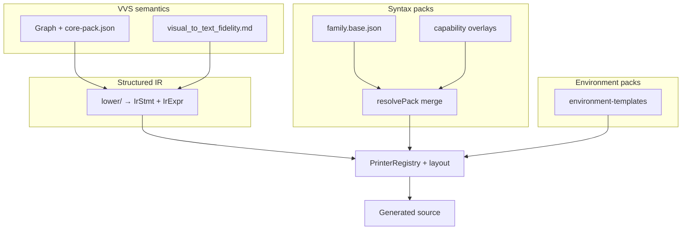

# Syntax Pack Architecture

**Status:** Locked direction (July 2026).  
**Companion:** [visual_to_text_fidelity.md](visual_to_text_fidelity.md) · [language_profiles.md](language_profiles.md) · [project_requirements.md](project_requirements.md) §2.3 · [roadmap.md](roadmap.md)

---

## Summary

VVS separates **what the graph means** from **how a target language prints it**. The three-stage pipeline is **shipped**: lowering produces language-neutral structured IR; **syntax packs** carry print rules for **seven pack-driven codegen families** (python, javascript, cpp, verse, gdscript, rust, csharp). **Language profiles** carry portability policy.

**Tree-sitter** is an optional **parse validator** in CI — not a syntax author. Syntax changes flow through packs, Rosetta golden tests, and agent-assisted maintenance gates.

---

## Problem (historical → current)

| Was (pre–July 2026) | Milestone 1 (python/cpp) | Milestone 2 (javascript/verse) | Milestone 3 (gdscript/rust/csharp) — **shipped** |
|-------|-----|--------|--------|
| Emitters branch on `TargetLanguage` | **PrinterRegistry** + packs for python/cpp | **All four v1 families** pack-first | **Seven codegen families** pack-first (+ json preview) |
| Hardcoded expr/leaf branches in `print/stmt.ts` | Removed for python/cpp | Removed for javascript/verse | Same pattern for Phase 6 v2 langs |
| Thin base JSON | — | Full Rosetta + layout for JS/verse | GDScript/Rust/C# base packs + 14× goldens each |

---

## Four layers (north star)

Increasing reuse from bottom to top:

| Layer | Owns | Changes when |
|-------|------|----------------|
| **VVS semantics** | Fidelity rules, node `kindId`, IR schema semver | New node types, fidelity policy |
| **Structured IR** | `IrCall`, `IrIf`, `IrAssign`, `IrExpr` slots — **no target text** | IR semver bumps |
| **Syntax packs** | Print templates + layout profile per language family | Language/capability deltas |
| **Environment packs** | API natives from manifests (`@vvs/environment-templates`) | OpenAPI/import only |



**Monorepo boundary:** `@vvs/syntax-packs` is pure TypeScript with zero React dependencies — same rules as `@vvs/transpiler`. It ships base JSON packs, a resolver, and the Rosetta fixture suite.

---

## Target resolution and capabilities

Flat `TargetLanguage` (`python`, `javascript`, `cpp`, `verse`, `gdscript`, `json`) maps to a **codegen target** with capabilities:

```ts
interface CodegenTarget {
  family: 'python' | 'javascript' | 'cpp' | 'verse' | 'gdscript' | 'rust' | 'csharp';
  capabilities: string[];  // e.g. 'async', 'type_hints', 'es2022', 'typed'
  packLock?: { base: string; overlays: string[] }; // pinned in .vvs/project.json
}
```

| Concept | Role |
|---------|------|
| **family** | Language family — maps to a base syntax pack |
| **capabilities** | Version and dialect deltas modeled as overlays, not cartesian product forks |
| **packLock** | Optional project pin: `{ "javascript": { "base": "javascript.base@1", "overlays": ["javascript.es2022@1"] } }` |

v1 UI keeps selecting `python` / `javascript` etc.; defaults map to `family + stable capability set`. Version overlays are opt-in later.

---

## Syntax pack structure

Future package layout (`packages/syntax-packs/`):

```
packages/syntax-packs/
├── src/
│   ├── schema.ts          # Pack manifest, template row types
│   ├── resolve.ts         # base ⊕ capability ⊕ project override merge
│   ├── registry.ts        # load packs, semver, sourcePackId tracing
│   └── packs/
│       ├── python.base.json
│       ├── javascript.base.json
│       ├── cpp.base.json
│       ├── verse.base.json
│       └── overlays/      # e.g. javascript.es2022.json (override-only)
├── rosetta/               # canonical graph fixtures + golden outputs
└── package.json
```

### Pack inheritance

Merge order is explicit; **last wins**. Every resolved template records `sourcePackId` for diagnostics.

1. **Base pack** — `family.base.json` — full print profile for the language family
2. **Capability overlays** — override-only JSON (e.g. `javascript.es2022.json`) — diff rows, not a fork
3. **Project overrides** — optional lockfile entries in `.vvs/project.json`

Adding `javascript.es2022` should change **≤5 template rows**, **0 IR changes**.

### Template format (Lego + quasi-quotes)

Packs reuse the Lego row model from [project_requirements.md](project_requirements.md) §2.3:

- `{ type: "static" | "slot", val: "..." }` rows for statement layout
- Out-of-band layout tokens (`\x01`–`\x05`) for indent and scope — see §2.4
- **Quasi-quote** expression templates: `{receiver}.{callee}({args})`

Simple constructs live in JSON; complex constructs stay in TypeScript printers (see hybrid emit below).

---

## Hybrid emit policy

Not everything belongs in JSONB on day one. The split preserves [visual_to_text_fidelity.md](visual_to_text_fidelity.md) without forcing events, hoisting, and multi-file layout into database rows.

| Mechanism | Owns | Examples |
|-----------|------|----------|
| **Data (JSON templates)** | Simple, stable constructs | `Print`, binary ops, literals, basic `If` / `Assign`, instance `Call` |
| **Code (TS printers in registry)** | Layout, fidelity-sensitive, multi-node | Events, hoisting, async, multi-file, `sourceMap` / `expressionSpans`, environment native substitution |
| **Pack shell templates** | Module scaffolding text | `ClassModuleOpen`, `EventHandlerOpen`, `FunctionDefOpen`, `ClassModuleClose`, … — TS still owns `sourceMap` tagging and param/signature slot assembly |
| **Block close helpers** | Shared brace/else/span-offset logic | `blockHelpers.ts` — used by `print/blocks.ts` (string path) and `emit/sinkStatements.ts` (CodeSink path) |

**PrinterRegistry** resolves `(IrStmtKind | IrExprKind, languageFamily)` → JSON template or TS printer. `PrintContext` carries indent, capabilities, binding rules, and the span builder.

### Shell template keys (all v1 base packs)

Required by `packCoverage.test.ts` alongside Rosetta construct keys:

| Key | Role |
|-----|------|
| `ClassModuleOpen` | Class / module declaration with optional `{extendsSuffix}` |
| `ClassModuleClose` | Closing brace (javascript/cpp) |
| `ClassPublicSection` | C++ `public:` |
| `EventHandlerOpen` / `EventHandlerClose` | Handler signature + optional close brace |
| `FunctionDefOpen` / `FunctionTabClose` | Member / tab function headers |
| `FunctionDeclPrototype` | C++ declare-only line in member chain |

Layout profile also carries `emptyHandlerBody` and `emptyFunctionBody` for empty handler/function bodies (`emit/layout.ts`).

---

## Rosetta suite and verification gates

Syntax changes are **contract-driven**. Version reuse means "most Rosetta files unchanged."

| Gate | Purpose |
|------|---------|
| **Rosetta golden tests** | One JSON graph fixture per core construct; strict string compare per `(fixture × family)` |
| **Span invariants** | Every behavioral node ID appears in `sourceMap`; `expressionSpans` cover expected substrings |
| **Fidelity linter (static)** | No statement without `sourceGraphNodeId` (except module scaffolding marked `synthetic: true`); no duplicate node IDs mapping to merged/hidden regions |
| **Parse validation (optional)** | Tree-sitter: generated Rosetta output must parse — Python/JS first; not a merge blocker for Verse until grammar stable |

Rosetta fixtures live in `packages/syntax-packs/rosetta/`. Golden files: `.golden.txt` per target family.

---

## Fidelity linter rules

The fidelity linter is a **pure function** run in CI on the Rosetta suite. It enforces the same contract as [visual_to_text_fidelity.md](visual_to_text_fidelity.md) at the codegen boundary:

1. **One behavioral node → one locatable region** — every non-synthetic statement must carry `sourceGraphNodeId`
2. **No hidden merges** — duplicate node IDs must not map to the same merged or collapsed text region
3. **Synthetic scaffolding only** — module headers, imports boilerplate, and file boundaries may omit node IDs when marked `synthetic: true`
4. **Span coverage** — expression nodes must register `expressionSpans` when they appear inside statement text

Agents and pack edits that violate these rules fail CI without human merge.

---

## Agent maintenance workflow

Agents automate grunt work; **CI is the source of truth**. Scope is intentionally narrow.

### What agents may edit

| Area | Allowed |
|------|---------|
| `packages/syntax-packs/**` | Yes — base packs, overlays, Rosetta fixtures |
| TS printers registered in PrinterRegistry | Yes — with Rosetta + span gates |
| `lower/**`, IR schema, fidelity rules | **No** — requires RFC and human approval |

### Workflow

1. **Input** — language release notes, failing Rosetta test, or user report
2. **Propose** — agent returns overlay JSON diff or TS printer patch against base pack
3. **Gates** — Rosetta golden + span invariants + fidelity linter (+ optional Tree-sitter parse if enabled)
4. **Review** — human review only for portability/emulation policy changes (language profiles)

### MCP tools (shipped locally)

Go MCP server exposes thin wrappers over pure functions in `server/internal/core/services/`:

| Tool | Purpose |
|------|---------|
| `list_syntax_packs` | Discover families, versions, capabilities |
| `propose_syntax_delta` | Returns diff against base pack |
| `run_rosetta_suite` | Runs golden tests for a target |
| `validate_generated_parse` | Optional Tree-sitter check (Python/JS; `--strict` in CI) |

See `.agents/skills/vvs_syntax_packs/SKILL.md` for edit boundaries.

---

## Relationship to language profiles

[language_profiles.md](language_profiles.md) and `@vvs/language-profiles` remain the **portability and policy layer**. Syntax packs do **not** replace them.

| Concern | Owner |
|---------|-------|
| Native vs emulated vs unsupported features | **Language profiles** — warnings at compile / language-switch |
| How a construct prints (`self.foo()` vs `this.foo()`) | **Syntax packs** |
| Cross-over mode capability intersection | **Language profiles** (capabilities align with pack overlays) |
| One node = one visible construct | **Fidelity rules** — enforced in lowering + linter |

**Adding a language** requires both: see [language_profiles.md](language_profiles.md) § Adding a language.

---

## Environment pack split

Environment syntax stays separate from core control flow:

- `@vvs/environment-templates` manifests drive `CallNative` / `env.call_native`
- Future `env.{manifestId}` overlay packs inherit `family.base`
- OpenAPI/AsyncAPI import (roadmap Phase 6) generates **environment pack only** — not core `if`/`while` rules

This aligns with `resolveApiSurface.ts` and avoids version-forking core syntax.

---

## Tree-sitter role (revised)

| Was (deferred vision) | Is (locked) |
|-----------------------|-------------|
| Auto-ingest syntax rules from upstream grammars | **Optional parse validator** in CI |
| Syntax author for new languages | **Syntax packs + Rosetta** are authoritative |
| Merge blocker for all targets | Python/JS first; Verse deferred until grammar stable |

Tree-sitter confirms generated output is syntactically valid — it does not define how VVS prints constructs.

---

## Implementation phases (reference)

| Phase | Deliverable | Status |
|-------|-------------|--------|
| **0** | This spec + cross-links | Done |
| **1** | Structured IR v2 + PrinterRegistry | Done |
| **2** | Rosetta suite + fidelity linter | Done |
| **3** | `@vvs/syntax-packs` package + shell templates + lockfile UI | Done (v1 + **gdscript** families) |
| **4** | Capability-based targets + profile alignment | Partial — `CodegenTarget` shipped; JSON profiles optional |
| **5** | MCP agent tools | Done (local) |
| **6** | Environment pack overlays + new language families | **Done (M3)** — GDScript + Godot env, Rust, C#; optional Rust/C# console env packs remain |

---

## Success criteria

- No `TargetLanguage` string literals in `graphToIr.ts` (expressions included)
- Rosetta suite covers all `core-pack.json` semantics with full golden files
- Adding a capability overlay changes minimal template rows, zero IR changes
- Agent can propose a pack delta; CI rejects invalid diffs without human merge
- Docs consistently describe Tree-sitter as **validator**, syntax packs as **authoritative print layer**
- Text-shaped fidelity unchanged — verified by span + Rosetta tests

---

## Explicit non-goals

- Full JSONB emit for events, hoisting, multi-file (stay TS printers)
- Runtime download of unsigned syntax packs
- Replacing `@vvs/language-profiles` with packs
- Blueprint VM semantics or hidden transforms ([visual_to_text_fidelity.md](visual_to_text_fidelity.md))
