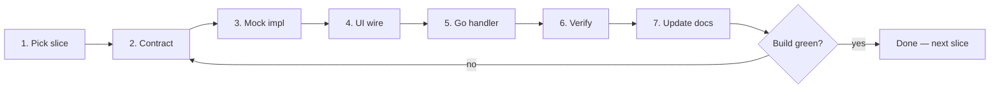

# VVS UI + API Delivery Loop

How to move from **UI skeleton with mocks** to a **wired frontend with real APIs**, one vertical slice at a time — without drift between UI, mock, and Go backend.

Companion docs: [current_state.md](current_state.md) · [project_requirements.md](project_requirements.md)

---

## Core rule: one contract, three implementations

Every feature slice shares a single typed contract:

```text
┌─────────────┐     ┌──────────────┐     ┌─────────────┐
│  UI layer   │────▶│  VvsApi      │────▶│  Transport  │
│  components │     │  (facade)    │     │  mock | http│
└─────────────┘     └──────────────┘     └─────────────┘
                            │
              same request/response types
                            │
        ┌───────────────────┼───────────────────┐
        ▼                   ▼                   ▼
  api-mock.ts         api-client.ts      server/handlers
  (localStorage)      (fetch → Go)       (Go + DB later)
```

**UI components never import `MockApi` or `fetch` directly.** They call `VvsApi.*` only.

Target file layout (create incrementally):

```text
apps/web/src/
├── types/api/           # Request/response DTOs per domain
├── lib/api/
│   ├── index.ts         # VvsApi facade (exported surface)
│   ├── client.ts        # HTTP transport + base URL
│   ├── mock.ts          # Mock transport (localStorage / fixtures)
│   └── errors.ts        # ApiError, network helpers
server/
├── internal/core/domain/
├── internal/core/ports/
├── internal/core/services/   # Pure functions (testable)
└── internal/transport/http/  # Handlers → services
```

Go handlers stay thin: parse → call service → JSON. Business logic lives in `internal/core/services/`.

---

## The loop (one slice per iteration)

Each agent or dev session completes **exactly one slice** end-to-end, then stops and reports.



### Step 1 — Pick slice

Take the **first incomplete** item from the backlog below. Do not start two slices in one iteration.

### Step 2 — Contract

- Add TypeScript types in `apps/web/src/types/api/<domain>.ts`
- Document the HTTP shape in a comment block (method, path, body, response) — OpenAPI file can come later
- Add method signature to `VvsApi` facade

### Step 3 — Mock implementation

- Implement in `lib/api/mock.ts` with the **same signatures** as the real client
- Use `localStorage`, in-memory fixtures, or delayed `Promise` — match error shapes too
- Register in facade; default to mock when `NEXT_PUBLIC_API_MODE=mock` (or no backend URL)

### Step 4 — UI wire

- Replace direct `MockApi` / inline fixtures in components with `VvsApi` calls
- Loading / error / empty states must be real (not `console.log`)
- Keep honest offline chrome until connection slice proves otherwise

### Step 5 — Go handler (when slice includes backend)

- Add handler under `server/internal/transport/http/`
- Implement service in `internal/core/services/` as pure functions
- Wire route in `cmd/vvs-server/main.go`
- CORS for `http://localhost:3000`
- Return JSON matching the TypeScript contract exactly

### Step 6 — Verify

```powershell
cd apps/web; bun run build
cd server; go build ./...
```

Manual smoke (when HTTP slice):

- `curl http://localhost:8080/health`
- Exercise the UI action that calls the new endpoint

### Step 7 — Update docs

- `docs/current_state.md` — mark slice done, note new endpoints
- If UI shell changed, update `vvs_ui_development` skill

### Definition of done (per slice)

- [ ] Types defined in `types/api/`
- [ ] `VvsApi` method exists; UI uses it (no direct mock imports in components)
- [ ] Mock implementation works offline
- [ ] Go endpoint works (if in scope for this slice)
- [ ] `bun run build` passes
- [ ] `current_state.md` updated

---

## Feature slice backlog (priority order)

Work top to bottom. **Phase A** = infrastructure; **Phase B** = editor persistence; **Phase C** = library; **Phase D** = compile/MCP (later).

| # | Slice | UI touchpoints | API contract | Backend | Status |
|---|-------|----------------|--------------|---------|--------|
| A1 | **API facade scaffold** | — | `VvsApi`, `api/client.ts`, `api/mock.ts`, env `NEXT_PUBLIC_API_URL` | — | **Done** (U20) |
| A2 | **Connection status** | `StatusBar`, MCP modal | `GET /health` → `{ status, service }` | `main.go` (exists) | Partial |
| B1 | **Save project** | TopNav File → Save | `PUT /api/projects/:id` | In-memory store OK for v1 | Mock only |
| B2 | **Load project** | TopNav File → Load | `GET /api/projects/:id` | Same | Mock only |
| B3 | **List projects** | (future picker) | `GET /api/projects` | Same | Not started |
| B4 | **Graph autosave** | debounced on graph change | `PATCH /api/projects/:id/graph` | Body: `{ nodes, edges }` | Not started |
| B5 | **Variables / functions** | `GraphExplorer`, properties | `PATCH /api/projects/:id/symbols` | Sub-resource of project | Not started |
| B6 | **Graph tabs state** | `GraphTabBar` | Part of project document or separate graphs | Multi-graph per project | Not started |
| C1 | **Library search** | `LibraryView` Discover | `GET /api/library?q=&type=` | Fixture JSON in Go for now | Mock inline |
| C2 | **Install asset** | Install button | `POST /api/library/:id/install` | Mock installed list | Not started |
| C3 | **Installed list** | Library Installed tab | `GET /api/projects/:id/installed` | — | Empty state |
| D1 | **Compile / validate** | Compile button, console | `POST /api/projects/:id/compile` OR client-only transpiler | Prefer client transpiler later | Mock logs |
| D2 | **MCP session** | Connect AI modal | MCP on Go (separate protocol) | Phase 2 | Not started |

---

## Environment switches

| Variable | Values | Behavior |
|----------|--------|----------|
| `NEXT_PUBLIC_API_MODE` | `mock` (default) \| `http` | Select transport in facade |
| `NEXT_PUBLIC_API_URL` | `http://localhost:8080` | Base URL when mode is `http` |

UI should show **Disconnected** when `http` mode cannot reach `/health`.

---

## Cursor loop prompts

Use these in Agent chat. Run **one slice per invocation**.

### Fixed interval (every 30 minutes)

```text
/loop 30m Run VVS UI+API delivery loop — read docs/ui_api_delivery_loop.md and docs/current_state.md. Complete exactly ONE highest-priority incomplete backlog slice. Follow all 7 steps. Run bun run build. Update current_state.md. Report: slice name, files changed, how to test, next slice.
```

### Dynamic (agent picks pacing)

```text
/loop dynamic Run VVS UI+API delivery loop — read docs/ui_api_delivery_loop.md. One backlog slice per wake. Build must pass before reporting done. If blocked, say why and do not start another slice.
```

### Babysit-style (until backlog phase complete)

```text
/loop 45m Continue VVS Phase B editor persistence: read ui_api_delivery_loop.md backlog rows B1–B6. Each tick: finish the next incomplete row only. No new UI tabs. No direct MockApi in components. Stop tick early if build fails and fix before moving on.
```

---

## Anti-patterns (do not reintroduce)

- Components importing `MockApi` or `fetch` directly
- Go handlers with business logic inline (use services)
- New demo REST endpoints unrelated to backlog (no `/api/roadmap`)
- Fake “connected” status before A2 is truly wired
- Implementing transpiler inside `CodePreviewPanel` string templates (that's slice D1 / `packages/transpiler`)
- Skipping types and passing `any` across the boundary

---

## Suggested first three sessions

1. **A1** — Scaffold `VvsApi`, migrate Save/Load off `MockApi` in TopNav  
2. **A2** — StatusBar + MCP modal call `VvsApi.getHealth()`; show connected only on success  
3. **B1+B2** — Go in-memory project store + wire Save/Load through HTTP  

After those, the app has a real **mock ↔ HTTP swap** pattern for everything else.
