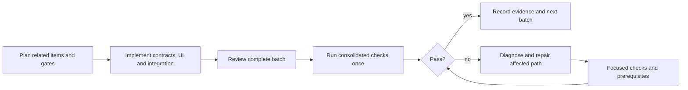

# VVS UI + API Delivery Loop

How to move from **UI skeleton with mocks** to a **wired frontend with real APIs**, in coherent dependency batches — without drift between UI, mock, and Go backend.

> **Product law:** default persist is mock / local / folder. Go HTTP + DB is an optional experiment, not a required app server.

Companion docs: [current_state.md](current_state.md) · [project_requirements.md](project_requirements.md)

---

## Core rule: one contract, three implementations

Every feature slice shares a single typed contract:

```text
┌─────────────┐     ┌──────────────┐     ┌─────────────┐
│  UI layer   │────▶│  VvsApi      │────▶│  Transport  │
│  components │     │  (facade)    │     │  mock | http│
└─────────────┘     └──────────────┘     └─────────────┘
                            │
              same request/response types
                            │
        ┌───────────────────┼───────────────────┐
        ▼                   ▼                   ▼
  lib/api/mock.ts     lib/api/client.ts  server/handlers
  (localStorage)      (fetch → Go)       (Go + DB later)
```

**UI components never import mock internals or `fetch` directly.** They call `VvsApi.*` only.

Target file layout (create incrementally):

```text
apps/web/src/
├── types/api/           # Request/response DTOs per domain
├── lib/api/
│   ├── index.ts         # VvsApi facade (exported surface)
│   ├── client.ts        # HTTP transport + base URL
│   ├── mock.ts          # Mock transport (localStorage / fixtures)
│   └── errors.ts        # ApiError, network helpers
server/
├── internal/core/domain/
├── internal/core/ports/
├── internal/core/services/   # Pure functions (testable)
└── internal/transport/http/  # Handlers → services
```

Go handlers stay thin: parse → call service → JSON. Business logic lives in `internal/core/services/`.

---

## The loop (one dependency batch per validation run)

Group related backlog slices by shared contracts and dependencies. Follow [the batch workflow](agentic_batch_workflow.md), complete implementation and review together, then run affected checks once. Continue authorized work after recording the batch outcome; do not impose a one-slice session limit.


```mermaid
flowchart LR
    A[Plan related items and gates] --> B[Implement contracts, UI and integration]
    B --> C[Review complete batch]
    C --> D[Run consolidated checks once]
    D --> E{Pass?}
    E -->|yes| F[Record evidence and next batch]
    E -->|no| G[Diagnose and repair affected path]
    G --> H[Focused checks and prerequisites]
    H --> E
```

### Step 1 — Plan the dependency batch

Start with the highest-priority incomplete items and group related dependencies into a reviewable batch. Record acceptance criteria and one affected validation set; unrelated work stays in later batches.

### Step 2 — Contract

- Add TypeScript types in `apps/web/src/types/api/<domain>.ts`
- Document the HTTP shape in a comment block (method, path, body, response) — OpenAPI file can come later
- Add method signature to `VvsApi` facade

### Step 3 — Mock implementation

- Implement in `lib/api/mock.ts` with the **same signatures** as the real client
- Use `localStorage`, in-memory fixtures, or delayed `Promise` — match error shapes too
- Register in facade; default to mock when `NEXT_PUBLIC_API_MODE=mock` (or no backend URL)

### Step 4 — UI wire

- Replace direct `MockApi` / inline fixtures in components with `VvsApi` calls
- Loading / error / empty states must be real (not `console.log`)
- Keep honest offline chrome until connection slice proves otherwise

### Step 5 — Go handler (when slice includes backend)

- Add handler under `server/internal/transport/http/`
- Implement service in `internal/core/services/` as pure functions
- Wire route in `cmd/vvs-server/main.go`
- CORS for `http://localhost:3000`
- Return JSON matching the TypeScript contract exactly

### Step 6 — Verify the batch

Run the affected combined-runner gates once, for example `bun tools/validate_batch.ts --only=web,lint,build` for frontend changes. Add `server-build,server-tests` when the optional Go paths change and relevant browser checks for user-visible integration. Do not build the untouched server or repeat the same web build for each endpoint. Inspect failures and retry the affected checks with their prerequisites. Update-only documentation/rules use lightweight checks.

### Step 7 — Update docs

- `docs/current_state.md` — mark the completed batch items done, note new endpoints
- If UI shell changed, update `vvs_ui_development` skill

### Definition of done (each item, validated together)

- [ ] Types defined in `types/api/`
- [ ] `VvsApi` method exists; UI uses it (no direct mock imports in components)
- [ ] Mock implementation works offline
- [ ] Go endpoint works (if in scope for this slice)
- [ ] Required affected batch gates pass; reuse the shared build result across items
- [ ] `current_state.md` updated

---

## Feature slice backlog (priority order)

Work top to bottom. **Phase A** = infrastructure; **Phase B** = editor persistence; **Phase C** = library; **Phase D** = compile/MCP (later).

| # | Slice | UI touchpoints | API contract | Backend | Status |
|---|-------|----------------|--------------|---------|--------|
| A1 | **API facade scaffold** | — | `VvsApi`, `api/client.ts`, `api/mock.ts`, env `NEXT_PUBLIC_API_URL` | — | **Done** (U20) |
| A2 | **Connection status** | `StatusBar`, MCP modal | `GET /health` → `{ status, service }` | `main.go` (exists) | Partial |
| B1 | **Save project** | TopNav File → Save | `PUT /api/projects/:id` | In-memory store OK for v1 | Mock only |
| B2 | **Load project** | TopNav File → Load | `GET /api/projects/:id` | Same | Mock only |
| B3 | **List projects** | (future picker) | `GET /api/projects` | Same | Not started |
| B4 | **Graph autosave** | debounced on graph change | `PATCH /api/projects/:id/graph` | Body: `{ nodes, edges }` | Not started |
| B5 | **Variables / functions** | `GraphExplorer`, properties | `PATCH /api/projects/:id/symbols` | Sub-resource of project | Not started |
| B6 | **Graph tabs state** | `GraphTabBar` | Part of project document or separate graphs | Multi-graph per project | Not started |
| C1 | **Library search** | `LibraryView` Discover | `GET /api/library?q=&type=` | Fixture JSON in Go for now | Mock inline |
| C2 | **Install asset** | Install button | `POST /api/library/:id/install` | Mock installed list | Not started |
| C3 | **Installed list** | Library Installed tab | `GET /api/projects/:id/installed` | — | Empty state |
| D1 | **Compile / validate** | Compile button, console | `POST /api/projects/:id/compile` OR client-only transpiler | Prefer client transpiler later | Mock logs |
| D2 | **MCP session** | Optional Go sidecar (Agent panel collapsed section) | Later thin MCP wrapper over the TS package. Hosted path is already the in-page agent | Deferred | Not the hosted path |

---

## Environment switches

| Variable | Values | Behavior |
|----------|--------|----------|
| `NEXT_PUBLIC_API_MODE` | `mock` (default) \| `http` | Select transport in facade |
| `NEXT_PUBLIC_API_URL` | `http://localhost:8080` | Base URL when mode is `http` |

UI should show **Disconnected** when `http` mode cannot reach `/health`.

---

## Cursor loop prompts

Use an authorized delivery loop to complete coherent batches, not one row per invocation:

```text
Continue the authorized VVS delivery scope. Read current_state and the batch workflow, group related backlog items and acceptance criteria, implement/review the whole batch, then run affected checks once. Diagnose failures before focused retries. Record exact fresh/reused/focused evidence and roadmap gaps, then continue the next authorized batch. Do not create a schedule unless explicitly requested.
```

---

## GenerateCode fidelity contract (Wave 0-B)

When slice **D1** wires server-side codegen, handlers MUST delegate to the same `@vvs/transpiler` pipeline (or a Go port that preserves output parity). Contract:

1. **Input:** Normalized `ProjectSnapshot` v2 (`normalizeProjectSnapshot` including `migrateTextShapedAlignment`).
2. **Output:** `TranspileResult` — `files[]`, `sourceMap`, `expressionSpans` / `fragments` per node.
3. **Rules:** Every behavioral node maps to a grep-able construct; no macro inline, no latent delay without AST, imports hoisted to file top.
4. **GraphBinding:** `call_function` and `import_module` only (`use_macro` deprecated → migrated to `call_function`).
5. **Registry:** Go embedded `core-pack.json` stays in sync with `packages/syntax-registry/core-pack.json`.

Optional future: Go mirror of `migrateTextShapedAlignment` for REST ingest before client normalization.

---

## Anti-patterns (do not reintroduce)

- Components importing `MockApi` or `fetch` directly
- Go handlers with business logic inline (use services)
- New demo REST endpoints unrelated to backlog (no `/api/roadmap`)
- Fake “connected” status before A2 is truly wired
- Implementing transpiler inside `CodePreviewPanel` string templates (that's slice D1 / `packages/transpiler`)
- Skipping types and passing `any` across the boundary

---

## Suggested first three sessions

1. **A1** — Scaffold `VvsApi`, migrate Save/Load off `MockApi` in TopNav  
2. **A2** — StatusBar + MCP modal call `VvsApi.getHealth()`; show connected only on success  
3. **B1+B2** — Go in-memory project store + wire Save/Load through HTTP  

After those, the app has a real **mock ↔ HTTP swap** pattern for everything else.
