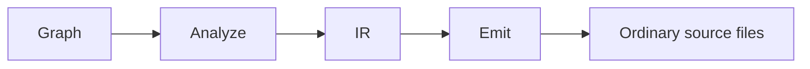
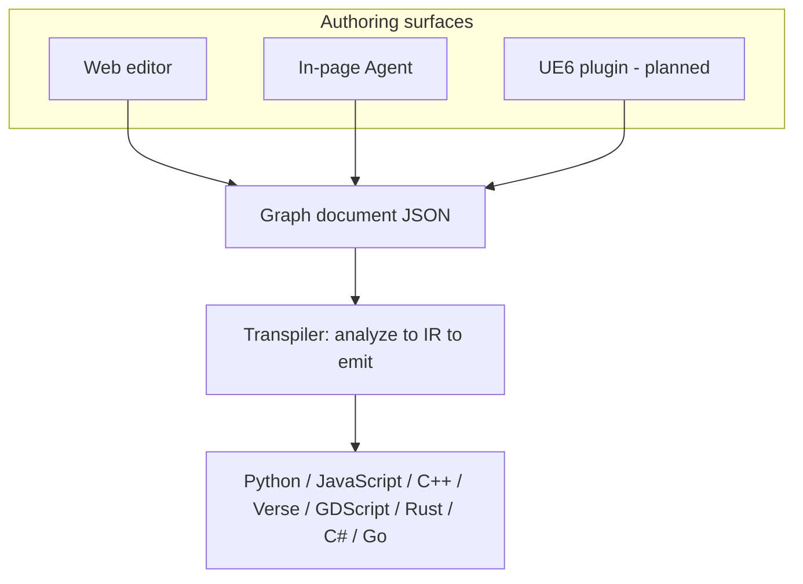

# VVS - Vision & Product Philosophy

### Product law

**[Product law]** Vision Visual Scripting (VVS) is an open visual programming platform that **builds on top of traditional software development** - not against it.

There is **no VVS account** and **no dedicated app server**. Browser plus folder / `.vvs/` / git. Hosted GitHub Pages is a static showcase. Canvas is the source of truth. **Generate** is the user action. Leftover `(x)` stays honest.

Interactive live docs are **[Research] / planned** ([design/interactive_docs_architecture.md](design/interactive_docs_architecture.md)). They are not a shipped `/docs` site.

The graph is an authoring surface. **Text code remains the integration layer**: files you can read in any IDE, commit to git, run in CI, and hand to the tools you already use (including the in-page Agent; later an MCP wrapper for other apps).

> **Origin:** VVS began as a [university graduation project](https://github.com/Sheriff99yt/Vision_Visual_Scripting) (2021) - a Python desktop app proving that a visual graph could translate into **any selected programming language**. **VVS Web** continues that mission for the open-system and AI era. See [history.md](history.md).

---

## North star: an open visual scripting language

We are working toward a **portable visual programming model** - graph schema, intermediate representation, and data-driven emitters - governed by **text-shaped graphs**: what you draw is what you could type.

- **Web** - author in the browser; share graphs and **trustworthy** generated code
- **Repos & automation** - JSON graphs plus text output; no proprietary runtime
- **AI tools** - in-page Agent exposes graph operations; later MCP wrapper for other apps / Cursor
- **Game engines** ? **[Research]** UE6 plugin (roadmap) reuses the **v1 Verse emitter** for in-engine authoring
- **Everything else** - education, tooling, scripting glue - via open node packs and syntax profiles

**Canvas is the source of truth for generated code.** Every line in export must come from a canvas node with `sourceMap` coverage. The Project panel symbol lists (`variables[]`, `functions[]`, `events[]`) are **indexes and CRUD shortcuts**. They organize and edit symbols but do not emit declarations on their own. **Declare** on the graph (`class_define`, `var_define`, `function_define`, `event_member_define`); **use** where logic runs (Get/Set, Call, Dispatch, Bind). See [visual_to_text_fidelity.md](visual_to_text_fidelity.md).

**Generate** is the user action and that full path. **Emit** is Stage C only (printers). Event invoke is **Dispatch**.

VVS Web exists because that vision needs a **modern, accessible, openly developed foundation** - not a single-vendor desktop app tied to one install path.

---

## The problem we are solving

Visual node systems have proven that **flow + typed data** is one of the fastest ways to reason about program structure - especially for gameplay, simulation, tooling, and glue logic. But most visual tools either:

- Lock logic inside a proprietary runtime, or
- Generate code that **does not match** the graph (hidden macros, latent actions, folded operations), or
- Stall when the host platform moves on (new languages, new engine APIs, deprecated authoring models).

VVS takes a different path: **decouple logic from syntax**, generate **ordinary source** with **text-shaped fidelity** (every node maps to honest text), and meet developers **where they already work** - browser, repo, IDE, in-page Agent, and optionally in-engine via **Verse export** - without a proprietary graph runtime.

**Canonical fidelity spec:** [visual_to_text_fidelity.md](visual_to_text_fidelity.md)

---

## Three layers, one graph model

Eight generate targets. JavaScript is one target, not "JS/TS". Bind prints a real registration line only on C# `+=`, JavaScript `.on`, and GDScript `.connect`. Other languages leave Bind unspawned or leftover `(x)`.

### 1. Logic layer (language-agnostic)

Nodes, ports, and wires express **what happens** - control flow, data flow, functions, variables, cross-graph references. This layer does not hardcode Python braces, Verse semantics, or **Unreal Blueprint VM rules** (latent delays, macro expansion).

**Fidelity rule:** Each behavioral node lowers to a visible construct in export - see [visual_to_text_fidelity.md](visual_to_text_fidelity.md). Honest leftover `(x)` when a target has no API. Do not invent language APIs (Verse GetInput stays Print + `(x)` + empty string).

### 2. Syntax layer (swappable emitters)

A data-driven **syntax registry** turns the intermediate representation into readable source for each target. Changing language does not mutate the graph.

### 3. Integration layer (your stack)

Export files, persist projects locally, use the in-page Agent (later MCP wrapper), and (roadmap) run graphs **inside UE6** through a plugin that emits **Verse** and interoperates with Epic's direction away from legacy Blueprint-only workflows.

---

## Building on traditional systems

| Traditional strength | How VVS extends it |
|---------------------|-------------------|
| Text code in git | Graphs serialize to JSON; generated code is normal source files |
| IDEs and debuggers | Output is not a black box - use standard tooling on emitted code |
| Code review | Diff generated artifacts or graph JSON depending on team preference |
| AI assistants | In-page Agent exposes graph operations; later MCP wrapper; predictable text diffs when nodes change |
| Third-party products | Generated files import into **any** stack - no VVS runtime required |
| Engine evolution | UE6 plugin emits **Verse text** with the same fidelity rules - not Blueprint simulation |

VVS is **not** "replace your codebase with graphs." It is **compose visually, integrate as code**, with optional in-engine authoring for Unreal teams.

---

## Unreal Engine 6 & the Blueprint transition

Epic's direction favors **Verse** over long-term Blueprint-centric authoring. VVS does **not** replicate Blueprint **semantics** (macro expand, latent Delay, VM-only behavior). We offer:

- Familiar **node canvas** patterns during transition
- **Verse (and other) output that matches the graph** - reviewable in git, debuggable in normal tooling
- **Third-party integration** - VVS as an open visual layer any project can adopt

**Why not Blueprint-faithful:** Hidden transforms break visual-to-text teaching, require a proprietary runtime, and prevent native embedding in non-UE software. Full rationale: [visual_to_text_fidelity.md](visual_to_text_fidelity.md).

**VVS's UE6 editor plugin (roadmap):**

1. **Host the same dynamic node system** as the web editor - data-driven definitions, typed ports, functions, events.
2. **Emit Verse** from the shared transpiler with **text-shaped fidelity** - same IR and honesty rules as Phase 1.
3. **Smooth UX** for teams leaving Blueprint - familiar canvas, **modern text underneath**.
4. **Stay optional** - browser, in-engine, or both; graphs portable JSON; output standard source files.

The web editor uses **generic software vocabulary** (graph, function, variable). The UE plugin may surface engine-familiar affordances where appropriate; outward web copy stays engine-neutral. See [naming_and_product_direction.md](naming_and_product_direction.md).

---

## Dynamic, flexible node system

Nodes are **data**, not hardcoded UI-only widgets:

- Categories, port types, and inline properties are schema-driven
- Community **node packs** and project-specific nodes extend the catalog without forked engines
- The in-page Agent (later MCP wrapper) chooses from **registered** nodes - reducing hallucinated APIs
- Cross-graph **Call Function** and **Import Module** - honest call sites in generated text

This flexibility is what makes a single graph model viable across **web**, **CLI**, **in-page Agent**, and **UE6**.

---

## Who this is for

- **Learners** - visual structure with real code output they can study
- **Professional developers** - faster glue logic, AI-assisted graph edits, export to repo
- **Unreal teams** - a Verse-oriented path through the Blueprint transition
- **Tool builders** - open graph schema, transpiler packages, in-page agent / later MCP integration surface

---

## Related documents

| Document | Purpose |
|----------|---------|
| [history.md](history.md) | Origin story - VVS 1 graduation project to VVS Web |
| [visual_to_text_fidelity.md](visual_to_text_fidelity.md) | **Text-shaped graphs** - locked direction, rejected paths |
| [roadmap.md](roadmap.md) | Public phased roadmap (including UE6 plugin) |
| [project_requirements.md](project_requirements.md) | Detailed requirements |
| [current_state.md](current_state.md) | What exists in the repo today |
| [naming_and_product_direction.md](naming_and_product_direction.md) | Vocabulary and UI principles |
| [vvs_2_0_tech_stack.md](vvs_2_0_tech_stack.md) | Technology choices |
